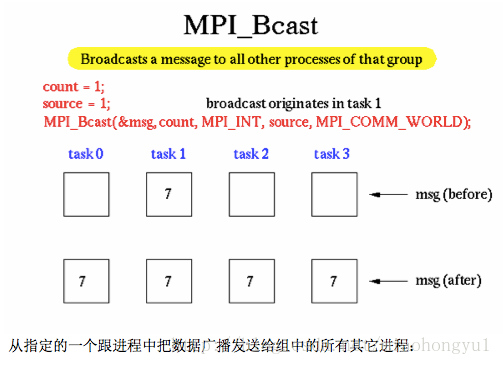
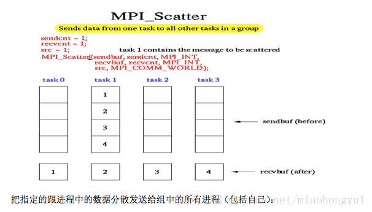
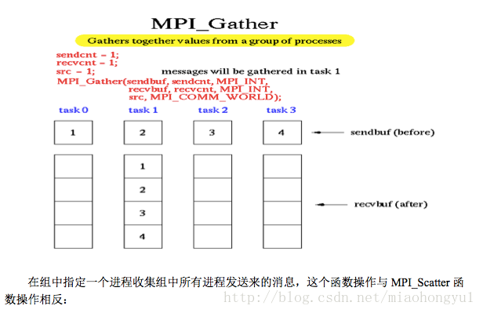
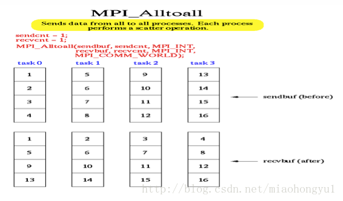
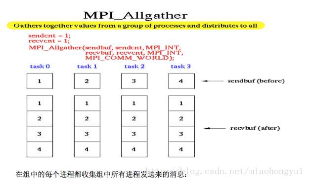

# MPI

<!-- TOC -->

- [1. What is MPI (message passing interface)](#1-what-is-mpi-message-passing-interface)
- [2. Hello world](#2-hello-world)
- [3. Communicators (通信子)](#3-communicators-通信子)
    - [3.1. Group and Communicators (组与通信子)](#31-group-and-communicators-组与通信子)
    - [3.2. Group Management](#32-group-management)
        - [3.2.1. Group Accessors](#321-group-accessors)
        - [3.2.2. Group Constructors](#322-group-constructors)
        - [3.2.3. Group Destruction](#323-group-destruction)
    - [3.3. Communicator Management](#33-communicator-management)
        - [3.3.1. Communicator Accessors](#331-communicator-accessors)
        - [3.3.2. Communicator Constructors](#332-communicator-constructors)
    - [3.4. 实例](#34-实例)
- [4. Procedure Specification (MPI函数参数类型)](#4-procedure-specification-mpi函数参数类型)
- [5. Datatypes (数据类型)](#5-datatypes-数据类型)
    - [5.1. 基础数据类型](#51-基础数据类型)
    - [5.2. User Defined Datatypes](#52-user-defined-datatypes)
        - [5.2.1. Derived datatypes (派生类型)](#521-derived-datatypes-派生类型)
        - [5.2.2. Packing and Unpacking](#522-packing-and-unpacking)
- [6. 六个基本常用函数](#6-六个基本常用函数)
- [7. Point to Point Communication (点到点通信)](#7-point-to-point-communication-点到点通信)
    - [7.1. 消息匹配](#71-消息匹配)
    - [7.2. status参数](#72-status参数)
    - [7.3. Block and Non-block Communication](#73-block-and-non-block-communication)
- [8. Collective Communication (集体通信)](#8-collective-communication-集体通信)
    - [8.1. Reductions (归约)](#81-reductions-归约)
- [9. Process Topology (进程拓扑)](#9-process-topology-进程拓扑)
    - [9.1. Why care?](#91-why-care)
    - [9.2. Cartesian Topologies (笛卡尔拓扑)](#92-cartesian-topologies-笛卡尔拓扑)
    - [9.3. Graph Topology (图拓扑)](#93-graph-topology-图拓扑)
- [10. File I/O (文件输入输出)](#10-file-io-文件输入输出)
    - [10.1. Independent I/O](#101-independent-io)
    - [10.2. Collective I/O](#102-collective-io)
- [11. 引用](#11-引用)

<!-- /TOC -->

## 1. What is MPI (message passing interface)

***

All machines run the same code
Messages are sent between them to guide computation

- MPI is a standard not a library itself
- MPI is portable
- MPI can work with heterogenous(不均匀的) clusters
- Your MPI code can work with various configurations of machines

<a href="https://www.math.ucla.edu/~wotaoyin/windows_coding_cygwin.html">环境配置</a>

## 2. Hello world

***

C中的MPI函数约定

1. 必须包含mpi.h
2. MPI函数返回出错代码或MPI_SUCCESS成功标志
3. MPI-前缀，且只有MPI和MPI_标志后的第一个字母大写，其余小写

```c
#include "mpi.h"
#include <stdio.h>
int main(int argc, char *argv[])
{
    MPI_Init(&argc, &argv);
    printf("Hello world\n");
    MPI_Finalize();
    return 0;
}
//All MPI programs need:
//• MPI_Init
//• MPI_Finalize()

```

Compiling MPI programs

``` cmd
mpicc -o helloWorld.exe helloworld.c
```

Running MPI Programs

``` cmd
 mpiexec -n 4 helloWorld.exe
```

1. -n → Number of processes

2. Call be called locally and will run multiple processes on one machine

## 3. Communicators (通信子)

***

通信子（communicator）是一个综合的通信概念。其包括上下文（context），进程组（group），虚拟处理器拓扑（topology）。其中进程组是比较重要的概念，表示通信域中所有进程的集合。一个通信域对应一个进程组。在执行函数MPI_Init之后,一个MPI程序的所有进程形成一个缺省的组,这个组的通信子即被写作MPI_COMM_WORLD.

communicator是MPI通信操作函数中必不可少的参数,用于限定参加通信的进程的范围.

- Processes exist as part of a communicator
    - It’s a group of processes(communicator 是一组进程)

- All processes are part of the MPI_COMM_WORLD communicator
    - It’s all the processes(MPI_COMM_WORLD,是所有进程)

1. Rank – The ‘id’ of this process in that communicator
2. Size – The number of processes in that communicator

Better hello world

```c
#include "mpi.h"
#include <stdio.h>
int main(int argc, char *argv[])
{
    int rank, size;
    MPI_Init(&argc, &argv);
    MPI_Comm_rank(MPI_COMM_WORLD, &rank);
    MPI_Comm_size(MPI_COMM_WORLD, &size);
    printf("I am process %d of %d\n", rank, size);
    MPI_Finalize();
    return 0;
}

```

communicator 的类型：

1. An intra-communicator is used to communicate within a group and has two main attributes
    • The process group
    • The topology (logical layout of processes) (we’ll cover topologies later)
    .
2. An inter-communicator is used to communicate between disjoint groups of processes and has two attributes
    • A pair of process groups
    • No topology
    .
3. Communicators can also have user-defined attribtues

For inter-communicators, group describes the remote group, and source is the rank of the process in the local group. For intra-communicators, group is the communicator group (remote=local), source is the rank of the process in this group, and send context and receive context are identical. A group is represented by a rank-to-absolute-address translation table.

### 3.1. Group and Communicators (组与通信子)

- 定义:
A group is an ordered set of process identifiers (called processes)
组是进程标识符的有序集（称为进程）。

        Each process has an integer rank
        Ranks are contiguous and start at 0
.
- 应用:
    group是MPI一个很重要的概念，group可以说是进程的有序集合，一台电脑（一个进程）可以属于多个group（所以也可以属于多个不同的communicator)。
    .
    group的正真强大体现在可以随时随地的组合任意group。group可以当成一个集合的概念，可以通过“子、交、并、补”各种方法。所有进程组产生的方法都可以套到集合的各种运算。利用gourp内，和group间的communicator，可以很容易实现复杂科学计算的中间过程，比如奇数rank一个group，偶数另一个group，或者拓扑结构的group，这样可以解决很多复杂问题，另外MPI还有一个默认的全局的group，他就是comm world，一般简单的应用有了这一个group已经足够了。
.
- Some special groups:

    - MPI_GROUP_EMPTY – Can be passed to some communication arguments
    - MPI_GROUP_NULL – Returned when a group is freed

关于组与通信子的奇妙比喻:

1. 通信子

    comm是一个通信子.什么是通信子?

    通信子其实就是一个对讲机,每个进程都有一个对讲机.

    通过对讲机,你可以和某个人对话,也可以对全部人发出广播.
    ·

2. 通信组
    警察有警察之间的对讲机,盗贼有盗贼之间的对讲机.

    显然,警察的对讲机是不应该能和盗贼的对讲机通信的(不包括偷听).

    这样的话,我们就有了通信组的概念.

    警察之间形成一个通信组,盗贼之间形成一个通信组.
    ·

3. MPI里的通信组
    MPI里有一个类Group,它就是充当了通信组的角色.

    当我们有一个对讲机comm的时候,我们通过Get_group()的方法可以得到对应的Group对象.

    Group对象有什么用?它可以用来创建新的通信组!
    ·

4. MPI里的默认通信子
    我们一开始就用到了一个系统帮我们创建的全局通信子,就是COMM_WORLD,它包含了所有的进程.

    其实还有两个系统默认创建的通信子,一个是COMM_SELF,另一个是COMM_NULL.

    COMM_SELF仅仅包含了当前进程,而COMM_NULL则什么进程都没有包含.

    在下面的代码中,我们将使用到COMM_NULL.
.

5. 创建新通信组
    在实际开发中,我们往往不止需要一个全局的通信组,还需要很多小型的通信组,我们需要创建新通信组.

    其实准确来说是创建新通信子,因为通信组只是一份名单,而通信需要的是对讲机!

    某个系列的对讲机一定有对应的某份名单,而某份名单不一定有对应的对讲机.

    要创建新通信子,我们的过程是这样的:

        (1)获取一个旧的通信组(通常是利用COMM_WORLD获取)

        (2)对这个通信组进行添加和删减,以达到我们的目标

        (3)通过旧通信子的Create方法创建新通信子

### 3.2. Group Management

#### 3.2.1. Group Accessors

- MPI_GROUP_SIZE(group, &size) – Returns the size of a group
.
- MPI_GROUP_RANK(group, &rank) – Returns the rank of a process
.
- MPI_GROUP_TRANSLATE_RANKS(group1, n, ranks1, group2, ranks2)
    - Translates the n ranks in group1 to their counterparts in group2
.
- MPI_GROUP_COMPARE(group1, group2, result)
    - MPI_IDENT if they are the same object
    - MPI_SIMILAR if the same processes are in both groups with differing ranks
    - MPI_UNEQUAL otherwise

#### 3.2.2. Group Constructors

- MPI_COMM_GROUP(comm, group)
    Returns the group corresponding to the communicator
    .
- MPI_GROUP_UNION(group1, group2, newgroup)
    newgroup will contain a group of all processes in group1 and group2
    .
- MPI_GROUP_INTERSECTION(group1, group2, newgroup)
    newgroup will contain the processes in both groups 1 and 2
    .
- MPI_GROUP_DIFFERENCE(group1, group2, newgroup)
    newgroup will contain the set difference between groups 1 and 2
    .
- Int MPI_Group_incl(MPI_Group group,int n,int *ranks,MPI_Group new group)
    IN      Group      进程组
    IN      n          ranks数组中元素的个数和新进数组的大小
    IN      ranks       将在新进程组中出现的旧进程组中的编号
    OUT      newgroup    有ranks定义的顺序导出的新进程组
.
- Int MPI_Group_excl(MPI_Group group,int n,int *ranks,MPI_Group newgroup)
    IN      group      进程组
    IN      N         ranks数组中元素的个数
    IN      ranks      在新进程组中不出现的旧进程组中的编号
    OUT    newgroup  旧进程组中不在ranks里的元素组成的新进程组

#### 3.2.3. Group Destruction

- MPI_GROUP_FREE(group)
    returns MPI_GROUP_NULL

### 3.3. Communicator Management

#### 3.3.1. Communicator Accessors

- MPI_COMM_SIZE(comm, size)
Returns the number of processes in the rank
.
- MPI_COMM_RANK(comm, rank)
Returns the rank of the calling process in that communicator
.
- MPI_COMM_COMPARE(comm1, comm2, result)
    1. MPI_IDENT – Same processes, same ranks
    2. MPI_SIMILAR – Same processes, different ranks
    3. MPI_UNEQUAL – Otherwise

#### 3.3.2. Communicator Constructors

1. 在已有通信域基础上划分获得：
MPI_Comm_split(MPI_Comm comm, int color, int key, MPI_Comm *newcomm)　　
.
2. 在已有通信域基础上复制获得 (useful to copy and then manipulate)
MPI_Comm_dup(MPI_Comm comm, MPI_Comm *newcomm)
.
3. 在已有进程组的基础上创建获得 (Creates a new intracommunicator using a subset of comm)
MPI_Comm_create(MPI_Comm comm, MPI_Group group, MPI_Comm *newcomm)

如果在已有进程组的基础上创建新的通信域（即（3）方法），则newcomm有两种结果：如果调用MPI_Comm_create的当前进程在group中，则newcomm就是新产生的通信域对象；如果调用MPI_Comm_create的当前进程不在group中，则newcomm就是MPI_COMM_NULL。由于MPI是多进程编程，类似“当前进程”与“通信域产生函数”这种情况会比较频繁的出现，在设计思路上要适应并行编程这种改变。

### 3.4. 实例

<a href="https://www.cnblogs.com/xbf9xbf/p/5239094.html">【MPI学习7】MPI并行程序设计模式：MPI的进程组和通信域</a>

代码做的事情如下：

1. 共有6个进程，在MPI_COMM_WORLD中的编号分别是{0，1，2，3，4，5}。

2. 将{1，3，5}进程形成一个新的通信域comm1；将编号为{0，2，4}的进程生成一个新的通信域comm2

3. 在comm1中执行MAX归约操作；在comm2中执行MIN归约操作；在MPI_COMM_WORLD中执行SUM归约操作

4. 显示各个通信域中归约操作的结果

```c
 1 #include "mpi.h"
 2 #include <stdio.h>
 3 #include <stdlib.h>
 4
 5 #define LEN 5
 6
 7 int main(int argc, char *argv[])
 8 {
 9     MPI_Init(&argc, &argv);
10     int world_rank, world_size;
11     MPI_Comm_rank(MPI_COMM_WORLD, &world_rank);
12     MPI_Comm_rank(MPI_COMM_WORLD, &world_size);
13 
14     MPI_Group world_group;
15     MPI_Comm_group(MPI_COMM_WORLD, &world_group);
16 
17     int n = 3;
18     const int ranks[3] = {1,3,5};
19     const int ori1[1] = {1};
20     const int ori2[1] = {0};
21     int root1, root2;
22 
23     // 从world_group进程组中构造出来两个进程组
24     MPI_Group group1, group2;
25     MPI_Group_incl(world_group, n, ranks, &group1);
26     MPI_Group_excl(world_group, n, ranks, &group2);
27     // 根据group1 group2分别构造两个通信域
28     MPI_Comm comm1, comm2;
29     MPI_Comm_create(MPI_COMM_WORLD, group1, &comm1);
30     MPI_Comm_create(MPI_COMM_WORLD, group2, &comm2);
31 
32     // 维护发送缓冲区和接受缓冲区
33     int i;
34     double *sbuf, *rbuf1, *rbuf2, *rbuf3;
35     sbuf = malloc(LEN*sizeof(double));
36     rbuf1 = malloc(LEN*sizeof(double));
37     rbuf2 = malloc(LEN*sizeof(double));
38     rbuf3 = malloc(LEN*sizeof(double));
39     srand(world_rank*100);
40     for(i=0; i<LEN; i++) sbuf[i] = (1.0*rand()) / RAND_MAX;
41     fprintf(stderr,"rank %d:\t", world_rank);
42     for(i=0; i<LEN; i++) fprintf(stderr,"%f\t",sbuf[i]);
43     fprintf(stderr,"\n");
44     MPI_Group_translate_ranks(world_group, 1, ori1, group1, &root1);
45     MPI_Group_translate_ranks(world_group, 1, ori2, group2, &root2);
46     // MPI_COMM_WORLD comm1 comm2分别执行不同的归约操作
47     if (MPI_COMM_NULL!=comm1) { // comm1
48         MPI_Reduce(sbuf, rbuf1, LEN, MPI_DOUBLE, MPI_MAX, root1, comm1);
49         int rank_1;
50         MPI_Comm_rank(comm1, &rank_1);
51         if (root1==rank_1) {
52             fprintf(stderr,"MAX:\t");
53             for(i=0; i<LEN; i++) fprintf(stderr,"%f\t",rbuf1[i]);
54             fprintf(stderr,"\n");
55         }
56     } 
57     else if (MPI_COMM_NULL!=comm2) { // comm2
58         MPI_Reduce(sbuf, rbuf2, LEN, MPI_DOUBLE, MPI_MIN, root2, comm2);
59         int rank_2;
60         MPI_Comm_rank(comm2, &rank_2);
61         if (root2==rank_2) {
62             fprintf(stderr,"MIN:\t");
63             for(i=0; i<LEN; i++) fprintf(stderr,"%f\t",rbuf2[i]);
64             fprintf(stderr,"\n");
65         }
66     }
67     MPI_Reduce(sbuf, rbuf3, LEN, MPI_DOUBLE, MPI_SUM, 0, MPI_COMM_WORLD); // MPI_COMM_WORLD 
68     if (0==world_rank) {
69         fprintf(stderr,"SUM:\t");
70         for(i=0; i<LEN; i++) fprintf(stderr,"%f\t",rbuf3[i]);
71         fprintf(stderr,"\n");
72     }
73     // 清理进程组和通信域
74     if(MPI_GROUP_NULL!=group1) MPI_Group_free(&group1);
75     if(MPI_GROUP_NULL!=group2) MPI_Group_free(&group2);
76     if(MPI_COMM_NULL!=comm1) MPI_Comm_free(&comm1);
77     if(MPI_COMM_NULL!=comm2) MPI_Comm_free(&comm2);
78     MPI_Finalize();
79 }

```

## 4. Procedure Specification (MPI函数参数类型)

***

• In MPI arguments take one of three types

ie the rank function:

```c
int MPI_Comm_rank(MPI_Comm comm, int *rank)
```

1. IN – Used but not updated (e.g. comm)
2. OUT – May be updated (e.g. rank)
3. INOUT - Both used and updated (less common but very important)

ps1: **Unless specified otherwise, an argument of type OUT or type INOUT cannot be aliased（混叠）  with any other argument passed to an MPI procedure.**

ps3：**mpi函数的一个常见现象是参数，它被一些进程用作in，而被其他进程用作out。从语法上讲，这样的参数是inout参数，并且被标记为inout参数，尽管从语义上讲，它在一次调用中不用于输入和输出。**

ps2：**IMP如果程序运行成功则会返回 MPI_SUCCESS，失败则视不同函数而定，返回不同值**

## 5. Datatypes (数据类型)

***

### 5.1. 基础数据类型

MPI| C语言数据类型
--|:--
MPI_CHAR|signed char
MPI_SHORT|signed short int
MPI_INT|signed int
MPI_LONG|signed long
MPI_UNSIGNED_CHAR|unsigned char
MPI_UNSIGNED_SHORT|unsigned short int
MPI_UNSIGNED|unsigned int
MPI_UNSIGNED_LONG|unsigned long int
MPI_FLOAT|float
MPI_DOUBLE|double
MPI_LONG_DOUBLE|long double
MPI_BYTE|8 binary digits
MPI_PACKED|data packed or unpacked with MPI_Pack()/MPI_Unpack

### 5.2. User Defined Datatypes

我们知道，比较基本的MPI点对点通信具有无法同时发送不同数据类型,，因此MPI提供说明更通用的,混合的非连续通信缓冲区的机制.直到执行(implementation)时再决定数据应该在发送之前打包到连续缓冲中,还是直接从数据存储区收集。

两种方法定义灵活的数据类型：

1. Derived datatypes (派生类型)
    - Specifying your own data layouts
    - Useful for sending structs for instance
2. Data-packing
    - An extra routine before/after sending/receiving to compress non-contiguous data into a dense block

#### 5.2.1. Derived datatypes (派生类型)

A derived datatype is an opaque（不透明的） object (we can’t edit it after construction) specifying two things：

1. A sequence of primitive datatypes
**Type signature**:

    > • A list of datatypes
• E.g. Typesig = {MPI_CHAR, MPI_INT}
• This describes some datatype which has one or more MPI_CHARs followed by one or more MPI_INTs

2. A sequence of integer (byte) displacements
**Type map**:

    > • A list of pairs
• The first elements are your type signature
• The second elements are the displacement in memory (in bytes) from
the first location
• E.g. MPI_INT has the type map {(int), 0} – A single integer beginning
at the start
• E.g. typemap={（type0,disp0),…,(typen-1,dispn-1)}
• Type maps define the size of the buffer you are sending
This will make more sense once we introduce datatype-constructor

实现：

1. 连续数据类型
    MPI_Type_contiguous
        MPI_Type_contiguous (count,oldtype,*newtype) : 相同基础类型构成的新连续数据类型
        • Example, oldtype = {(double, 0), (char, 8)}
• MPI_TYPE_CONTIGUOUS(3, oldtype, newtype) yields the datatype
• {(double, 0),(char, 8),(double, 16),(char, 24), (double, 32),(char, 40)}
    |arg|type|meaning|
    |---|----|---|
    count |IN| replication count
    oldtype|IN| the old datatype
    newtype|OUT| the new datatype

<br>

2. 向量数据类型
    MPI_Type_vector 、MPI_Type_hvector、MPI_Type_create_hvector
        MPI_Type_vector (count,blocklength,stride,oldtype,*newtype) : 相同基础数据类型构成的新的不连续数据类型，两个函数跨度有原点不同的区别
        MPI_Type_create_hvector(count,blocklength,stride,oldtype,*newtype) ; 相同基础数据类型构成的新的向量数据类型，跨度以块内存原点为起点

<br>

3. 索引数据类型
    MPI_Type_indexed 、MPI_Type_hindexed
        MPI_Type_indexed (count,blocklens[],offsets[],old_type,*newtype) : 与MPI_Type_vector类似，但是可以单独定义每一小块的长度和跨度
    |arg|type|meaning|
    |---|----|---|
    count|IN|the number of blocks
    array_of_blocklengths|IN| number of elements for each block
    array_of_displacements|IN| displacement for each block(measured in number of elements)
    oldtype|IN|the old datatype
    newtype|OUT|the new datatype
<br>

4. 结构体数据类型
    MPI_Type_struct (已弃用)
        MPI_Type_struct (count,blocklens[],offsets[],old_types,*newtype) : 最通用的类型构造函数，多种类型的MPI_Type_indexed
    MPI_Type_create_struct(新)
        MPI_Type_create_struct(count, array_of_blocklengths[], array_of_displacements[], array_of_types[],*rowtype 
<br>
5. 数据类型长度
    MPI_Type_extent (已弃用)
        MPI_Type_extent (datatype,*extent) : extent返回数据类型长度
    MPI_Type_get_extent(新)
        MPI_Type_get_extent(rowtype, *lb, *extent) : lb返回最小数据类型长度，extent返回数据类型长度
<br>
6. 提交数据类型到MPI
    MPI_Type_commit
        MPI_Type_commit (datatype) : 提交数据类型，使MPI认可该数据类型

实例：Upper Triangle of a Matrix

```c
double values[100][100];
double disp[100];
double blocklen[100];
MPI_Datatype upper;
/* find the start and end of each row */
for(int i = 0; i < 100; ++i){
disp[i] = 100 * i + i; // The i-th row starts at the i-th
element
blocklen[i] = 100 - i; // There are i elements in each row
}
/* Create datatype */
MPI_Type_indexed(100, blocklen, disp, MPI_DOUBLE, &upper);
MPI_Type_commit(&upper);
/* Send it */
MPI_Send(values, 1, upper, dest, tag, MPI_COMM_WORLD);
```

#### 5.2.2. Packing and Unpacking

In most cases one can avoid packing and unpacking in favour of derived datatypes
• More portable
• More descriptive
• Generally simpler

```c
MPI_PACK(inbuf, incount, datatype, outbuf, outsize, position,
comm)
```

|arg|type|meaning|
|---|----|---|
• inbuf|IN |input buffer
• incount |IN| number of elements in the buffer
• datatype |IN| the type of each elements
• outbuf |OUT| output buffer
• outsize |IN| output buffer in size (bytes)
• position |INOUT| current position in buffer (bytes)
• comm |IN| communicator for packed message

Used by repeatedly calling MPI_PACK with changed inbuf and outbuf values

```c 
MPI_UNPACK(inbuf, insize, position, outbuf, outcount,
datatype, comm)
```

|arg|type|meaning|
|---|----|---|
• inbuf |IN| input buffer
• insize |IN| size of input buffer (bytes)
• position |INOUT| current position (bytes)
• outbuf |OUT| output buffer
• outcount |IN| number of components to be unpacked
• datatype |IN| datatype of each output component
• comm |IN| communicator

The exact inverse of MPI_PACK. Used by repeatedly calling unpack, extracting each subsequent element

## 6. 六个基本常用函数

***

函数介绍

1. int MPI_Init (int* argc ,char** argv[] )
    - 该函数通常应该是第一个被调用的MPI函数用于并行环境初始化，其后面的代码到 MPI_Finalize()函数之前的代码在每个进程中都会被执行一次。
    - 除MPI_Initialized()外， 其余所有的MPI函数应该在其后被调用。
    - MPI系统将通过argc,argv得到命令行参数（也就是说main函数必须带参数，否则会出错）。
<br>
2. int MPI_Finalize (void)
    - 退出MPI系统， 所有进程正常退出都必须调用。 表明并行代码的结束,结束除主进程外其它进程。
    - 串行代码仍可在主进程(rank = 0)上运行， 但不能再有MPI函数（包括MPI_Init()）。
<br>
3. int MPI_Comm_size (MPI_Comm comm ,int* size )
    - 获得进程个数 size。
    - 指定一个通信子,也指定了一组共享该空间的进程, 这些进程组成该通信子的group（组）。
    - 获得通信子comm中规定的group包含的进程的数量。
<br>
4. int MPI_Comm_rank (MPI_Comm comm ,int* rank)
    - 得到本进程在通信空间中的rank值,即在组中的逻辑编号(该 rank值为0到p-1间的整数,相当于进程的ID。)
<br>
5. int MPI_Send( void *buff, int count, MPI_Datatype datatype, int dest, int tag, MPI_Comm comm)
    - void *buff：你要发送的变量。
    - int count：你发送的消息的个数（注意：不是长度，例如你要发送一个int整数，这里就填写1，如要是发送“hello”字符串，这里就填写6（C语言中字符串未有一个结束符，需要多一位））。
    - MPI_Datatype datatype：你要发送的数据类型，这里需要用MPI定义的数据类型，可在网上找到，在此不再罗列。
    - int dest：目的地进程号，你要发送给哪个进程，就填写目的进程的进程号。
    - int tag：消息标签，接收方需要有相同的消息标签才能接收该消息。
    - MPI_Comm comm：通讯域。表示你要向哪个组发送消息。

    
<br>
6. int MPI_Recv( void *buff, int count, MPI_Datatype datatype, int source, int tag, MPI_Comm comm, MPI_Status *status)
    - void *buff：你接收到的消息要保存到哪个变量里。
    - int count：你接收消息的消息的个数（注意：不是长度，例如你要发送一个int整数，这里就填写1，如要是发送“hello”字符串，这里就填写6（C语言中字符串未有一个结束符，需要多一位））。它是接收数据长度的上界. 具体接收到的数据长度可通过调用MPI_Get_count 函数得到。
    - MPI_Datatype datatype：你要接收的数据类型，这里需要用MPI定义的数据类型，可在网上找到，在此不再罗列。
    - int dest：接收端进程号，你要需要哪个进程接收消息就填写接收进程的进程号。
    - int tag：消息标签，需要与发送方的tag值相同的消息标签才能接收该消息。
    - MPI_Comm comm：通讯域。
    - MPI_Status *status：消息状态。接收函数返回时，将在这个参数指示的变量中存放实际接收消息的状态信息，包括消息的源进程标识，消息标签，包含的数据项个数等。

## 7. Point to Point Communication (点到点通信)

点到点通讯基本由 MPI_Send 与 MPI_Recv 完成

MPI标识一条消息的信息包含四个域:

1. Source: 发送进程隐式确定,由进程的rank值唯一标识

2. Destination: Send函数参数确定

3. Tag: Send函数参数确定,(0,UB),UB:MPI_TAG_UB>=32767.
4. Communicator: 缺省MPI_COMM_WORLD
    - Group:有限/N，有序/Rank [0,1,2,…N-1]
    - Context:Super_tag,用于标识该通讯空间.

### 7.1. 消息匹配

接收buffer必须至少可以容纳count个由datatype参数指明类型的数据. 如果接收buff太小, 将导致溢出、出错

参数匹配 dest,tag,comm/ source,tag,comm
Source == MPI_ANY_SOURCE：接收任意处理器来的数据(任意消息来源).
Tag == MPI_ANY_TAG：匹配任意tag值的消息(任意tag消息).

- 在阻塞式消息传送中不允许Source==Dest,否则会导致deadlock.
- 消息传送被限制在同一个communicator.
- 在send函数中必须指定唯一的接收者(Push/pull通讯机制).

### 7.2. status参数

当使用MPI_ANY_SOURCE或/和MPI_ANY_TAG接收消息时如何确定消息的来源source 和 tag值呢？
在C中,可以用status.MPI_SOURCE, status.MPI_TAG

Status还可用于返回实际接收到消息的长度

```c
int MPI_Get_count(MPI_Status status,MPI_Datatype datatype,int* count)
/**
*IN status 接收操作的返回值.
*IN datatype 接收缓冲区中元素的数据类型.
*OUT count 接收消息中的元素个数
*/
```

### 7.3. Block and Non-block Communication

- Blocking(阻塞) :一个例程须等待操作完成才返回,返回后用户可以重新使用调用中所占用的资源.
- Non-blocking(非阻塞):一个例程不必等待操作完成便可返回,但这并不意味着所占用的资源可被重用.

Blocking communication is done using MPI_Send() and MPI_Recv(). These functions do not return (i.e., they block) until the communication is finished. Simplifying somewhat, this means that the buffer passed to MPI_Send() can be reused, either because MPI saved it somewhere, or because it has been received by the destination. Similarly, MPI_Recv() returns when the receive buffer has been filled with valid data.

In contrast, non-blocking communication is done using MPI_Isend() and MPI_Irecv(). These function return immediately (i.e., they do not block) even if the communication is not finished yet. You must call MPI_Wait() or MPI_Test() to see whether the communication has finished.

Blocking communication is used when it is sufficient, since it is somewhat easier to use. Non-blocking communication is used when necessary, for example, you may call MPI_Isend(), do some computations, then do MPI_Wait(). This allows computations and communication to overlap, which generally leads to improved performance.

Note that collective communication (e.g., all-reduce) is only available in its blocking version up to MPIv2. IIRC, MPIv3 introduces non-blocking collective communication.

A quick overview of MPI's send modes can be seen here.

1. MPI_Wait
Waits for an MPI request to complete

    ```c
    int MPI_Wait(MPI_Request *request, MPI_Status *status)
    ```

    - Input Parameters
        request
        request (handle)
    - Output Parameters
        status
        status object (Status). May be MPI_STATUS_IGNORE.

2. MPI_Test

    Tests for the completion of a request Synopsis

    ```c
    int MPI_Test(MPI_Request *request, int *flag, MPI_Status *status)
    ```

    - Input Parameters
        request
        MPI request (handle)
    - Output Parameters
        flag
        true if operation completed (logical)
        status
        status object (Status). May be MPI_STATUS_IGNORE.

## 8. Collective Communication (集体通信)

1. 广播（Broadcast）
    

    |arg|type|meaning|
    |---|----|---|
    • buffer| (INOUT)| starting address of buffer
    • count |(IN)| number of elements in buffer
    • datatype |(IN)| datatype of the buffer
    • root |(IN)| the rank of the root in the communicator
    • comm |(IN)| the communicator

    Sends a copy of data specified by the root to all other processes in the communicator.

2. 分散(Scatter)
    

3. 收集(Gather)
    

4. 全部到全部(Alltoall)
    

5. allgather
    

### 8.1. Reductions (归约)

1. Global Reductions
    与openmp 中的reduction子句一致

    - Reduce

        ```c
        MPI_REDUCE(sendbuf, recvbuf, count,
        datatype, op, root, comm)
        ```

        |arg|type|meaning|
        |---|----|---|
        • sendbuf |(IN)| Address of send buffer
        • recvbuf |(OUT)| Address of receive buffer
        • count |(IN)| The number of elements in the send buffer
        • datatype |(IN)| The datatype of elements in the buffer
        • op |(IN)| *NEW* The reduce operation(Max,Min,Sum,Product)
        • root |(IN)| Rank of root process
        • comm |(IN)| Communicator

        OP：

        名字       |       含义
        |---|---|
        MPI_MAX    |       最大值
        MPI_MIN    |      最小值
        MPI_SUM    |      求和
        MPI_PROD   |      求积
        MPI_LAND   |      逻辑与
        MPI_BAND   |      按位与
        MPI_LOR    |      逻辑或
        MPI_BOR    |      按位或
        MPI_LXOR   |      逻辑异或
        MPI_BXOR   |      按位异或
        MPI_MAXLOC |      最大值且相应位置
        MPI_MINLOC |      最小值且相应位置

    实例：向量乘法，每个进程计算对应位置的数，最后再返回到某个进程的缓冲区中。

    ```c
    #include "stdio.h"
    #include "mpi.h"
    #include "stdlib.h"
    int main(int argc,char **argv)
    {
    int size,rank;
    MPI_Init(&argc,&argv);
    MPI_Comm_size(MPI_COMM_WORLD,&size);
    MPI_Comm_rank(MPI_COMM_WORLD,&rank);
    int a[100];
    int b[100];
    int root=2;
    for(int i=0;i<size;i++)
    {
        if(i==rank)
        {
            a[i]=rank;
            b[i]=rank;
        }
        else
        {
            a[i]=0;
        }
    }
    a[rank]=a[rank]*b[rank];
    MPI_Reduce(a,b,size,MPI_INT,MPI_MAX,root,MPI_COMM_WORLD);
    if(rank==root)
    {
        for(int i=0;i<size;i++)
            printf("%d ",b[i]);
        printf("\n");
    }
    //printf("\n");
    MPI_Finalize();
    }

    ```

    结果：

    ```c
    mpirun -np 4 a.out
    0 1 4 9
    ```

    - AllReduce

    执行一个规约操作，并把结果广播到组内的所有进程中。该操作等价于先执行 MPI_Reduce 操作，然后再执行 MPI_Bcast

    ```c
    MPI_Allreduce (*sendbuf,*recvbuf,count,datatype,op,comm)
    ```

    - Reduce-Scatter

    在组内按元素单位先进行规约操作， 然后把结果分段后分布到组内的其它进程上。 该操 作等价于先执行 MPI_Reduce 函数，然后再执行 MPI_ Scatter 函数

    ```c
    MPI_Reduce_scatter (*sendbuf,*recvbuf,recvcount,datatype, op,comm)
    ```

    - Scan

    用来对分布在进程组上的数据执行前缀归约

    ```c
    MPI_Scan (*sendbuf,*recvbuf,count,datatype,op,comm)
    ```

2. Custom Reductions
.
    It is possible to define your own reduction operation, as long as it is associative

    ```c
    typdef void MPI_User_function(void *invec, void *inoutvec, int *len, MPI_Datatype *datatype);

    MPI_OP_CREATE(MPI_User_function *function, int commute, MPI_Op op)
    ```

    • function (IN) The user defined function
    • commute (IN) true if commutative, false otherwise(可交换则为true，否则为 false   NOTE: 这里 可交换定义? 运算的可交换？)
    • op (OUT) The operation
.
    MPI_OP_CREATE 将用户自定义的函数 function 和操作 op联系起来， 这样的操作op可以像MPI预定义的归约操作一样用于各种MPI的归约函数中。用户自定义的操作必须是可以结合的。 如果commute=ture， 则此操作同时也是可交换的。如果commute=false,则此操作不满足交换律。
    用户自定义函数 function 必须具备四个参数： invec, inoutvec, len 和 datatype。 在C中的函数原型是:

    ```C
         typedef void MPI_User_function(void *invec, void *inoutvec, int *len, MPI_Datatype *datatype)
    ```

    > invec 和 inoutvec 分别指出将要被归约的数据所在的缓冲区的首地址，
    > len指出将要归约的元素的个数, datatype 指出归约对象的数据类型
    > datatype, 指出归约对象的数据类型

    从非正式的角度来看，可以认为invec和inoutvec 是函数中长度为len的数组， 归约的结果重写了inoutvec 的值。每次调用此函数都导致了对这len个元素逐个进行相应的操作。

    在用户自定义的函数中不能调用MPI中的通信函数。 当函数出错时可能会调用MPI_ABORT。

    ```c
    int  MPI_Op_free(MPI_Op *op)
    ```

    MPI_Op_free 将用户自定义的归约操作撤销将op设置成MPI_OP_NULL。

## 9. Process Topology (进程拓扑)

拓扑是加在内部通信子上的额外、可选的属性，它不能被加在组间通信子(inter-communicator)上。对于一组进程（通信子内部），拓扑能够提供一种方便的命名机制，另外，可以辅助运行时间系统，将进程映射到硬件上。

多数应用中，线性进程编号并不能很好的反映实际工作中各进程之间的通信模式，比如，根据问题的需要，需将进程映射到二维、三维网格乃至更复杂的图结构上。这种映射的需要和底层硬件设备无关，仅在逻辑上实现与问题领域特点相匹配，因此又称作虚拟进程拓扑。

通过虚拟进程拓扑提供的机制，可将MPI进程按照编号映射到某种几何形状上。目前MPI仅支持笛卡尔拓扑和图状拓扑两种。进程拓扑基于组内通信子和组进行管理，事实上，虚拟进程拓扑通过通信子对象的属性缓存来保存其数据结构和实现细节。

虚拟拓扑可以用图来表示，每个进程代表一个点，两点之间的连线代表通信联通，但是注意MPI在任意两个进程之间都可通信，未连接的两点之间不代表无法进行通信。

### 9.1. Why care?

1. So far, we deal with MPI processes as a linear range Somehow, this needs to get mapped onto you hardware Which is probably not a line of machines
    There are Many different architectures:
    • Hypercubes
    • Dragonfly Interconnect
.
2. Most numerical algorithms have some structure to their communication.
    If we don’t exploit(利用) the structure in an algorithm
• Could get ‘random’ process assignment
• Extra communication work
• Potentially undoes all your hard work 
.
3. Virtual topologies allow you to specify communication patterns, allowing MPI to make smarter mapping choices no matter what machine you use.

### 9.2. Cartesian Topologies (笛卡尔拓扑)

1. A simple example is the Cartesian topology
• Any decomposition in natural coordinates
• Indexing starts from 0
• MPI_COMM_WORLD is a 1D Cartesian topology
.
2. Can be non-periodic(循环，周期性) or periodic
• Periodic 1D == Ring
• Non-Periodic 2D == Rectangle
• Periodic 2D (in one dimension) == Cylinder
• Full Periodic 2D == Torus 

```c
MPI_CART_CREATE(comm_old, ndims, dims
periods, reorder, comm_cart)
```

|arg|type|meaning|
|---|----|---|
comm_old |(IN)| Input communicator
ndims |(IN)| Number of dimensions
dims |(IN)| Array of integers specifying number of processes in each dimension
periods |(IN)| Logical array of size ndims specifying if each dimension is periodic (true) or not (false)
reorder |(IN)| Whether the ranks can be re-order from the old communicator
comm_cart |(OUT)| Communicator with new Cartesian topology

其余函数

```c
int MPI_DIMS_CREATE(nnodes, ndims, dims)
//获得建议的最优维度 Result is stored in the integer array dims
int MPI_Cart_get( MPI_Comm comm, int maxdims, int *dims, int *periods, int *coords)
//获取相应信息
int MPI_Cart_rank( MPI_Comm comm, int *coords, int *rank)
//根据坐标获取rank
int MPI_Cartdim_get( MPI_Comm comm, int *ndims)
//获取维度
int MPI_Cart_shift( MPI_Comm comm, int direction, int disp, int *rank_source, int *rank_dest)
//移动rank位置，获得新的rank
int MPI_Cart_coords( MPI_Comm comm, int rank, int maxdims, in *coords)
//根据rank获取坐标
int MPI_Cart_sub( MPI_Comm comm, int *remain_dims, MPI_Comm *newcomm)
//根据维度生成子通信子
int MPI_Cart_map(MPI_Comm comm, int ndims , int *dims, int *periods,int *newrank)
//物理映射
```

### 9.3. Graph Topology (图拓扑)

函数：

```c
int MPI_Graph_create(MPI_Comm comm_old, int nnodes, int *index, int *edges, int reorder, MPI_Comm *comm_graph)

int MPI_Graphdims_get(MPI_Comm comm, int *nnodes, int *nedges)

int MPI_Graph_get(MPI_Comm comm, int maxindex, int maxedges, int *index, int *edges)

int MPI_Graph_neighbors_count( MPI_Comm comm, int rank, int *nneighbors)

int MPI_Graph_neighbors_count( MPI_Comm comm, int rank, int maxneighbors, int *neighbors)

int MPI_Graph_map(MPI_Comm comm, int nodes, int *index, int *edges, int *newrank)
```

## 10. File I/O (文件输入输出)

MPI 提供并行文件输入输出的方法，其分为两种类别，independent和collective，后者在不连续的输入输出可以大幅度提高效率。此外MPI是Supports derived datatypes的
（配合MPI_FILE_SET_VIEW(fh, disp, etype, filetype, datarep, info)
INOUT fh: file handle (handle)
IN disp: displacement (integer)
IN etype: elementary datatype (handle)
IN filetype: filetype (handle)
IN datarep: data representation (string)
IN info: info object (handle)）

### 10.1. Independent I/O

与C语言基本一致

```c
MPI_File_open(comm, filename, flags, info, &file_handle)
MPI_File_close(&file_handle)
MPI_File_seek(File_handle, offset, whence)
//Updates the file pointer to ‘whence’ which can be one of
// • MPI_SEEK_SET – Set to the offset value
// • MPI_SEEK_CUR – Set to the current position + offset
// • MPI_SEEK_END –Set to the end of the file + offset
MPI_File_read(file_handle, buffer, num_read, datatype, status)
MPI_File_write(file_handle, size, datatype, status);
```

seek+read/wirte:

```c
MPI_File_read_at(file_handle, offset, buf, num_items, datatype,status)
MPI_File_write_at(file_handle, offset, buf, count, datatype)
```

### 10.2. Collective I/O

• MPI_File_read_all
• MPI_File_write_all
• MPI_File_read_at_all
• MPI_File_write_at_all
• MPI_File_read_ordered
• MPI_File_write_ordered

## 11. 引用

<a href="https://www.cnblogs.com/xbf9xbf/p/5239094.html">【MPI学习7】MPI并行程序设计模式：MPI的进程组和通信域</a>
<a href="https://blog.csdn.net/lwwl12/article/details/89339719">数据类型和派生数据类型</a>
<a href="https://blog.csdn.net/miaohongyu1/article/details/21093913">MPI，同步/异步，阻塞/非阻塞通讯，集合通信，Gather/Scatter</a>
<a href="https://blog.csdn.net/qq100440110/article/details/52104841">MPI非阻塞通信使用、性能分析与实现原理</a>
<a href="https://www.cnblogs.com/applesun0757/archive/2012/10/28/3085271.html">[MPI] 用户自定义归约操作</a>
<a href="https://scc.ustc.edu.cn/zlsc/cxyy/200910/MPICH/mpi61.htm">进程拓扑</a>
