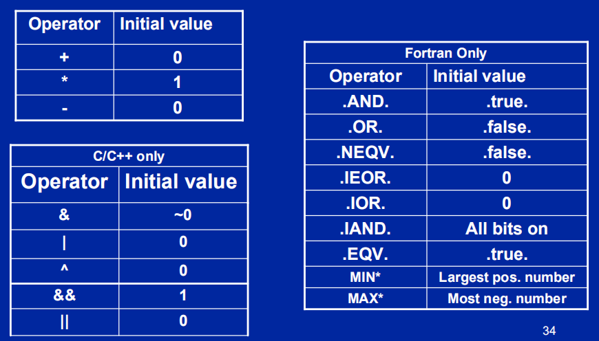
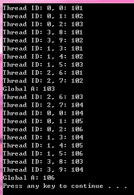
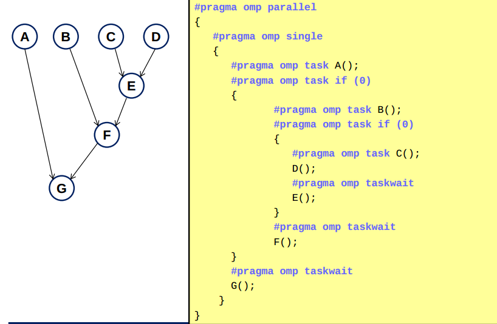

# OpenMP

[TOC]

## 1. 并行区间 parallel region

### 头文件以及区间

```c
#include <omp.h>
```

在井号后面写pragma omp parallel，此句之后的代码默认分成n_core*2的线程出来，重复多次，随机顺序执行。

```c
int main()
{
#pragma omp parallel
    {
        printf("The parallel region is executed by thread
        %d\n",omp_get_thread_num());
    }
}
```

### 编译 openmp in gcc

gcc -fopenmp test2.c -o test2_openmp

### 指定线程数

```c
omp_set_num_threads(4);
//写于#pragma omp parallel前，生成四个线程
```

## 2. 共享构造 worksharing Constructs

### 循环共享结构 Loop worksharing Constructs

以下三段代码等价，为实现在多个线程中共享一份内存而互不干扰，才有以下语句。例如一个长度为N的数组，将其分为线程的个数n份，每一份的长度是约等于N/n.

```c
//1.
#pragma omp parallel
{
int id, i, Nthrds, istart, iend;
id = omp_get_thread_num();
Nthrds = omp_get_num_threads();
istart = id * N / Nthrds;
iend = (id+1) * N / Nthrds;
if (id == Nthrds-1)  iend = N;
for(i=istart ; i<iend ;i++)
{
    a[i] = a[i] + b[i];}
}

//2.
#pragma omp parallel
#pragma omp for
for(i=0;i<N;i++) { a[i] = a[i] + b[i];}

//3.

#pragma omp parallel for
for (i=0;i<N; i++)
{
     a[i] = a[i] + b[i];
}

```

#### Order 子句

The omp ordered directive must be used as follows:

- It must appear within the extent of a omp for or omp parallel for construct containing an ordered clause.
- It applies to the statement block immediately following it. Statements in that block are executed in the same order in which iterations are executed in a sequential loop. (它应用于紧随其后的语句块。该块中的语句的执行顺序与在顺序循环中执行迭代的顺序相同。)
- An iteration of a loop must not execute the same omp ordered directive more than once.
- An iteration of a loop must not execute more than one distinct omp ordered directive.

```c
#pragma omp parallel private (tmp)
#pragma omp for ordered reduction(+:res)
for (I=0;I<N;I++){
    tmp = NEAT_STUFF(I);
#pragma ordered
    res += consum(tmp);
}
```

#### 拍扁子句 The Collapse clause

把一个循环拍扁，比如一个外循环是4次迭代的，内循环是一百次迭代的，如果只用for那么会有四个线程运行100次迭代，但如果你的线程多于四个线程，那么除了开头的四个线程，其他的可能会浪费掉。collapse子句的意义就在此，它将一个二维（4，100）的循环，拍扁成了一个一维的400次循环，因此可以让更多个线程运作。括号里的数值是被拍的维度(想把三层循环变成一层就写3)。以下代码等价。

```c
#pragma omp parallel for private(j) collapse(2)
for (i = 0; i < 4; i++)
    for (j = 0; j < 100; j++)
```

```c
#pragma omp parallel for
for(int n=0; n<4*100; n++) {
    int i = n/100; int j=n%100;
```

#### 调度子句 The Schedule clause

OpenMP中，任务调度主要用于并行的for循环中，当循环中每次迭代的计算量不相等时，如果简单地给各个线程分配相同次数的迭代的话，会造成各个线程计算负载不均衡，这会使得有些线程先执行完，有些后执行完，造成某些CPU核空闲，影响程序性能。例如以下代码：

```c
int i, j;
int a[100][100] = {0};
for ( i =0; i < 100; i++)
{
    for( j = i; j < 100; j++ )
    {
        a[i][j] = i*j;
    }
}
```

如果将最外层循环并行化的话，比如使用4个线程，如果给每个线程平均分配25次循环迭代计算的话，显然i＝0和i＝99的计算量相差了100倍，那么各个线程间可能出现较大的负载不平衡情况。为了解决这些问题，OpenMP中提供了几种对for循环并行化的任务调度方案。

The schedule clause affects how loop iterations are mapped onto threads()

- 静态调度 schedule(static [,chunk])
    > Deal-out blocks of iterations of size “chunk” to each thread.

    当parallel for编译指导语句没有带schedule子句时，大部分系统中默认采用static调度方式，这种调度方式非常简单。假设有n次循环迭代，t个线程，那么给每个线程静态分配大约n/t次迭代计算。这里为什么说大约分配n/t次呢？因为n/t不一定是整数，因此实际分配的迭代次数可能存在差1的情况，如果指定了size参数的话，那么可能相差一个size。静态调度时可以不使用size参数，也可以使用size参数。
    <br>

- 动态调度 schedule(dynamic[,chunk])
    > Each thread grabs “chunk” iterations off a queue until all iterations have been handled.

    动态调度是动态地将迭代分配到各个线程，动态调度可以使用size参数也可以不使用size参数，不使用size参数时是将迭代逐个地分配到各个线程，使用size参数时，每次分配给线程的迭代次数为指定的size次。
    <br>

- guided调度 schedule(guided[,chunk])
    > Threads dynamically grab blocks of iterations. The size of the block starts large and shrinks down to size “chunk” as the calculation proceeds.

    guided调度是一种采用指导性的启发式自调度方法。开始时每个线程会分配到较大的迭代块，之后分配到的迭代块会逐渐递减。迭代块的大小会按指数级下降到指定的size大小，如果没有指定size参数，那么迭代块大小最小会降到1。
    <br>

- schedule(runtime)
    > Schedule and chunk size taken from the OMP_SCHEDULE environment variable (or the runtime library … for OpenMP 3.0).

    runtime调度并不是和前面三种调度方式似的真实调度方式，它是在运行时根据环境变量OMP_SCHEDULE来确定调度类型，最终使用的调度类型仍然是上述三种调度方式中的某种。
    例如在unix系统中，可以使用setenv命令来设置OMP_SCHEDULE环境变量：
    setenv OMP_SCHEDULE “dynamic, 2”
    上述命令设置调度类型为动态调度，动态调度的迭代次数为2。
    在windows环境中，可以在”系统属性|高级|环境变量”对话框中进行设置环境变量。

以上内容摘录自：<a href="https://blog.csdn.net/drzhouweiming/article/details/1844762">OpenMP中的任务调度</a>

#### 效率问题

一个原则是：应该尽量少的使用parallelfor, 因为parallel for也需要时间开销。即:

    1. 如果外层循环次数远远小于内层循环次数，内层循环较多时，将parallel for加在内层循环
    2. 否则将parallel for 加在最外层循环，一般情况都是这样

### 归约 Reduction

worksharing 要求循环之间的独立性，而有些循环的单次运行本就不是独立的，如累加累乘操作，我们就会用到reduction。
>reduction的作用：A private copy for each list variable is created for each thread. At the end of the reduction, the reduction variable is applied to all private copies of the shared variable, and the final result is written to the global shared variable.


>reduction子句为变量指定一个操作符，每个线程都会创建reduction变量的私有拷贝，在OpenMP区域结束处，将使用各个线程的私有拷贝的值通过制定的操作符进行迭代运算，并赋值给原来的变量。

reduction的语法为recutioin(operator:list)
对于每一个操作符都有自己的独有的初始变量


例子如下：

```c
#include <omp.h>  
#define COUNT 10

int main(int argc, _TCHAR* argv[])  
{
    int sum = 100; // Assign an initial value.
#pragma omp parallel for reduction(+:sum)
    for(int i = 0;i < COUNT; i++)
    {
        sum += i;
    }
    printf("Sum: %d\n",sum);

    return 0;  
}
```

reduction 的工作过程：

1）进入并行区域后，team内的每个新的线程都会对reduction变量构造一个副本，比如上面的例子，假设有四个线程，那么，进入并行区域的初始化值分别为：sum0=100,sum1 = sum2 = sum3 = 0.为何sum0为100呢？因为主线程不是一个新的线程，所以不需要再为主线程构造一个副本（没有找到官方这样的说法，但是从理解上，应该就是这样工作的，只会有一个线程使用到并行区域外的初始值，其余的都是0）。

（2）每个线程使用自己的副本变量完成计算。

（3）在退出并行区域时，对所有的线程的副本变量使用指定的操作符进行迭代操作，对于上面的例子，即sum' = sum0'+sum1'+sum2'+sum3'.

（4）将迭代的结果赋值给原来的变量（sum），sum=sum'.

注意：

reduction只能用于标量类型（int、float等等）；

reduction只用于一个区域构造或者工作共享构造的结构中，并且，在这个区域中，reduction的变量只能被用于类似如下的语句：

```c
x = x op expr
x = expr op x (except subtraction)
x binop = expr
x++
++x
x--
--x
```

以上内容摘录自：<a href="https://blog.csdn.net/SHU15121856/article/details/79350474">OpenMP中的归约</a>

### Master Construct

- The master construct denotes a structured
block that is only executed by the master thread.
- The other threads just skip it (no
synchronization （并行性） is implied).

```c
#pragma omp parallel 
{
    do_many_things();
#pragma omp master
    { exchange_boundaries();}
#pragma omp barrier
    do_many_other_things();
}
```

### Single worksharing Construct

- The single construct denotes a block of code that is executed by only one thread (not necessarily the 
master thread).
- A barrier is implied at the end of the single block (can remove the barrier with a nowait clause).

```c
#pragma omp parallel
{
    do_many_things();
#pragma omp single
    { exchange_boundaries(); }
    do_many_other_things();
}
```

### 段共享构造 Sections worksharing Construct

The Sections worksharing construct gives a different structured block to each thread.

OpenMP提供了sections构造，用于构造一个sections，然后里面定义一堆的section，每一个section被一个线程去执行，这样，每一个section也类似于for的每一次迭代，只是使用sections会更灵活，更简单，但是其实，for和sections在某种程度上是可以转换的。

```c
#pragma omp parallel
{
    #pragma omp sections
    {
    #pragma omp section
        X_calculation();
    #pragma omp section
        y_calculation();
    #pragma omp section
        z_calculation();
    }
}
```

### 屏障 Barrier

Barrier: Each thread waits until all threads arrive.

```c
#pragma omp parallel shared (A, B, C) private(id)
{
    id=omp_get_thread_num();
    A[id] = big_calc1(id);
#pragma omp barrier
#pragma omp for
    for(i=0;i<N;i++){C[i]=big_calc3(i,A);}
#pragma omp for nowait
    for(i=0;i<N;i++){ B[i]=big_calc2(C, i); }
    A[id] = big_calc4(id);
}
```

 worksharing construct( 包括 for,sections,single,特别注意，master不是的)并行区间结束时，后面会自动加Barrier，写上nowait则可以不等。

## 3. 数据共享 Data sharing

Shared Memory programming model:

- Most variables are shared by default

Global variables are SHARED among threads

- Fortran: COMMON blocks, SAVE variables, MODULE 
variables
- C: File scope variables, static
- Both: dynamically allocated memory (ALLOCATE, malloc, new)

But not everything is shared...

- Stack variables in subprograms(Fortran) or functions(C) called from parallel regions are PRIVATE
- Automatic variables within a statement block are PRIVATE.

### private

private子句将一个或多个变量声明为线程的私有变量。每个线程都有它自己的变量私有副本，其他线程无法访问。即使在并行区域外有同名的共享变量，共享变量在并行区域内不起任何作用，并且并行区域内不会操作到外面的共享变量。

1. private变量在进入和退出并行区域是”未定义“的。
2. 在并行区域之前定义的原来的变量，在并行区域后也是”未定义“的。

    ```c
    int main(int argc, _TCHAR* argv[])
    {
        int B;

    #pragma omp parallel for private(B)
        for(int i = 0; i<10;i++)
        {
            B = 100;
        }

        printf("%d\n",B);

        return 0;
    }
    ```

3. 并行区域内的private变量和并行区域外同名的变量没有存储关联

总结来说，上面的三点是交叉的，第三点包含了所有的情况。所以，private的关键理解是：

> A private variable within the parallel region has no storage association with the same variable outside of the region.

简单点理解，可以认为，并行区域内的private变量和并行区域外的变量没有任何关联。如果非要说点关联就是，在使用private的时候，在之前要先定义一下这个变量，但是，到了并行区域后，并行区域的每个线程会产生此变量的副本，而且是没有初始化的。

```c

int main(int argc, _TCHAR* argv[])
{
    int A=100,B,C=0;
#pragma omp parallel for private(A) private(B)
    for(int i = 0; i<10;i++)
    {
    B = A + i;  // A is undefined! Runtime error!
    printf("%d\n",i);
    }
    /*--End of OpemMP paralle region. --*/

    C = B;  // B is undefined outside of the parallel region!
    printf("A:%d\n", A);
    printf("B:%d\n", B);

    return 0;
}
```

### firstprivate

遇到要初始化的时候可以使用firstprivate，产生的副本这样就可以产生一个在并行区域外的同名变量的初始化值

> Firstprivate(list):All variables in the list are initialized with the value the original object had before entering the parallel construct.

```c
int main(int argc, _TCHAR* argv[])
{
    int A = 100;

#pragma omp parallel for firstprivate(A)
    for(int i = 0; i<10;i++)
    {
        printf("%d: %d\n",i, A);    // #1
    }
    printf("%d\n",A);   // #2
    return 0;
}

```

上面这个程序是可以正常运行的，若改成private（a）则输出结果随机

### lastprivate

如果需要在并行区域内的私有变量经过计算后，在退出并行区域时，需要将其值赋给同名的共享变量，就可以使用lastprivate完成。

>Lastprivate(list):The thread that executes the sequentially last iteration or section updates the value of the objects in the list.

这里首先有一个问题是：退出并行区域后，需要将并行区域内的副本的值赋值为同名的共享变量，那么，并行区域内有多个线程，是哪一个线程的副本用于赋值呢？

是否是最后一个运行完毕的线程？否！OpenMP规范中指出，如果是循环迭代，那么是将最后一次循环迭代中的值赋给对应的共享变量；如果是section构造，那么是最后一个section语句中的值赋给对应的共享变量。注意这里说的最后一个section是指程序语法上的最后一个，而不是实际运行时的最后一个运行完的。

```c
#include <omp.h>
int main(int argc, _TCHAR* argv[])
{
    int A = 100;

#pragma omp parallel for lastprivate(A)
    for(int i = 0; i<10;i++)
    {
        printf("Thread ID: %d, %d\n",omp_get_thread_num(), i);// #1
        A = i;
    }

    printf("%d\n",A);// #2

    return 0;
}
```

从结果可以看出，最后并行区域外的共享变量的值并不是最后一个线程退出的值，多次运行发现，并行区域的输出结果可能发生变化，但是最终的输出都是9，这就是上面的OpenMP规范说明的问题，退出并行区域的时候，是根据“逻辑上”的最后一个线程用于对共享变量赋值，而不是实际运行的最后一个线程，对于for而言，就是最后一个循环迭代所在线程的副本值，用于对共享变量赋值。

### threadprivate

首先，threadprivate和上面几个子句的区别在于，threadprivate是指令，不是子句。threadprivate指定全局变量被OpenMP所有的线程各自产生一个私有的拷贝，即各个线程都有自己私有的全局变量。一个很明显的区别在于, threadprivate并不是针对某一个并行区域，而是整个于整个程序，所以，**其拷贝的副本变量也是全局的，即在不同的并行区域之间的同一个线程也是共享的。**

threadprivate只能用于全局变量或静态变量，这是很容易理解的，根据其功能。

根据下面的例子，来进一步理解threadprivate的使用：

```c
#include <omp.h>
int A = 100;
#pragma omp threadprivate(A)

int main(int argc, _TCHAR* argv[])
{
#pragma omp parallel for
    for(int i = 0; i<10;i++)
    {
        A++;
        printf("Thread ID: %d, %d: %d\n",omp_get_thread_num(), i, A); // #1
    }

    printf("Global A: %d\n",A);// #2

#pragma omp parallel for
    for(int i = 0; i<10;i++)
    {
        A++;
        printf("Thread ID: %d, %d: %d\n",omp_get_thread_num(), i, A); // #1
    }

    printf("Global A: %d\n",A); // #2

    return 0;
}

```

分析结果，发现，第二个并行区域是在第一个并行区域的基础上继续递增的；每一个线程都有自己的全局私有变量。另外，观察在并行区域外的打印的“Globa A”的值可以看出，这个值总是前面的thread 0的结果，这也是预料之中的，因为退出并行区域后，只有master线程运行。


以上内容摘录自：<a href="https://blog.csdn.net/gengshenghong/article/details/6985431">OpenMP中数据属性相关子句详解</a>

### default

default(shared)：表示并行区域内的共享变量在不指定的情况下都是shared属性

default(none)：表示必须显式指定所有共享变量的数据属性，否则会报错，除非变量有明确的属性定义（比如循环并行区域的循环迭代变量只能是私有的）


## 4. 任务 Task (OpenMP 3.0)

在此，先总结一下for和sections指令的”缺陷“：无法根据运行时的环境动态的进行任务划分，必须是预先能知道的任务划分的情况 而task 就是用来解决此问题的。

- The TASK construct defines an explicit task（显式任务）, which may be executed by the encountering thread, or deferred（延时） for execution by any other thread in the team.
- The data environment of the task is determined by the data sharing attribute clauses.
- Task execution is subject to task scheduling - see the OpenMP 3.1 specification document for details.
- Also see the OpenMP 3.1 documentation for the associated taskyield and taskwait directives.

Task，简单的理解，就是定义一个任务，线程组内的某一个线程来执行此任务。

而Task和for和sections的区别在于：task是“动态”定义任务的，在运行过程中，只需要使用task就会定义一个任务，任务就会在一个线程上去执行，那么其它的任务就可以并行的执行。可能某一个任务执行了一半的时候，或者甚至要执行完的时候，程序可以去创建第二个任务，任务在一个线程上去执行，一个动态的过程（switch），不像sections和for那样，在运行之前，已经可以判断出可以如何去分配任务。而且，task是可以进行嵌套定义的，可以用于递归的情况（task里面可以写task ，经常用于递归函数，如深度遍历二叉树等等）。因此，task主要适用于不规则的循环迭代（如循环）和递归的函数调用。<a href="https://codeday.me/bug/20171009/82996.html">点此看task与section的差别</a>


任务构造的格式：
> #pragma omp task [clause ...]
*structured-block* <br>
Clause can be:
if (scalar expression)
final (scalar expression)
untied
default (shared | none)
mergeable
private (list)
firstprivate (list)
shared (list)

OpenMP 规范版本 3.0 引入了一个称为任务处理的新功能。任务处理功能有助于应用程序的并行化，其中任务单元是动态生成的，就像在递归结构或 while 循环中一样。

在 OpenMP 中，使用 task 指令指定显式任务。task 指令定义了与任务及其数据环境关联的代码。任务构造可以放置在程序中的任何位置，只要线程遇到任务构造，就会生成新任务。

当线程遇到任务构造时，可能会选择立即执行任务或延迟执行任务直到稍后某个时间再执行。如果延迟执行任务，则任务会被放置在与当前并行区域关联的概念任务池中。当前组中的线程会将任务从该池中取出，并执行这些任务，直到该池为空。执行任务的线程可能与最初遇到该任务的线程不同。

### 任务交换 switch

与任务构造关联的代码将只被执行一次。如果代码从始至终都由相同的线程执行，则任务为绑定 (tied) 任务。如果代码可由多个线程执行，使得不同的线程执行代码的不同部分，则任务为非绑定 (untied) 任务。缺省情况下，任务为绑定 (tied) 任务，可以通过将 untied 子句与 task 指令一起使用来将任务指定为非绑定 (untied) 任务。

为了执行不同的任务，允许线程在任务调度点**暂停**执行任务。如果暂停的任务为绑定 (tied) 任务，则同一线程稍后会恢复执行暂停的任务。如果暂停的任务为非绑定 (untied) 任务，则当前组中的任何线程都可能会恢复执行该任务。(如同一时间生成大量任务时，以下操作可以做到先生成一部分，然后暂停，等一部分任务执行完在继续生成，这对cache非常友好)

OpenMP 规范为绑定 (tied) 任务定义了以下任务调度点：

- 遇到任务构造的点

- 遇到任务等待构造的点

- 遇到隐式或显式屏障的点

- 任务的完成点

在 Sun Studio 编译器中实现时，以上调度点也是非绑定 (untied) 任务的任务调度点。

除了使用 task 指令指定的显式任务外，OpenMP 规范版本 3.0 还介绍了隐式任务的概念。隐式任务是由隐式并行区域生成的任务，或是在执行期间遇到并行构造时生成的任务。每个隐式任务的代码都是 parallel 构造内的代码。每个隐式任务会分配给组中的不同线程，且隐式任务为绑定 (tied) 任务，即隐式任务从始至终总是由最初分配给的线程执行。

对于在遇到 parallel 构造时生成的所有隐式任务，都要保证在主线程退出并行区域末尾的隐式屏障（implicit barrier）时完成。另一方面，对于在并行区域中生成的所有显式任务，都要保证在从并行区域中的下一个隐式或显式（implicit or explictit）屏障退出时完成。

### task的数据环境（Data environment）

- The default for tasks is usually firstprivate, because the task may not be executed until later (and variables may have gone out of scope).（由于这个原因所以task语句前面的变量会被放到一个新的储存器里面，然后后面不管这个变量怎么变都会用前面那个）

- Variables that are shared in all constructs starting from the innermost enclosing parallel construct are shared, because the barrier guarantees task completion.

task 指令采用以下数据属性子句，这些子句可定义任务的数据环境：

default (private | firstprivate | shared | none)

private (list)

firstprivate (list)

shared (list)

在任务内对 shared 子句中列出的变量的所有引用是指在 task 指令之前的同名变量。

对于每个 private 和 firstprivate 变量，都会创建一个新存储，并且对 task 构造词法范围内的原始变量的所有引用都会被对新存储的引用所替换。遇到任务时，将会使用原始变量的值初始化 firstprivate 变量。

对于未在 task 构造的数据属性子句中列出以及未根据 OpenMP 规则预先确定的变量的数据共享属性，将按如下所述隐式确定：

(a) 在 task 构造中，如果不存在 default 子句，则被确定为在所有封闭构造（一直到并包括最深层封闭并行构造）中共享的变量为 shared。

(b) 在 task 构造中，如果不存在 default 子句，则其数据共享属性不根据规则 (a) 确定的变量为 firstprivate。

由此可见：

(a) 如果 task 构造在词法被上包含在 parallel 构造中，则在所有作用域（包括上一层的task 构造）中共享的变量在生成的任务中仍保持共享状态。否则，变量将被隐式确定为 firstprivate。

(b) 如果 task 构造是孤立的，则变量将被隐式确定为firstprivate。

### The if clause

标量表达式的值计算为 false 时，遇到任务的线程必须立即执行任务

### taskwait 指令

可以通过使用 taskwait 指令指定绑定到给定并行区域的所有显式任务的子集完成时的情况。taskwait 指令指定在完成自当前（隐式或显式）任务开始以来生成的子任务时进行等待。请注意，taskwait 指令指定在完成直接子任务（自己生成的任务而不是所有后续任务）时进行等待。

资料来源： <a href="https://docs.oracle.com/cd/E19205-01/821-0393/6nletfa62/index.html">任务处理</a>

### 举例

```c
#pragma omp parallel
{
 #pragma omp for private(p)
    for ( int i =0; i <numlists; i++)
    {
        p = listheads[i] ;
        while (p )
        {
 #pragma omp task firstprivate(p)
        {
            process(p);
        }
            p=next(p);
        }
    }
}
```

遍历列表数组

## 5.线程同步

互斥锁同步的概念类似于Windows中的临界区（CriticalSection）以及Windows和Linux中的Mutex以及VxWorks中的SemTake和SemGive（初始化时信号量为满），即对某一块代码操作进行保护，以保证同时只能有一个线程执行该段代码。

### atomic（原子）同步

语法:

``` c
#pragma omp atomic

    x < + or * or - or * or / or & or | or << or >> >=expt

    (例如，x<<=1; or x*=2;)

    或
#prgma omp atomic

    x++ or x-- or --x or ++x

    可以看到atomic的操作仅适用于两种情况：

    1. 自加减操作；

    2. x<上述列出的操作符>=expr;
```

实例

```c++
#include <iostream>
#include <omp.h>

int main()
{
   int sum = 0;
   std::cout << "Before: " << sum << std::endl;

#pragma omp parallel for
   for(int i = 0; i < 2000; ++i)
   {
   #pragma omp atomic
      sum++;
   }

```

输出2000，如果将#pragma omp atomic声明去掉，则结果不确定。

### critical同步机制

临界区critical可以对某个并行程度块进行保护，atomic所能保护的仅为一句代码

```c
#pragma omp critical [(name)] //[]表示名字可选

     {

           //并行程序块，同时只能有一个线程能访问该并行程序块

     }
```

实例

```c
#include <iostream>
#include <omp.h>

int main()
{
   int sum = 0;
   std::cout << "Before: " << sum << std::endl;

#pragma omp parallel for
   for(int i = 0; i < 10; ++i)
   {
   #pragma omp critial (a)
      {
       sum = sum + i;
       sum = sum + i*2;
      }
   }
   std::cout << "After: " << sum << std::endl;
   return 0;
}
```

### 互斥锁函数

```c
omp_init_lock, 初始化一个简单锁

omp_set_lock， 上锁操作

omp_unset_lock， 解锁操作，要和omp_set_lock函数配对使用。

omp_destroy_lock， omp_init_lock函数的配对操作函数，关闭一个锁
```

```c
#include <iostream>
#include <omp.h>

static omp_lock_t lock;

int main()
{
   omp_init_lock(&lock); //初始化互斥锁

#pragma omp parallel for
   for(int i = 0; i < 5; ++i)
   {
      omp_set_lock(&lock);   //获得互斥器
       std::cout << omp_get_thread_num() << "+" << std::endl;
      std::cout << omp_get_thread_num() << "-" << std::endl;
      omp_unset_lock(&lock); //释放互斥器
    }

   omp_destroy_lock(&lock);  //销毁互斥器
    return 0;
}
```

## 相关链接

1. <a href="https://computing.llnl.gov/tutorials/openMP">openMP<a>
2. <a href="https://blog.csdn.net/gengshenghong/article/details/6985431">OpenMP中数据属性相关子句详解(1):private/firstprivate/lastprivate/threadprivate之间的比较</a>
3. <a href="https://blog.csdn.net/gengshenghong/article/details/6999909">OpenMP中数据属性相关子句详解(2):shared/default/copyin/copyprivate子句的使用</a>
4. <a href="https://blog.csdn.net/drzhouweiming/article/details/1844762">OpenMP中的调度schedule</a>
5. <a href="https://blog.csdn.net/SHU15121856/article/details/79350474">OpenMP中的归约和reduction子句</a>
6. <a href="https://docs.oracle.com/cd/E19205-01/821-0393/6nletfa62/index.html">任务处理</a>
7. <a href="https://codeday.me/bug/20171009/82996.html">task与section的差别</a>
8. <a href="https://blog.csdn.net/qihuaheng/article/details/6282060">线程同步</a>
