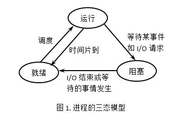
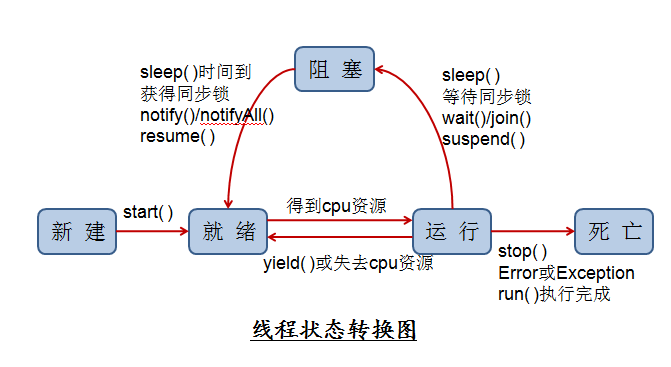

# cits3402

***

## Explain clearly with the help of examples the difference between SIMD and MIMD models of computation.

Single Instruction Multiple Data (SIMD): means that all parallel units share the same instruction, but they carry it out on different data elements. The idea is that you can, say, add the arrays [1,2,3,4] and [5,6,7,8] element-wise to obtain the array [6,8,10,12] ,like reduction.

Multiple Instruction Multiple Data (MIMD) means that parallel units have separate instructions, so each of them can do something different at any given time; one may be adding, another multiplying, yet another evaluating a branch condition, and so on. we always use multiple processes to realize it.

## Explain clearly why the cache hierarchy is necessary along with the RAM in a computer system.

In general, large memories (e.g. hard disk) are cheap but slow, whereas small ones (e.g. RAM, caches or CPU registers) are more expensive and faster. This makes necessary to implement a memory hierarchy in a computer system, in which faster and smaller memories are closer to the CPU in order to decrease reading and writing times and, therefore, make programs run faster and more efficiently.

## Explain the main similarities and dissimilarities between processes and threads. Explain clearly the three main states during the lifetime of a process and the transitions between them. Are there differences between the state transitions of processes and threads?

Both processes and threads are independent sequences of execution. The typical difference is that threads (of the same process) run in a shared memory space, while processes run in separate memory spaces. Each process provides the resources needed to execute a program. A thread is an entity within a process that can be scheduled for execution.

three main states of process, ready - running - block

five main states of threads: new, block, unblock, schedule, finish

进程和线程都是一个时间段的描述，是CPU工作时间段的描述
进程是资源分配的最小单位，线程是CPU调度的最小单位

一、进程的基本状态

进程经常讨论的基本状态为：就绪状态（Ready）、运行状态（Running）、阻塞状态（Blocked）。此外，还包括不常讨论的创建和结束。

就绪状态：当进程已分配到除CPU以外的所有必要资源后，只要再获得CPU，便可立即执行，进程这时的状态称为就绪状态。在一个系统中处于就绪状态的进程可能有多个，通常将它们排成一个队列，称为就绪队列。

运行状态：进程已获得CPU，其程序正在执行。在单处理机系统中，只有一个进程处于执行状态； 在多处理机系统中，则有多个进程处于执行状态。

阻塞状态：正在执行的进程由于发生某事件而暂时无法继续执行时，便放弃处理机而处于暂停状态，亦即进程的执行受到阻塞，把这种暂停状态称为阻塞状态，有时也称为等待状态或封锁状态。致使进程阻塞的典型事件有：请求I/O，申请缓冲空间等。通常将这种处于阻塞状态的进程也排成一个队列。有的系统则根据阻塞原因的不同而把处于阻塞状态的进程排成多个队列。

三种状态的切换如下图所示：

二、线程的基本状态

线程的基本状态包括：派生，阻塞，激活，调度，结束。

派生（New）：线程在进程内派生出来，它即可由进程派生，也可由线程派生。

阻塞（Block）：如果一个线程在执行过程中需要等待某个事件发生，则被阻塞。

激活（Unblock）：如果阻塞线程的事件发生，则该线程被激活并进入就绪队列。

调度（Schedule）：选择一个就绪线程进入执行状态。

结束（Finish）：如果一个线程执行结束，它的寄存器上下文以及堆栈内容等将被释放。

五种状态的切换如下图所示：

<a href="https://zhuanlan.zhihu.com/p/31875174"> Cache 的理解</a>
<a href="https://blog.csdn.net/runrun117/article/details/80291397">线程进程的理解</a>
