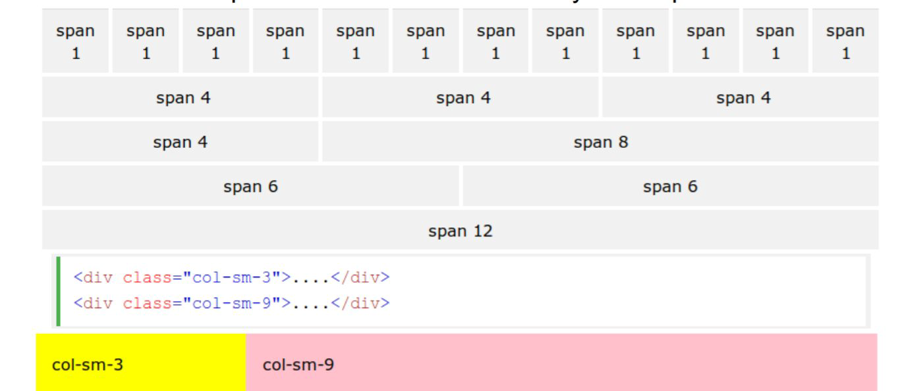

## Bootstrap

Bootstrap 是一个用于快速开发 Web 应用程序和网站的前端框架。Bootstrap 是基于 HTML、CSS、JAVASCRIPT 的。

### 基本语法

Bootstrap 使用了一些 HTML5 元素和 CSS 属性。为了让这些正常工作，您需要使用 HTML5 文档类型（Doctype）。

```html
<!DOCTYPE html>
```

使用bootstrap的基本html模版

```html
<!DOCTYPE html>
<html>
   <head>
      <title>Bootstrap 模板</title>
      <meta name="viewport" content="width=device-width, initial-scale=1.0">
      <!-- 引入 Bootstrap -->
      <link href="//apps.bdimg.com/libs/bootstrap/3.3.0/css/bootstrap.min.css" rel="stylesheet">
```

### 响应式页面

响应式网站设计是一种网络页面设计布局，其理念是：集中创建页面的图片排版大小，可以智能地根据用户行为以及使用的设备环境进行相对应的布局。

#### 移动设备优先 viewport(移动端的窗口)

移动设备优先是 Bootstrap 3 的最显著的变化。

为了让 Bootstrap 开发的网站对移动设备友好，确保适当的绘制和触屏缩放，需要在网页的 head 之中添加 viewport meta 标签，如下所示：

```html
<meta name="viewport" content="width=device-width, initial-scale=1.0">
```

在移动设备浏览器上，通过为 viewport meta 标签添加 user-scalable=no 可以禁用其缩放（zooming）功能。

通常情况下，maximum-scale=1.0 与 user-scalable=no 一起使用。这样禁用缩放功能后，用户只能滚动屏幕，就能让您的网站看上去更像原生应用的感觉。

```html
<meta name="viewport" content="width=device-width,initial-scale=1.0,maximum-scale=1.0,user-scalable=no">
```

#### 响应式图像

```html

```

通过添加 img-responsive class 可以让 Bootstrap 3 中的图像对响应式布局的支持更友好。

#### 容器（Container）

```css
<div class="container">

</div>
```

The container class automatically sets margins that respond to the page size.

container 类写的东西可以自动配合页面大小, 根据浏览器固定间距比例。把 container 的左右外边距（margin-right、margin-left）交由浏览器决定。请注意，由于内边距（padding）是固定宽度，默认情况下容器是不可嵌套的。

还可以使用 .container-fluid 类，它用于 100% 宽度，占据全部视口（viewport）的容器。

### 网格系统

Bootstrap 提供了一套响应式、移动设备优先的流式网格系统，随着屏幕或视口（viewport）尺寸的增加，系统会自动分为最多12列。



#### 基本结构

```html
<div class="container">
  <div class="row">
    <div class="col-*-*"></div>
    <div class="col-*-*"></div>
  </div>
  <div class="row">...</div>
  </div>
  <div class="container">....
```

基本格式如上，即将一行分为十二列，第二个\*号里写每一个行里分为多少列：如3,3,3,3,3的分布，亦或4,4,4， 2,2,8等的分布，总之加起来要等于12。而第一个\*中则是写它的类型：


为了在大屏幕显示器上使用偏移，请使用 .col-md-offset-\* 类。这些类会把一个列的左外边距（margin）增加 \* 列，其中 \* 范围是从 1 到 11。

如：

```html
<div class="container">
    <h1>Hello, world!</h1>
    <div class="row" >
        <div class="col-md-6 col-md-offset-3" 
        style="background-color: #dedef8;box-shadow: 
        inset 1px -1px 1px #444, inset -1px 1px 1px #444;">
            <p>Lorem ipsum dolor sit amet, consectetur adipisicing 
            elit.
            </p>
        </div>
    </div>
</div>
```

### 表 \<table>

如果您想要一个只带有内边距（padding）和水平分割的基本表，请添加 class .table

一些细节的类：

|标签|作用|
|-|-|
.table|	为任意 \<table> 添加基本样式 (只有横向分隔线)|
.table-striped|在 \<tbody> 内添加斑马线形式的条纹 ( IE8 不支持)
.table-bordered|为所有表格的单元格添加边框
.table-hover|在 \<tbody> 内的任一行启用鼠标悬停状态
.table-condensed|让表格更加紧凑

下面这些类可以改变行的颜色：

类|描述|
-|-|
.active|将悬停的颜色应用在行或者单元格上
.success|表示成功的操作
.info|表示信息变化的操作
.warning|表示一个警告的操作
.danger|表示一个危险的操作

### 字体图标(Glyphicons)

如需使用图标，只需要简单地使用下面的代码即可。请在图标和文本之间保留适当的空间。

```html
<span class="glyphicon glyphicon-search"></span>
```

实例

```html
<p>
    <button type="button" class="btn btn-default">
        <span class="glyphicon glyphicon-sort-by-attributes"></span>
    </button>
    <button type="button" class="btn btn-default">
        <span class="glyphicon glyphicon-sort-by-attributes-alt"></span>
    </button>
    <button type="button" class="btn btn-default">
        <span class="glyphicon glyphicon-sort-by-order"></span>
    </button>
    <button type="button" class="btn btn-default">
        <span class="glyphicon glyphicon-sort-by-order-alt"></span>
    </button>
</p>
<button type="button" class="btn btn-default btn-lg">
    <span class="glyphicon glyphicon-user"></span> User
</button>
<button type="button" class="btn btn-default btn-sm">
    <span class="glyphicon glyphicon-user"></span> User
</button>
<button type="button" class="btn btn-default btn-xs">
    <span class="glyphicon glyphicon-user"></span> User
</button>
```

