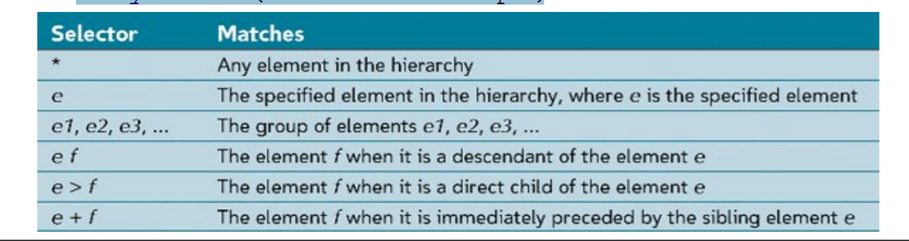
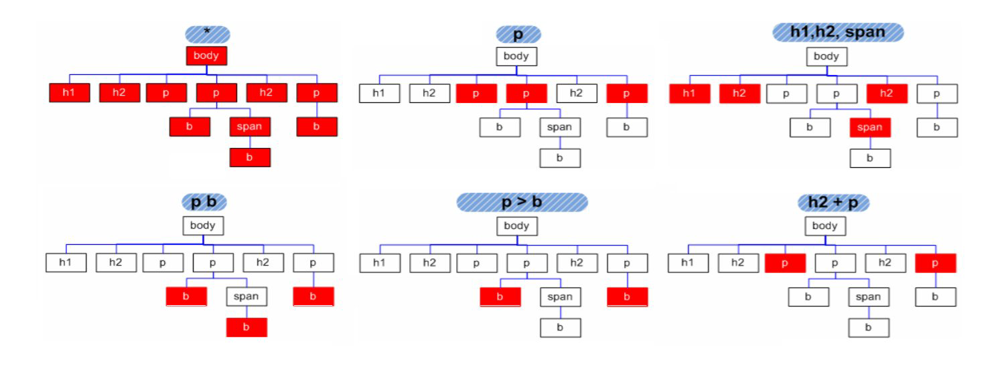
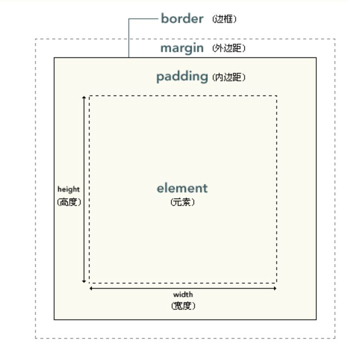
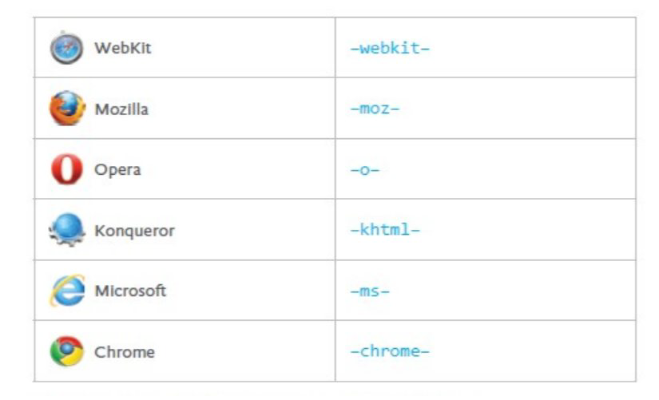

# css


<!-- TOC -->

- [1. 层叠次序](#1-层叠次序)
- [2. 基本语法](#2-基本语法)
    - [2.1. 选择器](#21-选择器)
        - [2.1.1. 并列tags](#211-并列tags)
        - [2.1.2. 派生选择器 Contextual](#212-派生选择器-contextual)
        - [2.1.3. id 与 类（class）选择器](#213-id-与-类class选择器)
            - [2.1.3.1. 伪类](#2131-伪类)
    - [2.2. \<span> 和 \<div> 标签](#22-\span-和-\div-标签)
- [3. 盒模型 (Box Model)](#3-盒模型-box-model)
    - [3.1. 文档流（normal flow）](#31-文档流normal-flow)
        - [3.1.1. 块级元素（block）和内联元素（inline）](#311-块级元素block和内联元素inline)
        - [3.1.2. 脱离文档流](#312-脱离文档流)
- [4. CSS属性（CSS Properties）](#4-css属性css-properties)
    - [4.1. 字体属性（Font Properties ）](#41-字体属性font-properties-)
        - [4.1.1. 引入外部字体](#411-引入外部字体)
        - [4.1.2. Google Fonts API](#412-google-fonts-api)
    - [4.2. 列表属性 (List properties)](#42-列表属性-list-properties)
    - [4.3. 颜色](#43-颜色)
    - [4.4. 文本 (Text)](#44-文本-text)
        - [4.4.1. 缩进文本 text-indent](#441-缩进文本-text-indent)
        - [4.4.2. 水平对齐 text-align](#442-水平对齐-text-align)
    - [4.5. 浏览器引擎前缀 （Vendor Prefix）](#45-浏览器引擎前缀-vendor-prefix)
- [5. 位置（Positioning）](#5-位置positioning)
    - [5.1. 相对定位](#51-相对定位)
    - [5.2. 绝对定位](#52-绝对定位)
    - [5.3. 浮动 （float）](#53-浮动-float)
- [6. 外部引用](#6-外部引用)
- [7. Bootstrap](#7-bootstrap)
    - [7.1. 基本语法](#71-基本语法)
    - [7.2. 响应式页面](#72-响应式页面)
        - [7.2.1. 移动设备优先 viewport(移动端的窗口)](#721-移动设备优先-viewport移动端的窗口)
        - [7.2.2. 响应式图像](#722-响应式图像)
        - [7.2.3. 容器（Container）](#723-容器container)
    - [7.3. 网格系统](#73-网格系统)
        - [7.3.1. 基本结构](#731-基本结构)
    - [7.4. 表 \<table>](#74-表-\table)
    - [7.5. 字体图标(Glyphicons)](#75-字体图标glyphicons)

<!-- /TOC -->

https://www.toptal.com/designers/subtlepatterns/(网页背景)

## 1. 层叠次序

- Inline - specified for a specific occurrence of a tag and apply only to that tag
    - This is fine-grain style, which defeats the purpose of style sheets -uniform style
- Document-level style sheets - apply to the whole document in which they appear
- External style sheets - can be applied to any number of documents

多重样式将层叠为一个

样式表允许以多种方式规定样式信息。样式可以规定在单个的 HTML 元素中，在 HTML 页的头元素中，或在一个外部的 CSS 文件中。甚至可以在同一个 HTML 文档内部引用多个外部样式表。


当同一个 HTML 元素被不止一个样式定义时，会使用哪个样式呢？

一般而言，所有的样式会根据下面的规则层叠于一个新的虚拟样式表中，其中数字 4 拥有最高的优先权。

1. 浏览器缺省设置
2. 外部样式表 **External style sheets**

    ```HTML
    <link rel="stylesheet”
        type="text/css”
        href="http://tiny.url/some.css">
    </link>
    ```

    在head标签内，并且用link标签来引入你要加载的css文件

3. 内部样式表（位于 $<head>$ 标签内部）**Document-level style sheets**

```HTML
    <!DOCTYPE html>
    <html>
    <head>
        <title>My first styled page</title>
        <style>
            body{
                    color: purple;
                    background-color: #d8da3d
                }
        </style>
    </head>
    <body>
```

4. 内联样式（在 HTML 元素内部）**Inline**

    ```HTML
    <p style="background: purple; color: white;">
    This paragraph will have white text on a purple
    background.
    </p>
    ```

因此，内联样式（在 HTML 元素内部）拥有最高的优先权，这意味着它将优先于以下的样式声明：\<head> 标签中的样式声明，外部样式表中的样式声明，或者浏览器中的样式声明（缺省值）。

所以的排序规则如下所示：

- From highest to lowest
    1. Important declarations with user origin ({key: value !important;})
    2. Important declarations with author origin
    3. Normal declarations with author origin
    4. Normal declarations with user origin
    5. Any declarations with browser (or other user agent) origin Tie-Breakers
- Specificity
    1. id selectors
    2. Class and pseudo-class selectors
    3. Contextual selectors
    4. General selectors
- Position
    – Essentially, later has precedence over earlier

## 2. 基本语法

- Inline

    直接在后面加：

    ```css
    style = "property_1: value_1; property_2: value_2;…
    property_n: value_n"
    ```

- Document-level style sheets 和 External style sheets

    ```css
    selector {declaration1; declaration2; ... declarationN }
    ```

### 2.1. 选择器

#### 2.1.1. 并列tags

- The selector is a tag name or a list of tag names, separated by commas, eg:

```css
h1, h2 {font-size: 24pt}
```



- Contextual (or descendant) selectors, eg:

 ```css
 body b em {font-size: 14pt}
 ```

#### 2.1.2. 派生选择器 Contextual

通过依据元素在其位置的上下文关系来定义样式，你可以使标记更加简洁。

在 CSS1 中，通过这种方式来应用规则的选择器被称为上下文选择器 (contextual selectors)，这是由于它们依赖于上下文关系来应用或者避免某项规则。在 CSS2 中，它们称为派生选择器，但是无论你如何称呼它们，它们的作用都是相同的。

派生选择器允许你根据文档的上下文关系来确定某个标签的样式。通过合理地使用派生选择器，我们可以使 HTML 代码变得更加整洁。

比方说，你希望列表中的 strong 元素变为斜体字，而不是通常的粗体字，可以这样定义一个派生选择器：

```css
li strong {
    font-style: italic;
    font-weight: normal;
  }

```

请注意标记为 \<strong> 的蓝色代码的上下文关系：

```html
<p><strong>我是粗体字，不是斜体字，因为我不在列表当中，所以这个规则对我不起作用</strong></p>

<ol>
<li><strong>我是斜体字。这是因为 strong 元素位于 li 元素内。</strong></li>
<li>我是正常的字体。</li>
</ol>
```

#### 2.1.3. id 与 类（class）选择器

id 选择器可以为标有特定 id 的 HTML 元素指定特定的样式。

id 选择器以 "#" 来定义。

下面的两个 id 选择器，第一个可以定义元素的颜色为红色，第二个定义元素的颜色为绿色：

```css
#red {color:red;}
#green {color:green;}
```

下面的 HTML 代码中，id 属性为 red 的 p 元素显示为红色，而 id 属性为 green 的 p 元素显示为绿色。

```html
<p id="red">这个段落是红色。</p>
<p id="green">这个段落是绿色。</p>
```

**注意：id 属性只能在每个 HTML 文档中出现一次。
注意：id名的第一个字符不能使用数字！**

在 CSS 中，类选择器以一个点号显示：

```css
center {text-align: center}
```

在上面的例子中，所有拥有 center 类的 HTML 元素均为居中。

在下面的 HTML 代码中，h1 和 p 元素都有 center 类。这意味着两者都将遵守 ".center" 选择器中的规则。

```html
<h1 class="center">
This heading will be center-aligned
</h1>

<p class="center">
This paragraph will also be center-aligned.
</p>
```

**注意：类名的第一个字符不能使用数字！**

##### 2.1.3.1. 伪类

Pseudo classes are styles that apply when something happens, rather than because the target element simply exists

语法：

```css
selector:pseudo-class {property:value;}
```

几个常用的伪类：

```css

a:link {color:#FF0000;} /* 未访问的链接 */
a:visited {color:#00FF00;} /* 已访问的链接 */
a:hover {color:#FF00FF;} /* 鼠标划过链接 */
a:active {color:#0000FF;} /* 已选中的链接 */
p:first-child
{
    color:blue;
}
/* 选择器匹配作为任何元素的第一个子元素的 <p> 元素： */
```

实例

```html
<html xmlns = "http://www.w3.org/1999/xhtml">
 <head>
    <title> Checkboxes </title>
    <style type = "text/css">
        input:hover {color: red;}
        input:focus {color: green;}
    </style>
 </head>
 <body>
    <form action = "">
        <p> Your name: <input type = "text" /> </p>
    </form>
 </body>
</html>
```

### 2.2. \<span> 和 \<div> 标签

我们可以用这两个标签来赋予我们想要的结构和段落以类名。例如：

One problem with the font properties is that they apply to whole elements, which
are often too large
– Solution: a tag to define an element within a larger element - \<span>
– Use \<span> to apply a document style sheet to its content

```html
 <style type = "text/css">
 bigred {font-size: 24pt; font-family: Ariel;
 color: red}
 </style>
 <p>
 Now is the
 <span class = "bigred"> best time </span> ever!
 </p>
```

\<div>是块级元素
\<span>是行级元素
添加这个tag 可以起到style中display的效果。

## 3. 盒模型 (Box Model)

CSS盒模型本质上是一个盒子，封装周围的HTML元素，它包括：边距，边框，填充，和实际内容。

盒模型有两种，W3C 和IE 盒子模型

    1. W3C定义的盒模型包括margin、border、padding、content，元素的宽度width=content的宽度

    2. IE盒模型与W3C盒模型的唯一区别就是元素的宽度，元素的width=border + padding + content



元素框的最内部分是实际的内容，直接包围内容的是内边距。内边距呈现了元素的背景。内边距的边缘是边框。边框以外是外边距，外边距默认是透明的，因此不会遮挡其后的任何元素。

当您指定一个CSS元素的宽度和高度属性时，你只是设置内容区域的宽度和高度。要知道完全大小的元素的话，你还必须添加填充边框和边距。

``` css
div {
    width: 300px;
    border: 25px solid green;
    padding: 25px;
    margin: 25px;
}
```

**提示：** 内边距、边框和外边距可以应用于一个元素的所有边，也可以应用于单独的边。

**提示：** 外边距可以是负值，而且在很多情况下都要使用负值的外边距。

### 3.1. 文档流（normal flow）

<a href="https://zhuanlan.zhihu.com/p/31261020">原文</a>

文档流指的是什么呢？由于这是显示在浏览器上面的，显示在电脑屏幕前的。如果我们将屏幕的两侧想象成河道，将屏幕的上面作为流的源头，将屏幕的底部作为流的结尾的话，那我们就抽象出来了文档流 ！

像水流，流动的是水，电磁流流动的是电磁。那文档流流动的又是什么呢？那就是元素！可以将屏幕中显示的内容都可以一一对应为文档中的一个元素，在这里就引出两个概念：内联元素与块级元素。


#### 3.1.1. 块级元素（block）和内联元素（inline）

**现已取消此设定**

- 块级元素：四四方方的块，在文档中自己占一行。如\<div>\<p>

- 内联元素：（行内元素）多个内联元素，可以在一行显示。如\<span>\

- 块级元素和行内元素的转换inline

    类似于文档的排版，我可以把一个内联元素加两个回车，换成块级元素。在CSS中是如何实现这种转换的呢？
    块级元素（block） 行内元素（inline）
    只要在style里加上display:block;或者是display：inline就可以转换了！

```css
/*CSS*/
.inline{
    border:1px solid #ccc;
    display:block;
}
```

#### 3.1.2. 脱离文档流

但是仅有的两种排版，就满足了我们的需求吗？肯定是不够的！！应该有一种更加自由的变换，从而满足多样的世界。有三种方式脱离文档流：

1. position:absolute
2. position:fixed
3. float

回到文章开头的例子上面，将文档流比作是河流的话，水就相当于文档流里面的元素。而脱离文档流就相当于脱离水跑到水的上面飘着，就像河流上的小船。关于定位的内容，会继续讲解。

个人关于脱离文档流的理解，就是一般的盒子都是排的好好的一个接着一个，背景啥的除外一般情况也不会叠在一起。脱离了文档流之后，元素盒子就可以到处跑，想在哪在哪，既可以占了别人的位子，叠在别人前面，也可以在很远的地方跳出来。相当于多了一个图层。

## 4. CSS属性（CSS Properties）

### 4.1. 字体属性（Font Properties ）

- font-family 属性设置文本的字体系列。

    font-family 属性应该设置几个字体名称作为一种"后备"机制，如果浏览器不支持第一种字体，他将尝试下一种字体。

    注意: 如果字体系列的名称超过一个字，它必须用引号，如Font Family："宋体"。

    多个字体系列是用一个逗号分隔指明：

    实例

    ```css
    p{font-family:"Times New Roman", Times, serif;}

    ```

- font-size 字体大小
    Possible values: a length number or a name, such as smaller, xx-large, etc.

    ```css
    h1 {font-size:40px;}
    h2 {font-size:30px;}
    p {font-size:14px;}
    ```

- font-style
    normal,italic, oblique (useless)
    >  正常 - 正常显示文本
        斜体 - 以斜体字显示的文字
        倾斜的文字 - 文字向一边倾斜（和斜体非常类似，但不太支持）

    ```css
    p.normal {font-style:normal;}
    p.italic {font-style:italic;}
    p.oblique {font-style:oblique;}
    ```

- font-weight 字体粗细 - degrees of boldness
    • bolder, lighter, bold, normal
    • Could specify as a multiple of 100 (100 – 900)

    ```css
    p.normal {font-weight:normal;}
    p.thick {font-weight:bold;}
    p.thicker {font-weight:900;}
    ```

- font 指定在一个声明的所有字体属性：
    1. font 简写属性在一个声明中设置所有字体属性。
    2. 可设置的属性是（按顺序）： "font-style font-variant font-weight font-size/line-height font-family"
    3. font-size和font-family的值是必需的。如果缺少了其他值，默认值将被插入，如果有默认值的话。
    **注意：** line - height属性设置行与行之间的空间。
    ```css
    p.ex1
    {
        font:15px arial,sans-serif;
    }
    p.ex2
    {
        font:italic bold 12px/30px Georgia, serif;
    }
    ```

#### 4.1.1. 引入外部字体

    语法:

    ```css
    @font-face {
        font-family: <YourWebFontName>;
        src: <source> [<format>][,<source> [<format>]]*;
        [font-weight: <weight>];
        [font-style: <style>];
        }
    字体后缀和浏览器有关，如下所示
    * .TTF或.OTF，适用于Firefox 3.5、Safari、Opera 
    * .EOT，适用于Internet Explorer 4.0+ 
    * .SVG，适用于Chrome、IPhone 
    比如:
    @font-face {
        font-family: 'HansHandItalic';
        src: url('fonts/hanshand-webfont.eot');
        src: url('fonts/hanshand-webfont.eot?#iefix') format('embedded-opentype'),
            url('fonts/hanshand-webfont.woff') format('woff'),
            url('fonts/hanshand-webfont.ttf') format('truetype'),
            url('fonts/hanshand-webfont.svg#webfont34M5alKg') format('svg');
        font-weight: normal;
        font-style: normal;
    }
    ```
#### 4.1.2. Google Fonts API 

<a href="http://www.google.com/fonts/">Google Fonts （谷歌字体官方网站）</a>
有三种方式来添加字体链接：

1. Standard 方式：

```html
<link rel='stylesheet' type='text/css'
href='http://fonts.googleapis.com/css?family=Condiment'>
```

2. @import 方式：

```css
@import url(http://fonts.googleapis.com/css?family=Condiment);
```
3.  JavaScript 方式：
（通过添加动态脚本并执行来导入字体，代码省略）

4. 下一步定义在那个标签上使用该字体，例如：在<class="myheader">标签上使用，

```css
.myheader {font-family: 'Condiment', cursive;}
```

### 4.2. 列表属性 (List properties)

CSS列表属性作用如下：

- 设置不同的列表项标记为有序列表
- 设置不同的列表项标记为无序列表
- 设置列表项标记为图像

运用 list-style-type做操作

全文的：
```css
ul.a {list-style-type: circle;}
ul.b {list-style-type: square;}
 
ol.c {list-style-type: upper-roman;}
ol.d {list-style-type: lower-alpha;}
```

亦或行内的（改变列表的前面的标记符号）

1. ul/ol中的
    ```html
    <h3> Some Common Single-Engine Aircraft
    </h3>
    <ul style = "list-style-type: square">
        <li> Cessna Skyhawk </li>
        <li> Beechcraft Bonanza </li>
        <li> Piper Cherokee </li>
    </ul>
    ```

 2. li中的
    ```html
    <h3> Some Common Single-Engine Aircraft </
    h3>
    <ul>
        <li style = "list-style-type: disc">
        Cessna Skyhawk </li>
        <li style = "list-style-type: square">
        Beechcraft Bonanza </li>
        <li style = "list-style-type: circle">
        Piper Cherokee </li>
    </ul>
    ```

**设置外部图像为标记符号**:

```css
ul
{
    list-style-image: url('sqpurple.gif');
}
```

### 4.3. 颜色

```html
<style type = “text/css”>
    th.red {color: red}
    th.orange {color: orange}
 </style>
 …
 <table border = "5">
 <tr>
    <th class = "red"> Apple </th>
    <th class = "orange"> Orange </th>
    <th class = "orange"> Screwdriver </th>
 </tr>
 </table>
 
```

### 4.4. 文本 (Text)

#### 4.4.1. 缩进文本 text-indent

把 Web 页面上的段落的第一行缩进，这是一种最常用的文本格式化效果。

CSS 提供了 text-indent 属性，该属性可以方便地实现文本缩进。

通过使用 text-indent 属性，所有元素的第一行都可以缩进一个给定的长度，甚至该长度可以是负值。

这个属性最常见的用途是将段落的首行缩进，下面的规则会使所有段落的首行缩进 5 em：

```css
p {text-indent: 5em;}
```

**注意**：一般来说，可以为所有块级元素应用 text-indent，但无法将该属性应用于行内元素，图像之类的替换元素上也无法应用 text-indent 属性。不过，如果一个块级元素（比如段落）的首行中有一个图像，它会随该行的其余文本移动。

**提示**：如果想把一个行内元素的第一行“缩进”，可以用左内边距或外边距创造这种效果。

#### 4.4.2. 水平对齐 text-align

text-align 是一个基本的属性，它会影响一个元素中的文本行互相之间的对齐方式。它的前 3 个值相当直接，不过第 4 个和第 5 个则略有些复杂。

1. 值 left、right 和 center 会导致元素中的文本分别左对齐、右对齐和居中。

    西方语言都是从左向右读，所有 text-align 的默认值是 left。文本在左边界对齐，右边界呈锯齿状（称为“从左到右”文本）。对于希伯来语和阿拉伯语之类的的语言，text-align 则默认为 right，因为这些语言从右向左读。不出所料，center 会使每个文本行在元素中居中。

    **提示：**将块级元素或表元素居中，要通过在这些元素上适当地设置左、右外边距来实现。

    text-align:center 与 \<CENTER>
    您可能会认为 text-align:center 与 \<CENTER> 元素的作用一样，但实际上二者大不相同。

    \<CENTER> 不仅影响文本，还会把整个元素居中。text-align 不会控制元素的对齐，而只影响内部内容。元素本身不会从一段移到另一端，只是其中的文本受影响。

2. justify 最后一个水平对齐属性是 justify。

    在两端对齐文本中，文本行的左右两端都放在父元素的内边界上。然后，调整单词和字母间的间隔，使各行的长度恰好相等。您也许已经注意到了，两端对齐文本在打印领域很常见。

    需要注意的是，要由用户代理（而不是 CSS）来确定两端对齐文本如何拉伸，以填满父元素左右边界之间的空间。

### 4.5. 浏览器引擎前缀 （Vendor Prefix）

浏览器厂商们有时会给实验性的或者非标准的CSS属性和JavaScript API添加前缀，这样开发者就可以用这些新的特性进行试验（理论上地）防止他们的实验被依赖导致在标准化生产过程中破坏web开发人员的代码。开发者们应该等到浏览器行为标准化之后再包含未加前缀的属性。*浏览器厂商们正在努力停止使用前缀来表示实验性质的代码的行为。*

>由于浏览器厂商众多，不同的厂商有着自己的利益，所以很多时候对于同一规范并不会完全按照执行。特别是早期。对于CSS部分属性的前缀，不同的浏览器添加不同的前缀到今天来说已经是成为历史了。使用PostCSS的Autoprefixer插件可以解决这些问题。（2017）


```css
.foo {
    -webkit-border-radius: 10px;
    -moz-border-radius: 10px;
    border-radius: 10px;
}

```

## 5. 位置（Positioning）

### 5.1. 相对定位

CSS 相对定位
相对定位是一个非常容易掌握的概念。如果对一个元素进行相对定位，它将出现在它所在的位置上。然后，可以通过设置垂直或水平位置，让这个元素“相对于”它的起点进行移动。

如果将 top 设置为 20px，那么框将在原位置顶部下面 20 像素的地方。如果 left 设置为 30 像素，那么会在元素左边创建 30 像素的空间，也就是将元素向右移动。

```css
#box_relative {
  position: relative;
  left: 30px;
  top: 20px;
}
```

### 5.2. 绝对定位

绝对定位使元素的位置与文档流无关，因此不占据空间。这一点与相对定位不同，相对定位实际上被看作普通流定位模型的一部分，因为元素的位置相对于它在普通流中的位置。

普通流中其它元素的布局就像绝对定位的元素不存在一样：

```css
#box_relative {
  position: absolute;
  left: 30px;
  top: 20px;
}
```

绝对定位的元素的位置相对于最近的已定位祖先元素，如果元素没有已定位的祖先元素，那么它的位置相对于最初的包含块。

对于定位的主要问题是要记住每种定位的意义。所以，现在让我们复习一下学过的知识吧：相对定位是“相对于”元素在文档中的初始位置，而绝对定位是“相对于”最近的已定位祖先元素，如果不存在已定位的祖先元素，那么“相对于”最初的包含块。

注释：根据用户代理的不同，最初的包含块可能是画布或 HTML 元素。

**提示：** 因为绝对定位的框与文档流无关，所以它们可以覆盖页面上的其它元素。可以通过设置 z-index 属性来控制这些框的堆放次序。

### 5.3. 浮动 （float）
 
太麻烦了，自己上网查，反正浮动的框可以向左或向右移动，直到它的外边缘碰到包含框或另一个浮动框的边框为止。

而且由于浮动框不在文档的普通流中，所以文档的普通流中的块框表现得就像浮动框不存在一样。

## 6. 外部引用

1、链接式

```html
<link type="text/css" rel="styleSheet"  href="CSS文件路径" />
```

2、导入式

```html
<style type="text/css">
  @import url("css文件路径");
</style>
```

## 7. Bootstrap

Bootstrap 是一个用于快速开发 Web 应用程序和网站的前端框架。Bootstrap 是基于 HTML、CSS、JAVASCRIPT 的。

### 7.1. 基本语法

Bootstrap 使用了一些 HTML5 元素和 CSS 属性。为了让这些正常工作，您需要使用 HTML5 文档类型（Doctype）。

```html
<!DOCTYPE html>
```

使用bootstrap的基本html模版

```html
<!DOCTYPE html>
<html>
   <head>
      <title>Bootstrap 模板</title>
      <meta name="viewport" content="width=device-width, initial-scale=1.0">
      <!-- 引入 Bootstrap -->
      <link href="//apps.bdimg.com/libs/bootstrap/3.3.0/css/bootstrap.min.css" rel="stylesheet">
```

### 7.2. 响应式页面

响应式网站设计是一种网络页面设计布局，其理念是：集中创建页面的图片排版大小，可以智能地根据用户行为以及使用的设备环境进行相对应的布局。

#### 7.2.1. 移动设备优先 viewport(移动端的窗口)

移动设备优先是 Bootstrap 3 的最显著的变化。

为了让 Bootstrap 开发的网站对移动设备友好，确保适当的绘制和触屏缩放，需要在网页的 head 之中添加 viewport meta 标签，如下所示：

```html
<meta name="viewport" content="width=device-width, initial-scale=1.0">
```

在移动设备浏览器上，通过为 viewport meta 标签添加 user-scalable=no 可以禁用其缩放（zooming）功能。

通常情况下，maximum-scale=1.0 与 user-scalable=no 一起使用。这样禁用缩放功能后，用户只能滚动屏幕，就能让您的网站看上去更像原生应用的感觉。

```html
<meta name="viewport" content="width=device-width,initial-scale=1.0,maximum-scale=1.0,user-scalable=no">
```

#### 7.2.2. 响应式图像

```html

```

通过添加 img-responsive class 可以让 Bootstrap 3 中的图像对响应式布局的支持更友好。

#### 7.2.3. 容器（Container）

```css
<div class="container">

</div>
```

The container class automatically sets margins that respond to the page size.

container 类写的东西可以自动配合页面大小, 根据浏览器固定间距比例。把 container 的左右外边距（margin-right、margin-left）交由浏览器决定。请注意，由于内边距（padding）是固定宽度，默认情况下容器是不可嵌套的。

还可以使用 .container-fluid 类，它用于 100% 宽度，占据全部视口（viewport）的容器。

### 7.3. 网格系统

Bootstrap 提供了一套响应式、移动设备优先的流式网格系统，随着屏幕或视口（viewport）尺寸的增加，系统会自动分为最多12列。


#### 7.3.1. 基本结构

```html
<div class="container">
  <div class="row">
    <div class="col-*-*"></div>
    <div class="col-*-*"></div>
  </div>
  <div class="row">...</div>
  </div>
  <div class="container">....
```

基本格式如上，即将一行分为十二列，第二个\*号里写每一个行里分为多少列：如3,3,3,3,3的分布，亦或4,4,4， 2,2,8等的分布，总之加起来要等于12。而第一个\*中则是写它的类型：


为了在大屏幕显示器上使用偏移，请使用 .col-md-offset-\* 类。这些类会把一个列的左外边距（margin）增加 \* 列，其中 \* 范围是从 1 到 11。

如：

```html
<div class="container">
    <h1>Hello, world!</h1>
    <div class="row" >
        <div class="col-md-6 col-md-offset-3" 
        style="background-color: #dedef8;box-shadow: 
        inset 1px -1px 1px #444, inset -1px 1px 1px #444;">
            <p>Lorem ipsum dolor sit amet, consectetur adipisicing 
            elit.
            </p>
        </div>
    </div>
</div>
```

### 7.4. 表 \<table>

如果您想要一个只带有内边距（padding）和水平分割的基本表，请添加 class .table

一些细节的类：

|标签|作用|
|-|-|
.table|	为任意 \<table> 添加基本样式 (只有横向分隔线)|
.table-striped|在 \<tbody> 内添加斑马线形式的条纹 ( IE8 不支持)
.table-bordered|为所有表格的单元格添加边框
.table-hover|在 \<tbody> 内的任一行启用鼠标悬停状态
.table-condensed|让表格更加紧凑

下面这些类可以改变行的颜色：

类|描述|
-|-|
.active|将悬停的颜色应用在行或者单元格上
.success|表示成功的操作
.info|表示信息变化的操作
.warning|表示一个警告的操作
.danger|表示一个危险的操作

### 7.5. 字体图标(Glyphicons)

如需使用图标，只需要简单地使用下面的代码即可。请在图标和文本之间保留适当的空间。

```html
<span class="glyphicon glyphicon-search"></span>
```

实例

```html
<p>
    <button type="button" class="btn btn-default">
        <span class="glyphicon glyphicon-sort-by-attributes"></span>
    </button>
    <button type="button" class="btn btn-default">
        <span class="glyphicon glyphicon-sort-by-attributes-alt"></span>
    </button>
    <button type="button" class="btn btn-default">
        <span class="glyphicon glyphicon-sort-by-order"></span>
    </button>
    <button type="button" class="btn btn-default">
        <span class="glyphicon glyphicon-sort-by-order-alt"></span>
    </button>
</p>
<button type="button" class="btn btn-default btn-lg">
    <span class="glyphicon glyphicon-user"></span> User
</button>
<button type="button" class="btn btn-default btn-sm">
    <span class="glyphicon glyphicon-user"></span> User
</button>
<button type="button" class="btn btn-default btn-xs">
    <span class="glyphicon glyphicon-user"></span> User
</button>
```

