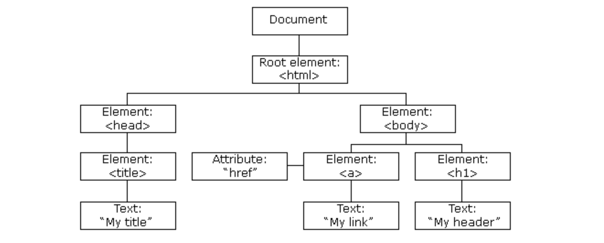
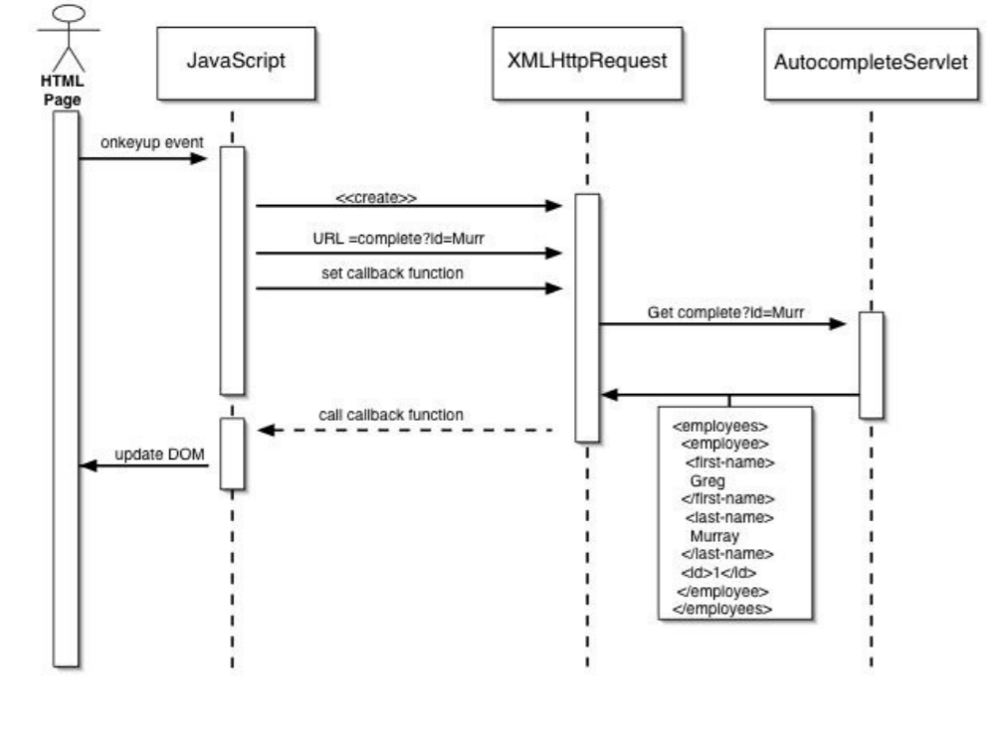
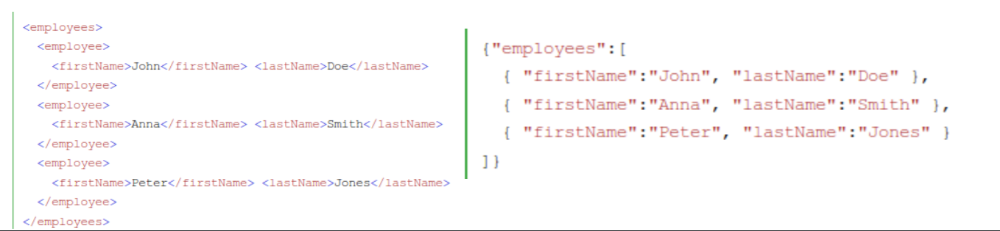
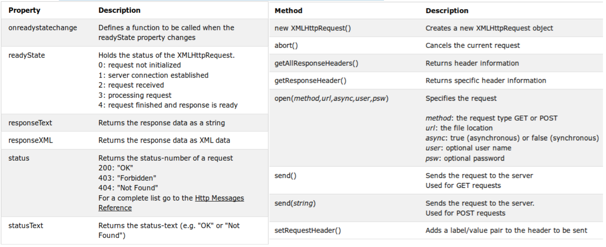
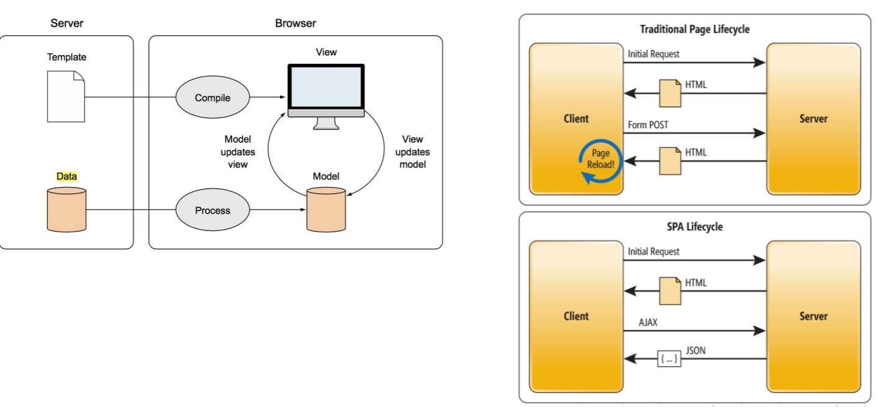
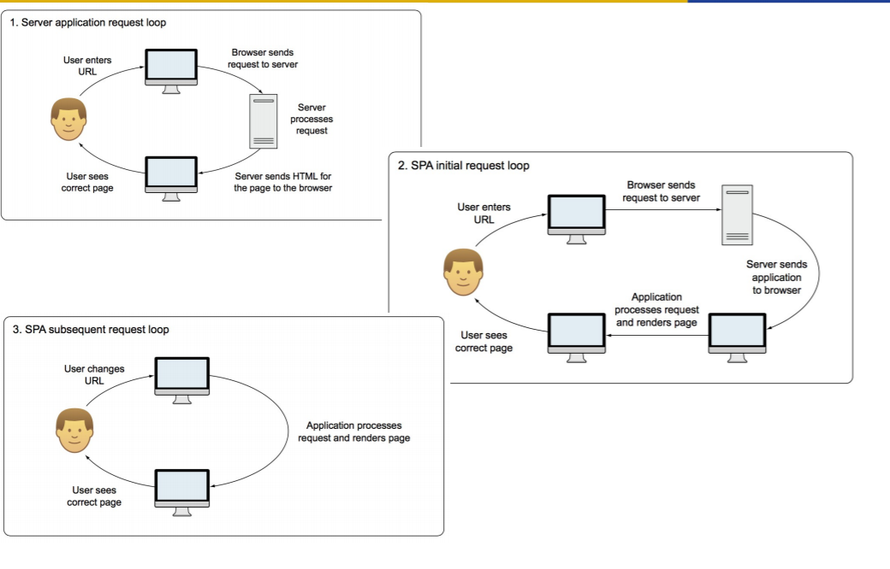

# JavaScript

<!-- TOC -->

- [1. 基本语法](#1-基本语法)
- [2. 对象](#2-对象)
- [3. JavaScript prototype（原型对象）](#3-javascript-prototype原型对象)
- [4. 函数](#4-函数)
    - [4.1. 函数提升（Hoisting）](#41-函数提升hoisting)
    - [4.2. 自调用函数](#42-自调用函数)
    - [4.3. 箭头函数](#43-箭头函数)
    - [4.4. Inner functions 内嵌函数](#44-inner-functions-内嵌函数)
    - [4.5. closure 闭包](#45-closure-闭包)
- [5. Javascript IO](#5-javascript-io)
- [6. DOM (Document Object Model)](#6-dom-document-object-model)
    - [6.1. 节点 node](#61-节点-node)
    - [6.2. HTML DOM 与 Browser 的对象](#62-html-dom-与-browser-的对象)
        - [6.2.1. HTML DOM 对象](#621-html-dom-对象)
        - [6.2.2. Brower 对象](#622-brower-对象)
    - [6.3. JavaScript and the DOM](#63-javascript-and-the-dom)
    - [6.4. DOM 实例操作](#64-dom-实例操作)
        - [6.4.1. 常用document对象的方法](#641-常用document对象的方法)
        - [6.4.2. 访问 HTML 元素（节点）](#642-访问-html-元素节点)
        - [6.4.3. 修改 HTML 改变元素、属性、样式和事件](#643-修改-html-改变元素属性样式和事件)
- [7. 网页缓存](#7-网页缓存)
    - [7.1. Cookies](#71-cookies)
    - [7.2. Web Storage](#72-web-storage)
- [8. Event-Driven Programming 事件驱动编程](#8-event-driven-programming-事件驱动编程)
    - [8.1. propagation 事件传播](#81-propagation-事件传播)
- [9. Regular Expressions 正则表达式](#9-regular-expressions-正则表达式)
    - [9.1. PCRE表达式全集](#91-pcre表达式全集)
    - [（?:正向|负向）表达](#正向负向表达)
    - [9.2. JS 中的正则表达式](#92-js-中的正则表达式)
    - [9.3. JS 正则表达的方法](#93-js-正则表达的方法)
    - [9.4. JS  modifier 标志](#94-js--modifier-标志)
- [10. JQuery](#10-jquery)
    - [10.1. jQuery Syntax 语法](#101-jquery-syntax-语法)
    - [10.2. jQuery Events 事件](#102-jquery-events-事件)
    - [10.3. jQuery Effects 效果](#103-jquery-effects-效果)
    - [10.4. jQuery DOM](#104-jquery-dom)
- [11. AJAX （Asynchronous 异步 Javascript And XML）](#11-ajax-asynchronous-异步-javascript-and-xml)
    - [11.1. XML and Json](#111-xml-and-json)
    - [11.2. XMLHTTP](#112-xmlhttp)
    - [11.3. jQuery AJAX 方法](#113-jquery-ajax-方法)
    - [11.4. Single Page Applications](#114-single-page-applications)

<!-- /TOC -->
## 1. 基本语法

在 HTML 中，JavaScript 代码必须位于 \<script> 与 \</script> 标签之间。

```html
<script>
document.getElementById("demo").innerHTML = "我的第一段 JavaScript";
</script>
```

\<head> 或 \<body> 中的 JavaScript
您能够在 HTML 文档中放置任意数量的脚本。

脚本可被放置与 HTML 页面的 \<body> 或 \<head> 部分中，或兼而有之。

可通过完整的 URL 或相对于当前网页的路径引用外部脚本：

本例使用完整的 URL 来链接至脚本：

```html
<script src="https://www.w3school.com.cn/js/myScript1.js"></script>
```

## 2. 对象

通过 JavaScript，您能够定义并创建自己的对象。

创建新对象有两种不同的方法：

- 定义并创建对象的实例

```javascript
person=new Object();
person.firstname="John";
person.lastname="Doe";
person.age=50;
person.eyecolor="blue";

// 或者
person={firstname:"John",lastname:"Doe",age:50,eyecolor:"blue"};
```

- 使用函数来定义对象，然后创建新的对象实例

```javascript
function person(firstname,lastname,age,eyecolor)
{
    this.firstname=firstname;
    this.lastname=lastname;
    this.age=age;
    this.eyecolor=eyecolor;
}
//在JavaScript中，this通常指向的是我们正在执行的函数本身，或者是指向该函数所属的对象（运行时）
var myFather=new person("John","Doe",50,"blue");
var myMother=new person("Sally","Rally",48,"green");

```

如果要添加方法则，只不过是在对象上附加函数。

在构造器函数内部定义对象的方法：

```javascript
function person(firstname,lastname,age,eyecolor)
{
    this.firstname=firstname;
    this.lastname=lastname;
    this.age=age;
    this.eyecolor=eyecolor;
    this.changeName=changeName;
    function changeName(name)
    {
        this.lastname=name;
    }
}
```

以上函数被称之为对象的**构造器（constructor）**，在一个已存在的对象构造器中是不能添加新的属性的：

```js
Person.nationality = "English";
```

要添加一个新的属性需要在在构造器函数中添加

## 3. JavaScript prototype（原型对象）

所有的 JavaScript 对象都会从一个 prototype（原型对象）中继承属性和方法：

Date 对象从 Date.prototype 继承。
Array 对象从 Array.prototype 继承。
Person 对象从 Person.prototype 继承。
所有 JavaScript 中的对象都是位于原型链顶端的 Object 的实例。

JavaScript 对象有一个指向一个原型对象的链。当试图访问一个对象的属性时，它不仅仅在该对象上搜寻，还会搜寻该对象的原型，以及该对象的原型的原型，依次层层向上搜索，直到找到一个名字匹配的属性或到达原型链的末尾。

Date 对象, Array 对象, 以及 Person 对象从 Object.prototype 继承。

有的时候我们想要在所有已经存在的对象添加新的属性或方法。

另外，有时候我们想要在对象的构造函数中添加属性或方法。

使用 prototype 属性就可以给对象的构造函数添加新的属性：

```js
function Person(first, last, age, eyecolor) {
  this.firstName = first;
  this.lastName = last;
  this.age = age;
  this.eyeColor = eyecolor;
}

Person.prototype.nationality = "English";
```

当然我们也可以使用 prototype 属性就可以给对象的构造函数添加新的方法：

```js
function Person(first, last, age, eyecolor) {
  this.firstName = first;
  this.lastName = last;
  this.age = age;
  this.eyeColor = eyecolor;
}
 
Person.prototype.name = function() {
  return this.firstName + " " + this.lastName;
};
```

## 4. 函数

除了正常的定义方式以外
JavaScript 函数还可以通过一个表达式定义。

函数表达式可以存储在变量中：

```js
var x = function (a, b) {return a * b};
```

在函数表达式存储在变量后，变量也可作为一个函数使用：

```js
var x = function (a, b) {return a * b};
var z = x(4, 3);
```

以上函数实际上是一个 匿名函数 (函数没有名称)。

函数存储在变量中，不需要函数名称，通常通过变量名来调用。

Function() 构造函数
在以上实例中，我们了解到函数通过关键字 function 定义。

函数同样可以通过内置的 JavaScript 函数构造器（Function()）定义。

```js
var myFunction = new Function("a", "b", "return a * b");

var x = myFunction(4, 3);
```

函数可作为一个值使用


```js
function myFunction(a, b) {
    return a * b;
}

var x = myFunction(4, 3) * 2;

```

### 4.1. 函数提升（Hoisting）

提升（Hoisting）是 JavaScript 默认将当前作用域提升到前面去的的行为。

提升（Hoisting）应用在变量的声明与函数的声明。

因此，函数可以在声明之前调用：

```js
myFunction(5);

function myFunction(y) {
    return y * y;
}
```

使用表达式定义函数时无法提升。

### 4.2. 自调用函数

函数表达式可以 "自调用"。

自调用表达式会自动调用。

如果表达式后面紧跟 () ，则会自动调用。

不能自调用声明的函数。

通过添加括号，来说明它是一个函数表达式：

```js
(function () {
    var x = "Hello!!";      // 我将调用自己
})();
```

### 4.3. 箭头函数

箭头函数
ES6 新增了箭头函数。

箭头函数表达式的语法比普通函数表达式更简洁。

```js

(参数1, 参数2, …, 参数N) => { 函数声明 }

(参数1, 参数2, …, 参数N) => 表达式(单一)
// 相当于：(参数1, 参数2, …, 参数N) =>{ return 表达式; }

//当只有一个参数时，圆括号是可选的：
(单一参数) => {函数声明}
单一参数 => {函数声明}


//没有参数的函数应该写成一对圆括号:
() => {函数声明}
实例
// ES5
var x = function(x, y) {
     return x * y;
}
 
// ES6
const x = (x, y) => x * y;
```

有的箭头函数都没有自己的 this。 不适合顶一个 对象的方法。

当我们使用箭头函数的时候，箭头函数会默认帮我们绑定外层 this 的值，所以在箭头函数中 this 的值和外层的 this 是一样的。

箭头函数是不能提升的，所以需要在使用之前定义。

使用 const 比使用 var 更安全，因为函数表达式始终是一个常量。

如果函数部分只是一个语句，则可以省略 return 关键字和大括号 {}，这样做是一个比较好的习惯:

```js
const x = (x, y) => { return x * y };
```

注意：IE11 及更早 IE 版本不支持箭头函数。

### 4.4. Inner functions 内嵌函数

全局变量的作用域是全局性的，即在整个JavaScript程序中，全局变量处处都在。

而在函数内部声明的变量，只在函数内部起作用。这些变量是局部变量，作用域是局部性的；函数的参数也是局部性的，只在函数内部起作用

计数器困境
设想下如果你想统计一些数值，且该计数器在所有函数中都是可用的。

你可以使用全局变量，函数设置计数器递增：

实例

```js
var counter = 0;

function add() {
   return counter += 1;
}

add();
add();
add();

// 计数器现在为 3
```

计数器数值在执行 add() 函数时发生变化。

但问题来了，页面上的任何脚本都能改变计数器，即便没有调用 add() 函数。

如果我在函数内声明计数器，如果没有调用函数将无法修改计数器的值：

```js
function add() {
    var counter = 0;
    return counter += 1;
}
 
add();
add();
add();
 
// 本意是想输出 3, 但事与愿违，输出的都是 1 !
```

以上代码将无法正确输出，每次我调用 add() 函数，计数器都会设置为 1。

JavaScript 内嵌函数可以解决该问题。

所有函数都能访问全局变量。  

实际上，在 JavaScript 中，所有函数都能访问它们上一层的作用域。

JavaScript 支持嵌套函数。嵌套函数可以访问上一层的函数变量。

该实例中，内嵌函数 plus() 可以访问父函数的 counter 变量：

```js
function add() {
    var counter = 0;
    function plus() {counter += 1;}
    plus();    
    return counter; 
}
```

如果我们能在外部访问 plus() 函数，这样就能解决计数器的困境。

我们同样需要确保 counter = 0 只执行一次。

我们需要闭包。

### 4.5. closure 闭包


```js
var add = (function () {
    var counter = 0;
    return function () {return counter += 1;}
})();
 
add();
add();
add();
```


变量 add 指定了函数自我调用的返回字值。

自我调用函数只执行一次。设置计数器为 0。并返回函数表达式。

add变量可以作为一个函数使用。非常棒的部分是它可以访问函数上一层作用域的计数器。

这个叫作 JavaScript 闭包。它使得函数拥有私有变量变成可能。

计数器受匿名函数的作用域保护，只能通过 add 方法修改。

**闭包是一种保护私有变量的机制，在函数执行时形成私有的作用域，保护里面的私有变量不受外界干扰。**
**直观的说就是形成一个不销毁的栈环境**

Here, the outer function (add()) has returned, and hence common sense would seem to dictate that its local variable no longer exist. But they do still exist, otherwise the adder function would be unable to work.

In actuality, whenever Javascript executes a function, a scope object is created to hold the local variables created within that function. It is initialized with any variables passed in as function parameters.
• This is similar to the global object that all global variables and functions live in, but with a couple of important differences: firstly, a brand new scope object is created every time a function starts executing, and secondly, unlike the global
object these scope objects cannot be directly accessed from your code.
• So when add() is called, a scope object is created with one property: a, which is the argument passed to the function. It then returns a newly created function.
• Normally JavaScript's garbage collector would clean up the scope object created for add() at this point, but the returned function maintains a reference back to that scope object. As a result, the scope object will not be garbage collected until there are no more references to the function object that add() returned.
• Normally JavaScript's garbage collector would clean up the scope object created for add() at this point, but the returned function maintains a reference back to that scope object. As a result, the scope object will not be garbage collected until there are no more references to the function object that add() returned.


## 5. Javascript IO

Standard output for JavaScript embedded in a browser is the window displaying thepage in which the JavaScript is embedded

• Writing to the document object is now consideredbad practice. For simple debugging use

```js
 console.log(“The result is: ”, result, “<br />”);
```

• To read, you can use alert or confirm. To get input you can use prompt.

• In NodeJS you can access stdin, stdout, and stderr through the process object. 

```js
const readline = require('readline');
const rl = readline.createInterface({
input: process.stdin,
output: process.stdout});
rl.question('What do you think of Node.js? ', (answer) => {
 console.log('Thank you for your feedback:', answer);
rl.close();});
```

## 6. DOM (Document Object Model)

***

"The Document Object Model is a platform- and language-neutral interface that will allow programs and scripts to dynamically access and update the content, structure and style of documents."

“W3C 文档对象模型 （DOM） 是中立于平台和语言的接口，它允许程序和脚本动态地访问和更新文档的内容、结构和样式。”

"The document can be further processed and the results of that processing can be incorporated back into the presented page."

文档对象模型 (DOM) 是HTML和XML文档的编程接口。它提供了对文档的结构化的表述，并定义了一种方式可以使从程序中对该结构进行访问，从而改变文档的结构，样式和内容。DOM 将文档解析为一个由节点和对象（包含属性和方法的对象）组成的结构集合。简言之，它会将web页面和脚本或程序语言连接起来。

W3C DOM 标准被分为 3 个不同的部分：

- 核心 DOM - 针对任何结构化文档的标准模型
- XML DOM - 针对 XML 文档的标准模型
- HTML DOM - 针对 HTML 文档的标准模型

其中 HTML DOM 是 ：

- HTML 的标准对象模型
- HTML 的标准编程接口
- W3C 标准

HTML DOM 定义了所有 HTML 元素的对象和属性，以及访问它们的方法。
换言之，HTML DOM 是关于如何获取、修改、添加或删除 HTML 元素的标准。

当网页被加载时，浏览器会创建页面的文档对象模型（Document Object Model）。

### 6.1. 节点 node

HTML DOM 模型被构造为对象的树
根据 W3C 的 HTML DOM 标准，HTML 文档中的所有内容都是节点：

- 整个文档是一个文档节点
- 每个 HTML 元素是元素节点
- HTML 元素内的文本是文本节点
- 每个 HTML 属性是属性节点
- 注释是注释节点

HTML DOM 将 HTML 文档视作树结构。这种结构被称为节点树：



通过 HTML DOM，树中的所有节点均可通过 JavaScript 进行访问。所有 HTML 元素（节点）均可被修改，也可以创建或删除节点。

所以JavaScript 获得了足够的能力来创建动态的 HTML。

- JavaScript 能够改变页面中的所有 HTML 元素
- JavaScript 能够改变页面中的所有 HTML 属性
- JavaScript 能够改变页面中的所有 CSS 样式
- JavaScript 能够对页面中的所有事件做出反应

节点树中的节点彼此拥有层级关系。

父（parent）、子（child）和同胞（sibling）等术语用于描述这些关系。父节点拥有子节点。同级的子节点被称为同胞（兄弟或姐妹）。

在节点树中，顶端节点被称为根（root）
每个节点都有父节点、除了根（它没有父节点）
一个节点可拥有任意数量的子
同胞是拥有相同父节点的节点
下面的图片展示了节点树的一部分，以及节点之间的关系：


DOM 处理中的常见错误是希望元素节点包含文本。

<u>在本例中：\<title>DOM 教程\</title>，元素节点 \<title>，包含值为 "DOM 教程" 的文本节点。

可通过节点的 innerHTML 属性来访问文本节点的值。
</u>

### 6.2. HTML DOM 与 Browser 的对象 

DOM树还包括浏览器中执行环境的节点

- Window object represents the window displaying a document
    – All properties are visible to all scripts
    – Global variables are properties of the Window object
- Document object represents the HTML document displayed
    – Accessed through document property of Window
    – Property arrays for forms, links, images, anchors, …

#### 6.2.1. HTML DOM 对象

Document 对象

>
    每个载入浏览器的 HTML 文档都会成为 Document 对象。

    Document 对象使我们可以从脚本中对 HTML 页面中的所有元素进行访问。

    *提示：Document 对象是 Window 对象的一部分，可通过 window.document 属性对其进行访问。*

```html
<html>
<head>
<script type="text/javascript">
function getValue()
  {
  var x=document.getElementById("myHeader")
  alert(x.innerHTML)
  }
</script>
</head>
<body>

<h1 id="myHeader" onclick="getValue()">This is a header</h1>
<p>Click on the header to alert its value</p>

</body>
</html>
````

**Element 对象**
***
在 HTML DOM 中，Element 对象表示 HTML 元素。

Element 对象可以拥有类型为元素节点、文本节点、注释节点的子节点。

NodeList 对象表示节点列表，比如 HTML 元素的子节点集合。

元素也可以拥有属性。属性是属性节点。

**Attr 对象**
***
在 HTML DOM 中，Attr 对象表示 HTML 属性。

HTML 属性始终属于 HTML 元素。

**Event 对象**
***
Event 对象代表事件的状态，比如事件在其中发生的元素、键盘按键的状态、鼠标的位置、鼠标按钮的状态。

事件通常与函数结合使用，函数不会在事件发生前被执行！

```html
<html>
<head>
<script type="text/javascript">
function whichButton(event)
{
var btnNum = event.button;
if (btnNum==2)
  {
  alert("您点击了鼠标右键！")
  }
else if(btnNum==0)
  {
  alert("您点击了鼠标左键！")
  }
else if(btnNum==1)
  {
  alert("您点击了鼠标中键！");
  }
else
  {
  alert("您点击了" + btnNum+ "号键，我不能确定它的名称。");
  }
}
</script>
</head>

<body onmousedown="whichButton(event)">
<p>请在文档中点击鼠标。一个消息框会提示出您点击了哪个鼠标按键。</p>
</body>

</html>
```

**Collection 对象**
***
getElementsByTagName() 方法返回 HTMLCollection 对象。

HTMLCollection 对象类似包含 HTML 元素的一个数组。

```js
var x = document.getElementsByTagName("p");
```

集合中的元素可以通过索引(以 0 为起始位置)来访问。

访问第二个 \<p> 元素可以是以下代码:

```js
y = x[1];
```

集合 **length** 属性常用于遍历集合中的元素。
修改所有 <p> 元素的背景颜色:

```js
var myCollection = document.getElementsByTagName("p");
var i;
for (i = 0; i < myCollection.length; i++) {
    myCollection[i].style.backgroundColor = "red";
}
```

注意：

*HTMLCollection 不是一个数组！
HTMLCollection 看起来可能是一个数组，但其实不是。
你可以像数组一样，使用索引来获取元素。
HTMLCollection 无法使用数组的方法： valueOf(), pop(), push(), 或 join() 。*

**NodeList 对象**

***

NodeList 对象是一个从文档中获取的节点列表 (集合) 。

NodeList 对象类似 HTMLCollection 对象。

一些旧版本浏览器中的方法（如：getElementsByClassName()）返回的是 NodeList 对象，而不是 HTMLCollection 对象。

所有浏览器的 childNodes 属性返回的是 NodeList 对象。

大部分浏览器的 querySelectorAll() 返回 NodeList 对象。

NodeList 对象 length 属性定义了节点列表中元素的数量。

注意：

*节点列表不是一个数组！
节点列表看起来可能是一个数组，但其实不是。
你可以像数组一样，使用索引来获取元素。
节点列表无法使用数组的方法： valueOf(), pop(), push(), 或 join()。*


**HTMLCollection 与 NodeList 的区别**：

HTMLCollection 是 HTML 元素的集合。

NodeList 是一个文档节点的集合。

NodeList 与 HTMLCollection 有很多类似的地方。

NodeList 与 HTMLCollection 都与数组对象有点类似，可以使用索引 (0, 1, 2, 3, 4, ...) 来获取元素。

NodeList 与 HTMLCollection 都有 length 属性。

HTMLCollection 元素可以通过 name，id 或索引来获取。

NodeList 只能通过索引来获取。

只有 NodeList 对象有包含属性节点和文本节点。

NodeList 是 DOM 快照，节点数量和类型的快照，就是对节点增删，NodeList 感觉不到，但是对节点内部内容修改，是可以感觉到的，比如修改innerHTML。

HtmlCollection 是 live 绑定的，节点的增删是敏感的。

#### 6.2.2. Brower 对象

**浏览器对象模型 Browser Object Model (BOM)** 允许 JavaScript 与浏览器对话。它可以做以下的事情：

- Type of browser
- User’s history
- Cookies
- Screen size
- Location (url)
- Geolocation
- Local (browser) storage

1. Window
 
    所有浏览器都支持 window 对象。它代表浏览器的窗口。

    所有全局 JavaScript 对象，函数和变量自动成为 window 对象的成员。

    全局变量是 window 对象的属性。

    全局函数是 window 对象的方法。

    甚至（HTML DOM 的）document 对象也是 window 对象属性：

    window 的<a href="https://www.w3school.com.cn/jsref/dom_obj_window.asp">属性与方法列表</a>
.
2. Navigator
    对象 Navigator 对象包含有关浏览器的信息。
.
3. Screen 对象
    Screen 对象包含有关客户端显示屏幕的信息。
.
4. History 对象
    History 对象包含用户（在浏览器窗口中）访问过的 URL。

    History 对象是 window 对象的一部分，可通过 window.history 属性对其进行访问。
.
5. Location 对象
    Location 对象包含有关当前 URL 的信息。
    Location 对象是 Window 对象的一个部分，可通过 window.location 属性来访问。
    实例：

    ```html
    <html>
    <head>
    <script type="text/javascript">
    function currLocation()
    {
    alert(window.location)
    }
    function newLocation()
    {
    window.location="/index.html"
    }
    </script>
    </head>

    <body>
    <input type="button" onclick="currLocation()" value="显示当前的 URL">
    <input type="button" onclick="newLocation()" value="改变 URL">
    </body>

    </html>
    ```

<a href="https://www.zhihu.com/question/33453164">DOM, DOCUMENT, BOM, WINDOW 有什么区别?</a>

### 6.3. JavaScript and the DOM

- Elements in HTML document correspond to nodes on the tree
- These nodes bind to JavaScript Element objects
- Attributes of elements become named properties of element node objects

    - ```<input type=“text” name=“address”>```
    - The object representing this node will have two properties

- type property will have value “text”
- name property will have value “address”
- Node objects can be addressed in several ways:
    - arrays defined in DOM 0
        - forms, elements, images, links,...
        - individual elements are specified by index
    - by name
    - by id


### 6.4. DOM 实例操作

#### 6.4.1. 常用document对象的方法

一些常用的对象集合

集合|描述
|-|-|
all[ ]|提供对文档中所有 HTML 元素的访问。
anchors[ ]|返回对文档中所有 Anchor 对象的引用。
applets[ ]	|返回对文档中所有 Applet 对象的引用。
forms[ ]|返回对文档中所有 Form 对象引用。
images[ ]|返回对文档中所有 Image 对象引用。
links[ ]|返回对文档中所有 Area 和 Link 对象引用。

一些常用的 HTML DOM 属性：
集合|描述
|-|-|
|innerHTML |节点（元素）的文本值
|parentNode |节点（元素）的父节点
|childNodes |节点（元素）的子节点
|attributes |节点（元素）的属性节点
body|提供对 \<body> 元素的直接访问。对于定义了框架集的文档，该属性引用最外层的\<frameset>。
cookie|设置或返回与当前文档有关的所有 cookie。
domain|返回当前文档的域名。
lastModified|返回文档被最后修改的日期和时间。
referrer|返回载入当前文档的文档的 URL。
title|返回当前文档的标题。
URL|返回当前文档的 URL。

一些常用的 HTML DOM 方法 (document对象的)：


方法|描述
|-|-|
getElementById()|返回带有指定 ID 的元素。
getElementsByTagName()|返回包含带有指定标签名称的所有元素的节点列表（集合/节点数组）。
getElementsByClassName()|返回包含带有指定类名的所有元素的节点列表。
appendChild()|把新的子节点添加到指定节点。
removeChild()|删除子节点。
replaceChild()|替换子节点。
insertBefore()|在指定的子节点前面插入新的子节点。
createAttribute()|创建属性节点。
createElement()|创建元素节点。
createTextNode()|创建文本节点。
getAttribute()|返回指定的属性值。
setAttribute()|把指定属性设置或修改为指定的值
open()|打开一个流，以收集来自任何 document.write() 或 document.writeln() 方法的输出。
write()|向文档写 HTML 表达式 或 JavaScript 代码。
writeln()|等同于 write() 方法，不同的是在每个表达式之后写一个换行符。
close()|关闭用 document.open() 方法打开的输出流，并显示选定的数据。

#### 6.4.2. 访问 HTML 元素（节点）

访问 HTML 元素等同于访问节点

您能够以不同的方式来访问 HTML 元素：

- 通过使用 getElementById() 方法

```html
<!DOCTYPE html>
<html>
<body>

<p id="intro">Hello World!</p>
<p>本例演示 <b>getElementById</b> 方法！</p>

<script>
x=document.getElementById("intro");
document.write("<p>来自 intro 段落的文本：" + x.innerHTML + "</p>");
</script>

</body>
</html>

```

- 通过使用 getElementsByTagName() 方法

```html
<!DOCTYPE html>
<html>
<body>

<p>Hello World!</p>

<div id="main">
<p>DOM 很有用！</p>
<p>本例演示 <b>getElementsByTagName</b> 方法。</p>
</div>

<script>
x=document.getElementById("main").getElementsByTagName("p");
document.write("div 中的第一段的文本: " + x[0].innerHTML);
</script>

</body>
</html>
```

- 通过使用 getElementsByClassName() 方法

``` js
document.getElementsByClassName("intro");
```

- Finding HTML Elements by CSS Selectors

If you want to find all HTML elements that match a specified CSS selector (id, class names, types, attributes, values of attributes, etc), use the querySelectorAll() method.

This example returns a list of all \<p> elements with class="intro".

```js
var x = document.querySelectorAll("p.intro");
```

- Finding HTML Elements by HTML Object Collections

This example finds the form element with id="frm1", in the forms collection, and displays all element values:

```js
var x = document.forms["frm1"];
var text = "";
var i;
for (i = 0; i < x.length; i++) {
  text += x.elements[i].value + "<br>";
}
document.getElementById("demo").innerHTML = text;
```

#### 6.4.3. 修改 HTML 改变元素、属性、样式和事件

修改 HTML DOM 意味着许多不同的方面：

改变 HTML 内容
改变 CSS 样式
改变 HTML 属性
创建新的 HTML 元素
删除已有的 HTML 元素
改变事件（处理程序）

**改变 HTML 内容**
改变元素内容的最简答的方法是使用 innerHTML 属性。

下面的例子改变一个 \<p> 元素的 HTML 内容

```html
<html>
<body>

<p id="p1">Hello world!</p>

<script>
function ChangeText()
{
document.getElementById("p1").innerHTML="New text!";
}
</script>

<input type="button" onclick="ChangeText()" value="Change text">

</body>
</html>
```

**改变 HTML 样式**
通过 HTML DOM，您能够访问 HTML 元素的样式对象。

下面的例子改变一个段落的 HTML 样式：

```html
<html>

<body>
<p id="p2">Hello world!</p>

<script>
document.getElementById("p2").style.color="blue";
</script>

</body>
</html>
```

**创建新的 HTML 元素**
如需向 HTML DOM 添加新元素，您首先必须创建该元素（元素节点），然后把它追加到已有的元素上

```html
<div id="d1">
<p id="p1">This is a paragraph.</p>
<p id="p2">This is another paragraph.</p>
</div>

<script>
var para=document.createElement("p");
var node=document.createTextNode("This is new.");
para.appendChild(node);

var element=document.getElementById("d1");
element.appendChild(para);
</script>
```
如果不希望如此，您可以使用 insertBefore() 方法

**删除已有的 HTML 元素**
如需删除 HTML 元素，您必须清楚该元素的父元素：

```html
<div id="div1">
<p id="p1">This is a paragraph.</p>
<p id="p2">This is another paragraph.</p>
</div>
<script>
var parent=document.getElementById("div1");
var child=document.getElementById("p1");
parent.removeChild(child);
</script>
```

**替换 HTML 元素**
如需替换 HTML DOM 中的元素，请使用 replaceChild() 方法：

```html
<div id="div1">
<p id="p1">This is a paragraph.</p>
<p id="p2">This is another paragraph.</p>
</div>

<script>
var para=document.createElement("p");
var node=document.createTextNode("This is new.");
para.appendChild(node);

var parent=document.getElementById("div1");
var child=document.getElementById("p1");
parent.replaceChild(para,child);
</script>
```

## 7. 网页缓存

### 7.1. Cookies

类型为“小型文本文件”，是某些网站为了辨别用户身份，进行Session跟踪而储存在用户本地终端上的数据（通常经过加密），由用户客户端计算机暂时或永久保存的信息

Cookie 并不是它的原意“甜饼”的意思, 而是一个保存在客户机中的简单的文本文件, 这个文件与特定的 Web 文档关联在一起, 保存了该客户机访问这个Web 文档时的信息, 当客户机再次访问这个 Web 文档时这些信息可供该文档使用。由于“Cookie”具有可以保存在客户机上的神奇特性, 因此它可以帮助我们实现记录用户个人信息的功能, 而这一切都不必使用复杂的CGI等程序 

- A cookie is a small text file containing key-value pairs that is stored in the browser.
- The cookie will be sent with a request to the website it is associated with (and only that
website).
- Cookies for the current web-page are accessible through the DOM/BOM.
- Cookies are specified with an expiry date or will be deleted when the broswer is closed

Cookie 的作用就是用于解决 "如何记录客户端的用户信息":

当用户访问 web 页面时，他的名字可以记录在 cookie 中。
在用户下一次访问该页面时，可以在 cookie 中读取用户访问记录。
Cookie 以名/值对形式存储，如下所示:

```c
username=John Doe
```

document.cookie 将以字符串的方式返回所有的 cookie，类型格式： cookie1=value; cookie2=value; cookie3=value;

document.cookie 属性看起来像一个普通的文本字符串，其实它不是。

即使您在 document.cookie 中写入一个完整的 cookie 字符串, 当您重新读取该 cookie 信息时，cookie 信息是以名/值对的形式展示的。

如果您设置了新的 cookie，旧的 cookie 不会被覆盖。 新 cookie 将添加到 document.cookie 中，所以如果您重新读取document.cookie，您将获得如下所示的数据：

cookie1=value; cookie2=value;

设置 cookie 值的函数

``` js
function setCookie(cname,cvalue,exdays)
{
  var d = new Date();
  d.setTime(d.getTime()+(exdays*24*60*60*1000));
  var expires = "expires="+d.toGMTString();
  document.cookie = cname + "=" + cvalue + "; " + expires;
}
```

获取 cookie 值的函数

```js
function getCookie(cname)
{
  var name = cname + "=";
  var ca = document.cookie.split(';');
  for(var i=0; i<ca.length; i++) 
  {
    var c = ca[i].trim();
    if (c.indexOf(name)==0) return c.substring(name.length,c.length);
  }
  return "";
}
```

完整实例

```js
function setCookie(cname,cvalue,exdays){
    var d = new Date();
    d.setTime(d.getTime()+(exdays*24*60*60*1000));
    var expires = "expires="+d.toGMTString();
    document.cookie = cname+"="+cvalue+"; "+expires;
}
function getCookie(cname){
    var name = cname + "=";
    var ca = document.cookie.split(';');
    for(var i=0; i<ca.length; i++) {
        var c = ca[i].trim();
        if (c.indexOf(name)==0) { return c.substring(name.length,c.length); }
    }
    return "";
}
function checkCookie(){
    var user=getCookie("username");
    if (user!=""){
        alert("欢迎 " + user + " 再次访问");
    }
    else {
        user = prompt("请输入你的名字:","");
          if (user!="" && user!=null){
            setCookie("username",user,30);
        }
    }
}
```

### 7.2. Web Storage

使用HTML5可以在本地存储用户的浏览数据。

早些时候,本地存储使用的是 cookie。但是Web 存储需要更加的安全与快速. 这些数据不会被保存在服务器上，但是这些数据只用于用户请求网站数据上.它也可以存储大量的数据，而不影响网站的性能.

数据以 键/值 对存在, web网页的数据只允许该网页访问使用。

客户端存储数据的两个对象为：

localStorage - 用于长久保存整个网站的数据，保存的数据没有过期时间，直到手动去除。
sessionStorage - 用于临时保存同一窗口(或标签页)的数据，在关闭窗口或标签页之后将会删除这些数据。

在使用 web 存储前,应检查浏览器是否支持 localStorage 和
sessionStorage:

```js
if(typeof(Storage)!=="undefined")
{
    // 是的! 支持 localStorage  sessionStorage 对象!
    // 一些代码.....
} else {
    // 抱歉! 不支持 web 存储。
}
```

不管是 localStorage，还是 sessionStorage，可使用的API都相同，常用的有如下几个（以localStorage为例）：

保存数据：localStorage.setItem(key,value);
读取数据：localStorage.getItem(key);
删除单个数据：localStorage.removeItem(key);
删除所有数据：localStorage.clear();
得到某个索引的key：localStorage.key(index);
提示: 键/值对通常以字符串存储，你可以按自己的需要转换该格式。


**localStorage 对象**
localStorage 对象存储的数据没有时间限制。第二天、第二周或下一年之后，数据依然可用。

```js
localStorage.sitename="菜鸟教程";
document.getElementById("result").innerHTML="网站名：" + localStorage.sitename;
```

**sessionStorage 对象**
sessionStorage 方法针对一个 session 进行数据存储。当用户关闭浏览器窗口后，数据会被删除。

如何创建并访问一个 sessionStorage：

```js
if (sessionStorage.clickcount)
{
    sessionStorage.clickcount=Number(sessionStorage.clickcount)+1;
}
else
{
    sessionStorage.clickcount=1;
}
document.getElementById("result").innerHTML="在这个会话中你已经点击了该按钮 " + sessionStorage.clickcount + " 次 ";
```

运用实例

```js
/保存数据  
function save(){  
    var site = new Object;
    site.keyname = document.getElementById("keyname").value;
    site.sitename = document.getElementById("sitename").value;  
    site.siteurl = document.getElementById("siteurl").value;
    var str = JSON.stringify(site); // 将对象转换为字符串
    localStorage.setItem(site.keyname,str);  
    alert("保存成功");
}  
//查找数据  
function find(){  
    var search_site = document.getElementById("search_site").value;  
    var str = localStorage.getItem(search_site);  
    var find_result = document.getElementById("find_result");
    var site = JSON.parse(str);  
    find_result.innerHTML = search_site + "的网站名是：" + site.sitename + "，网址是：" + site.siteurl;  
}
```

## 8. Event-Driven Programming 事件驱动编程

Event-driven programming or event-based programming

- programming paradigm in which the flow of the program is determined by sensor outputs or user actions (mouse clicks, key presses) or messages from other programs

- not new - from hardware interrupts to multi-process operating systems to distributed programming to Java listeners to Exceptions

两个类型的编程的举例：

- Fundamental to web-based programming
    - client-server model
    - stateless programming
    - controlled from browser (user) end
- Event driven programming drives many of the technologies we will cover in this unit:
    - Sockets
    - AJAX
    - Javascript callbacks

鼠标事件|键盘事件|表单事件|文档/窗口事件
|-|-|-|-|
click|keypress|submit|load
dblclick|keydown|change|resize
mouseenter|keyup|focus|scroll
mouseleave|  |blur|unload
hover |

### 8.1. propagation 事件传播

一个事件发生后，会在子元素和父元素之间传播（propagation）。这种传播分成三个阶段。

第一阶段：从window对象传导到目标节点（上层传到底层），称为“捕获阶段”（capture phase）。
第二阶段：在目标节点上触发，称为“目标阶段”（target phase）。
第三阶段：从目标节点传导回window对象（从底层传回上层），称为“冒泡阶段”（bubbling phase）。

这种三阶段的传播模型，使得同一个事件会在多个节点上触发。

事件捕获：当使用事件捕获时，父级元素先触发，子元素后触发  
事件冒泡：当使用事件冒泡时，子级元素先触发，父元素后触发

**知识点太多了，爷现在理解了，就不写下来了。。。。。如果我以后忘了，就点下面这个链接，也许大概一定是可以回忆起来的。。。**
<a href="https://javascript.ruanyifeng.com/dom/event.html#toc0">js中dom的事件模型的详细概述，一定要看！！！</a>


## 9. Regular Expressions 正则表达式

正则表达式使用单个字符串来描述、匹配一系列符合某个句法规则的字符串。在很多文本编辑器里，正则表达式通常被用来检索、替换那些符合某个模式的文本。

> Regular expressions are used to specify patterns in strings

一个正则表达式通常被称为一个模式（pattern），为用来描述或者匹配一系列符合某个句法规则的字符串。例如：Handel、Händel和Haendel这三个字符串，都可以由H(a|ä|ae)ndel这个模式来描述。大部分正则表达式的形式都有如下的结构：

**选择**
竖线|代表选择（即或集），具有最低优先级。例如gray|grey可以匹配grey或gray。

**数量限定**
某个字符后的数量限定符用来限定前面这个字符允许出现的个数。最常见的数量限定符包括+、?和*（不加数量限定则代表出现一次且仅出现一次）：

加号 **+** 代表前面的字符必须至少出现一次。（1次或多次）。例如，goo+gle可以匹配google、gooogle、goooogle等;

问号 **?** 代表前面的字符最多只可以出现一次。（0次或1次）。例如，colou?r可以匹配color或者colour;

星号 **\*** 代表前面的字符可以不出现，也可以出现一次或者多次。（0次、1次或多次）。例如，0*42可以匹配42、042、0042、00042等。

**匹配**
圆括号()可以用来定义操作符的范围和优先度。例如，gr(a|e)y等价于gray|grey，(grand)?father匹配father和grandfather。
上述这些构造子都可以自由组合，因此H(ae?|ä)ndel和H(a|ae|ä)ndel是相同的，表示{"Handel", "Haendel", "Händel"}。

精确的语法可能因不同的工具或程序而异。

### 9.1. PCRE表达式全集

字符|描述
-|-|
\ |将下一个字符标记为一个特殊字符（File Format Escape，清单见本表）、或一个原义字符（Identity Escape，有^\$()*+?.[\{\|共计12个)、或一个向后引用（backreferences）、或一个八进制转义符。例如，“n”匹配字符“n”。“\n”匹配一个换行符。序列“\\”匹配“\”而“\(”则匹配“(”。
^|匹配输入字符串的开始位置。如果设置了RegExp对象的Multiline属性，^也匹配“\n”或“\r”之后的位置。
$|	匹配输入字符串的结束位置。如果设置了RegExp对象的Multiline属性，$也匹配“\n”或“\r”之前的位置。
*	|匹配前面的子表达式零次或多次。例如，zo*能匹配“z”、“zo”以及“zoo”。*等价于{0,}。
+	|匹配前面的子表达式一次或多次。例如，“zo+”能匹配“zo”以及“zoo”，但不能匹配“z”。+等价于{1,}。
?	|匹配前面的子表达式零次或一次。例如，“do(es)?”可以匹配“does”中的“do”和“does”。?等价于{0,1}。
{n}	|n是一个非负整数。匹配确定的n次。例如，“o{2}”不能匹配“Bob”中的“o”，但是能匹配“food”中的两个o。
{n,}|n是一个非负整数。至少匹配n次。例如，“o{2,}”不能匹配“Bob”中的“o”，但能匹配“foooood”中的所有o。“o{1,}”等价于“o+”。“o{0,}”则等价于“o*”。
{n,m}|	m和n均为非负整数，其中n<=m。最少匹配n次且最多匹配m次。例如，“o{1,3}”将匹配“fooooood”中的前三个o。“o{0,1}”等价于“o?”。请注意在逗号和两个数之间不能有空格。
?|非贪心量化（Non-greedy quantifiers）：当该字符紧跟在任何一个其他重复修饰符（*,+,?，{n}，{n,}，{n,m}）后面时，匹配模式是非贪婪的。非贪婪模式尽可能少的匹配所搜索的字符串，而默认的贪婪模式则尽可能多的匹配所搜索的字符串。例如，对于字符串“oooo”，“o+?”将匹配单个“o”，而“o+”将匹配所有“o”。
.|匹配除“\r”“\n”之外的任何单个字符。要匹配包括“\r”“\n”在内的任何字符，请使用像“(.\|\r\|\n)”的模式。
(pattern)|匹配pattern并获取这一匹配的子字符串。该子字符串用于向后引用。所获取的匹配可以从产生的Matches集合得到，在VBScript中使用SubMatches集合，在JScript中则使用\$0…\$9属性。要匹配圆括号字符，请使用“\\( ”或“\\)”。可带数量后缀。
(?:pattern)|匹配pattern但不获取匹配的子字符串（shy groups），也就是说这是一个非获取匹配，不存储匹配的子字符串用于向后引用。这在使用或字符“(|)”来组合一个模式的各个部分是很有用。例如“industr(?:y|ies)”就是一个比“industry|industries”更简略的表达式。
(?=pattern)|正向肯定预查（look ahead positive assert），在任何匹配pattern的字符串开始处匹配查找字符串。这是一个非获取匹配，也就是说，该匹配不需要获取供以后使用。例如，“Windows(?=95|98|NT|2000)”能匹配“Windows2000”中的“Windows”，但不能匹配“Windows3.1”中的“Windows”。预查不消耗字符，也就是说，在一个匹配发生后，在最后一次匹配之后立即开始下一次匹配的搜索，而不是从包含预查的字符之后开始。
(?!pattern)|正向否定预查（negative assert），在任何不匹配pattern的字符串开始处匹配查找字符串。这是一个非获取匹配，也就是说，该匹配不需要获取供以后使用。例如“Windows(?!95|98|NT|2000)”能匹配“Windows3.1”中的“Windows”，但不能匹配“Windows2000”中的“Windows”。预查不消耗字符，也就是说，在一个匹配发生后，在最后一次匹配之后立即开始下一次匹配的搜索，而不是从包含预查的字符之后开始
(?<=pattern)|反向（look behind）肯定预查，与正向肯定预查类似，只是方向相反。例如，“(?<=95|98|NT|2000)Windows”能匹配“2000Windows”中的“Windows”，但不能匹配“3.1Windows”中的“Windows”。
(?<!pattern)|反向否定预查，与正向否定预查类似，只是方向相反。例如“(?<!95|98|NT|2000)Windows”能匹配“3.1Windows”中的“Windows”，但不能匹配“2000Windows”中的“Windows”。
x\|y|没有包围在()里，其范围是整个正则表达式。例如，“z\|food”能匹配“z”或“food”。“(?:z\|f)ood”则匹配“zood”或“food”。
[xyz]|字符集合（character class）。匹配所包含的任意一个字符。例如，“[abc]”可以匹配“plain”中的“a”。特殊字符仅有反斜线\保持特殊含义，用于转义字符。其它特殊字符如星号、加号、各种括号等均作为普通字符。脱字符^如果出现在首位则表示负值字符集合；如果出现在字符串中间就仅作为普通字符。连字符 - 如果出现在字符串中间表示字符范围描述；如果如果出现在首位（或末尾）则仅作为普通字符。右方括号应转义出现，也可以作为首位字符出现。
[^xyz]|排除型字符集合（negated character classes）。匹配未列出的任意字符。例如，“[^abc]”可以匹配“plain”中的“plin”。
[a-z]|字符范围。匹配指定范围内的任意字符。例如，“[a-z]”可以匹配“a”到“z”范围内的任意小写字母字符。
[^a-z]|排除型的字符范围。匹配任何不在指定范围内的任意字符。例如，“[^a-z]”可以匹配任何不在“a”到“z”范围内的任意字符。
[:name:]|增加命名字符类（named character class）[注 1]中的字符到表达式。只能用于方括号表达式。
[=elt=]|增加当前locale下排序（collate）等价于字符“elt”的元素。例如，[=a=]可能会增加ä、á、à、ă、ắ、ằ、ẵ、ẳ、â、ấ、ầ、ẫ、ẩ、ǎ、å、ǻ、ä、ǟ、ã、ȧ、ǡ、ą、ā、ả、ȁ、ȃ、ạ、ặ、ậ、ḁ、ⱥ、ᶏ、ɐ、ɑ 。只能用于方括号表达式。
[.elt.]|增加排序元素（collation element）elt到表达式中。这是因为某些排序元素由多个字符组成。例如，29个字母表的西班牙语， "CH"作为单个字母排在字母C之后，因此会产生如此排序“cinco, credo, chispa”。只能用于方括号表达式。
\b|匹配一个单词边界，也就是指单词和空格间的位置。例如，“er\b”可以匹配“never”中的“er”，但不能匹配“verb”中的“er”。
\B|匹配非单词边界。“er\B”能匹配“verb”中的“er”，但不能匹配“never”中的“er”。
\cx|匹配由x指明的控制字符。x的值必须为A-Z或a-z之一。否则，将c视为一个原义的“c”字符。控制字符的值等于x的值最低5比特（即对3210进制的余数）。例如，\cM匹配一个Control-M或回车符。\ca等效于\u0001, \cb等效于\u0002, 等等…
\d|匹配一个数字字符。等价于[0-9]。注意Unicode正则表达式会匹配全角数字字符。
\D|匹配一个非数字字符。等价于[^0-9]。
\f|匹配一个换页符。等价于\x0c和\cL。
\n|匹配一个换行符。等价于\x0a和\cJ。
\r|匹配一个回车符。等价于\x0d和\cM。
\s|匹配任何空白字符，包括空格、制表符、换页符等等。等价于[ \f\n\r\t\v]。注意Unicode正则表达式会匹配全角空格符。
\S|匹配任何非空白字符。等价于[^ \f\n\r\t\v]。
\t|匹配一个制表符。等价于\x09和\cI。
\v|匹配一个垂直制表符。等价于\x0b和\cK。
\w|匹配包括下划线的任何单词字符。等价于“[A-Za-z0-9_]”。注意Unicode正则表达式会匹配中文字符。
\W|匹配任何非单词字符。等价于“[^A-Za-z0-9_]”。
\xnn|十六进制转义字符序列。匹配两个十六进制数字nn表示的字符。例如，“\x41”匹配“A”。“\x041”则等价于“\x04&1”。正则表达式中可以使用ASCII编码。.
\num|向后引用（back-reference）一个子字符串（substring），该子字符串与正则表达式的第num个用括号围起来的捕捉群（capture group）子表达式（subexpression）匹配。其中num是从1开始的十进制正整数，其上限可能是9[注 2]、31[注 3]、99甚至无限[注 4]。例如：“(.)\1”匹配两个连续的相同字符。
\n|标识一个八进制转义值或一个向后引用。如果\n之前至少n个获取的子表达式，则n为向后引用。否则，如果n为八进制数字（0-7），则n为一个八进制转义值。
\nm|3位八进制数字，标识一个八进制转义值或一个向后引用。如果\nm之前至少有nm个获得子表达式，则nm为向后引用。如果\nm之前至少有n个获取，则n为一个后跟文字m的向后引用。如果前面的条件都不满足，若n和m均为八进制数字（0-7），则\nm将匹配八进制转义值nm。
\nml|如果n为八进制数字（0-3），且m和l均为八进制数字（0-7），则匹配八进制转义值nml。
\un|Unicode转义字符序列。其中n是一个用四个十六进制数字表示的Unicode字符。例如，\u00A9匹配著作权符号（©）。

### （?:正向|负向）表达

比如我们要匹配下面这个语句中的“<”后面不是“br>”的“<”：

```html
<div>line1</div> <br> 
```

这个正则表达式这么写：

```js
/<(?!br>)/
```

如果我们只匹配后面为“br>”的“<”呢，正则表达式这么写：

```js
/<(?=br>)/
```

这两种语法在正则表达式中称之为：
(?=pattern) 零宽正向先行断言
(?!pattern) 零宽负向先行断言
断言的意思是判断是否满足，零宽的意思是它只匹配一个位置，如同^匹配开头，$匹配末尾一样，只是一个位置，不返回匹配到的字符，正向表示需要满足pattern，负向表示不能满足pattern，先行表示这个断言语句现在期望返回的匹配字符的后面。

我们在来假设一个需求，如果我要匹配不在“\<br>”中的“>”，也就是说只匹配“\<div>”、“\</div>”中的“>”，而不匹配“\<br>”中的“>”，那么要写的正则表达式就是“匹配前面没有'\<br'的'>'”，写法如下：
/(?<!<br)>/

对应的如果只匹配“\<br>”中的“>”，而不匹配“\<div>”或者“\</div>”中的“>”，就这么写：
/(?<=<br)>/

这两种语法在正则表达式中称之为：
(?<=pattern) 零宽正向后行断言
(?<!pattern) 零宽负向后行断言
与先行断言的意思一样，只不过后行断言写在需要匹配的字符的前面，表示如果前面的字符满足pattern就返回。
但是很遗憾的是javascript中并不支持这种后行断言。


### 9.2. JS 中的正则表达式

<a href="https://developer.mozilla.org/zh-CN/docs/Web/JavaScript/Guide/Regular_Expressions">JS 中的正则表达式</a>

在 JavaScript中，正则表达式也是对象。这些模式被用于 RegExp 的 exec 和 test 方法, 以及 String 的 match、matchAll、replace、search 和 split 方法。本章介绍 JavaScript 正则表达式。

在JS中你可以使用以下两种方法构建一个正则表达式：

使用一个正则表达式字面量，其由包含在斜杠之间的模式组成，如下所示：

```js
var re = /ab+c/;
```

脚本加载后，正则表达式字面量就会被编译。当正则表达式保持不变时，使用此方法可获得更好的性能。

或者调用RegExp对象的构造函数，如下所示：

```js
var re = new RegExp("ab+c");
```

在脚本运行过程中，用构造函数创建的正则表达式会被编译。如果正则表达式将会改变，或者它将会从用户输入等来源中动态地产生，就需要使用构造函数来创建正则表达式。

### 9.3. JS 正则表达的方法

正则表达式可以被用于 RegExp 的 exec 和 test 方法以及 String 的 match、replace、search 和 split 方法。这些方法在 JavaScript 手册中有详细的解释。

**使用正则表达式的方法**
方法|描述
-|-
exec|一个在字符串中执行查找匹配的RegExp方法，它返回一个数组（未匹配到则返回 null）。
test|一个在字符串中测试是否匹配的RegExp方法，它返回 true 或 false。
match|一个在字符串中执行查找匹配的String方法，它返回一个数组，在未匹配到时会返回 null。
matchAll|一个在字符串中执行查找所有匹配的String方法，它返回一个迭代器（iterator）。
search|一个在字符串中测试匹配的String方法，它返回匹配到的位置索引，或者在失败时返回-1。
replace|一个在字符串中执行查找匹配的String方法，并且使用替换字符串替换掉匹配到的子字符串。
split|一个使用正则表达式或者一个固定字符串分隔一个字符串，并将分隔后的子字符串存储到数组中的 String 方法。
当你想要知道在一个字符串中的一个匹配是否被找到，你可以使用 test 或 search 方法；想得到更多的信息（但是比较慢）则可以使用 exec 或 match 方法。如果你使用exec 或 match 方法并且匹配成功了，那么这些方法将返回一个数组并且更新相关的正则表达式对象的属性和预定义的正则表达式对象（详见下）。如果匹配失败，那么 exec 方法返回 null（也就是false）。
当你想要知道在一个字符串中的一个匹配是否被找到，你可以使用 test 或 search 方法；想得到更多的信息（但是比较慢）则可以使用 exec 或 match 方法。如果你使用exec 或 match 方法并且匹配成功了，那么这些方法将返回一个数组并且更新相关的正则表达式对象的属性和预定义的正则表达式对象（详见下）。如果匹配失败，那么 exec 方法返回 null（也就是false）。

在接下来的例子中，脚本将使用exec方法在一个字符串中查找一个匹配。

```js
var myRe = /d(b+)d/g;
var myArray = myRe.exec("cdbbdbsbz");
```

如果你不需要访问正则表达式的属性，这个脚本通过另一个方法来创建myArray：

```js
var myArray = /d(b+)d/g.exec("cdbbdbsbz");
// similar to "cdbbdbsbz".match(/d(b+)d/g); however,
// "cdbbdbsbz".match(/d(b+)d/g) outputs Array [ "dbbd" ], while 
// /d(b+)d/g.exec('cdbbdbsbz') outputs Array [ "dbbd", "bb", index: 1, input: "cdbbdbsbz" ].
```

如果你想通过一个字符串构建正则表达式，那么这个脚本还有另一种方法：

```js
var myRe = new RegExp("d(b+)d", "g");
var myArray = myRe.exec("cdbbdbsbz");
```

**正则表达式执行后的返回信息**:

对象|属性或索引	|描述|在例子中对应的值
|-|-|-|-
myArray||匹配到的字符串和所有被记住的子字符串。|["dbbd", "bb"]
同上|index|在输入的字符串中匹配到的以0开始的索引值。|1
同上|input|初始字符串。|"cdbbdbsbz"
同上|[0]|匹配到的所有字符串（并不是匹配后记住的字符串）。注：原文"The last matched characters."，应该是原版错误。匹配到的最终字符。|"dbbd"
myRe|lastIndex|下一个匹配的索引值。（这个属性只有在使用g参数时可用在 通过参数进行高级搜索 一节有详细的描述.)|5
同上|source|模式文本。在正则表达式创建时更新，不执行。|"d(b+)d"

### 9.4. JS  modifier 标志

正则表达式标志
标志|描述
-|-
g|全局搜索。
i|不区分大小写搜索。
m|多行搜索。
s|允许 . 匹配换行符。
u|使用unicode码的模式进行匹配。
y|执行“粘性”搜索,匹配从目标字符串的当前位置开始，可以使用y标志。


为了在正则表达式中包含标志，请使用以下语法：

```js
var re = /pattern/flags;
```

或者

```js
var re = new RegExp("pattern", "flags");
```

值得注意的是，标志是一个正则表达式的一部分，它们在接下来的时间将不能添加或删除。

## 10. JQuery

jQuery 极大地简化了 JavaScript 编程。

jQuery是一个JavaScript函数库。

jQuery是一个轻量级的"写的少，做的多"的JavaScript库。

jQuery库包含以下功能：

- HTML 元素选取
- HTML 元素操作
- CSS 操作
- HTML 事件函数
- JavaScript 特效和动画
- HTML DOM 遍历和修改
- AJAX
- Utilities

### 10.1. jQuery Syntax 语法

jQuery 库是一个 JavaScript 文件，您可以使用 HTML 的 \<script> 标签引用它：

将下载的文件放在网页的同一目录下，就可以使用jQuery。

```html
<head>
<script src="jquery-1.10.2.min.js"></script>
</head>
```

如果您不希望下载并存放 jQuery，那么也可以通过 CDN（内容分发网络） 引用它。(Staticfile CDN)

```html
<head>
<script src="https://cdn.staticfile.org/jquery/1.10.2/jquery.min.js">
</script>
</head>
```

jQuery 语法是通过选取 HTML 元素，并对选取的元素执行某些操作。

基础语法：

```js
 $(selector).action()
```

- 美元符号定义 jQuery
- 选择符（selector）"查询"和"查找" HTML 元素
- jQuery 的 action() 执行对元素的操作

实例:

```html
<!DOCTYPE html>
<html>
<head>
<meta charset="utf-8"> 
<title>菜鸟教程(runoob.com)</title> 
<script src="https://cdn.staticfile.org/jquery/2.0.0/jquery.min.js">
</script>
<script>
$(document).ready(function(){
  $("button").click(function(){
    $("p").hide();
  });
});
</script>
</head>

<body>
<h2>这是一个标题</h2>
<p>这是一个段落。</p>
<p>这是另一个段落。</p>
<button>点我</button>
</body>
</html>
```

选择器的细节：

语法|描述
-|-|
\$("*")|选取所有元素
\$(this)|选取当前 HTML 元素
\$("p.intro")|选取 class 为 intro 的 \<p> 元素
\$("p:first")|选取第一个 \<p> 元素
\$("ul li:first")|选取第一个 \<ul> 元素的第一个 \<li> 元素
\$("ul li:first-child")|选取每个 \<ul> 元素的第一个 \<li> 元素
\$("[href]")|选取带有 href 属性的元素
\$("a[target='_blank']")|选取所有 target 属性值等于 "_blank" 的 \<a> 元素
\$("a[target!='_blank']")|选取所有 target 属性值不等于 "_blank" 的 \<a> 元素
\$(":button")|选取所有 type="button" 的 \<input> 元素 和 \<button> 元素
\$("tr:even")|选取偶数位置的 \<tr> 元素
\$("tr:odd")|选取奇数位置的 \<tr> 元素

### 10.2. jQuery Events 事件

鼠标事件|键盘事件|表单事件|文档/窗口事件
|-|-|-|-|
click|keypress|submit|load
dblclick|keydown|change|resize
mouseenter|keyup|focus|scroll
mouseleave|  |blur|unload
hover |

**常用的 jQuery 事件方法**
\$(document).ready()

\$(document).ready() 方法允许我们在文档完全加载完后执行函数, **您也许已经注意到在我们的实例中的所有 jQuery 函数位于一个 document ready 函数中**：

```js
$(document).ready(function(){
 
   // 开始写 jQuery 代码...
 
});
```

这是为了防止文档在完全加载（就绪）之前运行 jQuery 代码，即在 DOM 加载完成后才可以对 DOM 进行操作。

如果在文档没有完全加载之前就运行函数，操作可能失败。下面是两个具体的例子：

- 试图隐藏一个不存在的元素
- 获得未完全加载的图像的大小

click()
click() 方法是当按钮点击事件被触发时会调用一个函数。

该函数在用户点击 HTML 元素时执行。

在下面的实例中，当点击事件在某个 \<p> 元素上触发时，隐藏当前的 \<p> 元素：

```js
$("p").click(function(){
  $(this).hide();
});
```

mouseenter()
当鼠标指针穿过元素时，会发生 mouseenter 事件。

mouseenter() 方法触发 mouseenter 事件，或规定当发生 mouseenter 事件时运行的函数：

```js
$("#p1").mouseenter(function(){
    alert('您的鼠标移到了 id="p1" 的元素上!');
});
```

**The on() method allows multiple events to be
assigned to a given selector**.

### 10.3. jQuery Effects 效果

jQuery实现了一些有用的效果，包括隐藏、显示、淡入、滑动和动画。

如：

```js
$("#hide").click(function(){
  $("p").hide();
});
 
$("#show").click(function(){
  $("p").show();
});
```

### 10.4. jQuery DOM

jQuery 中非常重要的部分，就是操作 DOM 的能力。

jQuery 提供一系列与 DOM 相关的方法，这使访问和操作元素和属性变得很容易。


获得内容 - text()、html() 以及 val()
三个简单实用的用于 DOM 操作的 jQuery 方法：

- text() - 设置或返回所选元素的文本内容
- html() - 设置或返回所选元素的内容（包括 HTML 标记）
- val() - 设置或返回表单字段的值
- attr() - 获取属性 

实例：

```html
<!DOCTYPE html>
<html>
<head>
<meta charset="utf-8">
<script src="https://cdn.staticfile.org/jquery/1.10.2/jquery.min.js">
</script>
<script>
$(document).ready(function(){
  $("#btn1").click(function(){
    alert("Text: " + $("#test").text());
  });
  $("#btn2").click(function(){
    alert("HTML: " + $("#test").html());
  });
  $("button").click(function(){
    alert("值为: " + $("#test2").val());
  });
});
</script>
</head>

<body>
<p id="test">这是段落中的 <b>粗体</b> 文本。</p>
<button id="btn1">显示文本</button>
<button id="btn2">显示 HTML</button>
<p>名称: <input type="text" id="test2" value="菜鸟教程"></p>
<button>显示值</button>
</body>
</html>
```

attr():

```html
<!DOCTYPE html>
<html>
<head>
<meta charset="utf-8">
<script src="https://cdn.staticfile.org/jquery/1.10.2/jquery.min.js">
</script>
<script>
$(document).ready(function(){
  $("button").click(function(){
    alert($("#runoob").attr("id"));
  });
});
</script>
</head>

<body>
<p><a href="//www.runoob.com" id="runoob">菜鸟教程</a></p>
<button>显示 href 属性的值</button>
</body>
</html>
```

- You can modify elements with text(newText), html(newHTML) and val(newVal)
- You can modify the attributes of an element with the method
attr(label,new value)
- You can append, prepend, insert before and after with the functions append, prepend before and after.

```js
append()  //- 在被选元素的结尾插入内容
prepend()  //- 在被选元素的开头插入内容
after()  //- 在被选元素之后插入内容
before()  //- 在被选元素之前插入内容
```

注：
**append/prepend 是在选择元素内部嵌入。
after/before 是在元素外面追加。**

## 11. AJAX （Asynchronous 异步 Javascript And XML）

到目前为止，我们看到的javascript响应浏览器中的本地事件，如用户单击按钮、页面加载、鼠标移动等。

然而，我们经常想要对远程事件做出响应，比如某人给你发了一条消息，点了一个帖子等等。

我们还可能希望使用全局信息动态响应本地事件:如果用户输入4月1日作为首选约会日期，那么我们希望立即向他们显示可用的约会。

我们可以将日期发送到服务器，让服务器重新构建页面并将整个页面发送回来，但是我们只需要几个字节的数据。

AJAX就是一种与服务器交换数据的技术，可以在不重新载入整个页面的情况下更新网页的一部分。

传统的Web应用允许用户端填写表单（form），当提交表单时就向网页服务器发送一个请求。服务器接收并处理传来的表单，然后送回一个新的网页，但这个做法浪费了许多带宽，因为在前后两个页面中的大部分HTML码往往是相同的。由于每次应用的沟通都需要向服务器发送请求，应用的回应时间依赖于服务器的回应时间。这导致了用户界面的回应比本机应用慢得多。

与此不同，AJAX应用可以仅向服务器发送并取回必须的数据，并在客户端采用JavaScript处理来自服务器的回应。因为在服务器和浏览器之间交换的数据大量减少，服务器回应更快了。同时，很多的处理工作可以在发出请求的客户端机器上完成，因此Web服务器的负荷也减少了。

类似于DHTML或LAMP，AJAX不是指一种单一的技术，而是有机地利用了一系列相关的技术。虽然其名称包含XML，但实际上数据格式可以由JSON代替，进一步减少数据量，形成所谓的AJAJ。而客户端与服务器也并不需要异步。一些基于AJAX的“派生／合成”式（derivative/composite）的技术也正在出现，如AFLAX

以下为一个Ajax过程




### 11.1. XML and Json

For a javascript function to communicate directly with a server, we require a universal format to transmit data. The two most common forms are XML and JSON.

XML is eXtensible Markup Langauage and is similar in form to HTML. All data is contained in a tree of named tags. It is designed to be as general as possible, it only contains data and does not execute, and is favoured by academics.

JSON is JavaScript Object Notation and stores data in the syntax of javascript: specifically the structural object declaration required to create themobject instance representing the data

**JSON is more succinct and can contain arrays, but should not include functions.** Both XML and JSON are interpretted by parsers (JSON.parse)



### 11.2. XMLHTTP

Modern browsers have an XMLHTTP request object to handle requests to, and responses from a remote server.

The object is initialised, and then opens a connection to a server. The send method sends the request to the server, and when the server responds, the status and response can be accessed as properties.

**Browsers only handle GET and POST requests**. 



Requests maybe either GET or POST. Http allows other request methods(DELETE, PUT) but these are not implemented by most browsers.

<u>A **GET** request is used to **retrieve data from a server**, such as loading a webpage, and a **POST** request is used to **send data to a server**, such as submitting a form.</u>

All requests should be done asynchronously so they do not block other scripts running.

An asynchronous request has a **readystate** property describing the progress of the request, and an **onreadystatechange** callback function, that is **executed when the readystate changes**. 

The request changes state when the server responds, and the response is
accessibile as a property of the request (**responseText** or **responseXML**)

As with the request, the response has a status, the status text, and a header, which is a set of value key pairs.

- The header can be used to set parameters and cookies etc.
- It is accessible via the **getResponseHeader**function 
(详见上图，与下例)

```js
var xhttp = new XMLHttpRequest(); //建一个request
xhttp.onreadystatechange = function() {
    if (this.readyState == 4 && this.status == 200) {
       // Typical action to be performed when the document is ready:
       document.getElementById("demo").innerHTML = xhttp.responseText;
    }
};//状态发生改变就运行一次
xhttp.open("GET", "filename", true);
xhttp.send();//发出请求

```

```html
<!DOCTYPE html>
<html>
<body>

<h2>Using the XMLHttpRequest Object</h2>

<div id="demo">
<button type="button" onclick="loadXMLDoc()">Change Content</button>
</div>

<script>
function loadXMLDoc() {
  var xhttp = new XMLHttpRequest();
  xhttp.onreadystatechange = function() {
    if (this.readyState == 4 && this.status == 200) {
      document.getElementById("demo").innerHTML =
      this.responseText;
    }
  };
  xhttp.open("GET", "xmlhttp_info.txt", true);
  xhttp.send();
}
</script>

</body>
</html>

```

### 11.3. jQuery AJAX 方法

方法|描述
-|-|
\$.ajax()|执行异步 AJAX 请求
\$.ajaxPrefilter()|在每个请求发送之前且被 \$.ajax() 处理之前，处理自定义 Ajax 选项或修改已存在选项
\$.ajaxSetup()|为将来的 AJAX 请求设置默认值
\$.ajaxTransport()|创建处理 Ajax 数据实际传送的对象
\$.get()|使用 AJAX 的 HTTP GET 请求从服务器加载数据
\$.getJSON()|使用 HTTP GET 请求从服务器加载 JSON 编码的数据
\$.getScript()|使用 AJAX 的 HTTP GET 请求从服务器加载并执行 JavaScript
\$.param()|创建数组或对象的序列化表示形式（可用于 AJAX 请求的 URL 查询字符串）
\$.post()|使用 AJAX 的 HTTP POST 请求从服务器加载数据
ajaxComplete()|规定 AJAX 请求完成时运行的函数
ajaxError()|规定 AJAX 请求失败时运行的函数
ajaxSend()|规定 AJAX 请求发送之前运行的函数
ajaxStart()|规定第一个 AJAX 请求开始时运行的函数
ajaxStop()|规定所有的 AJAX 请求完成时运行的函数
ajaxSuccess()|规定 AJAX 请求成功完成时运行的函数
load()|从服务器加载数据，并把返回的数据放置到指定的元素中
serialize()|编码表单元素集为字符串以便提交
serializeArray()|编码表单元素集为 names 和 values 的数组


### 11.4. Single Page Applications

Single Page Application指一种基于web的应用或者网站, 这种single page在和用户交互的时候当用户点击某个物件或者按键的时候不会跳转到其他的页面. 举个例子, 在知乎里, 如果你点击一个问题或者一个人名的时候, 网页会自动跳转到该页面. 反之, 比如说我们现在有一个基于网页版的计算器应用, 不管你点数字还是运算符号, 都不会跳转到其他页面, 仅仅是在网页的某处(计算器显示数字的地方)进行更新, 显示你刚刚所按的键或者计算的结果.



Application Architectures：


Pros：

- Less load on the server, able to respond to more clients.
- A more responsive client. No need to wait for server responses.
- Genuine separation between content and presentation.

Cons：

- Longer load time, first up. A lot of JS has to be transferred.
- SEO can be a problem. Robots won’t crawl js.
- Navigation can be an issue
