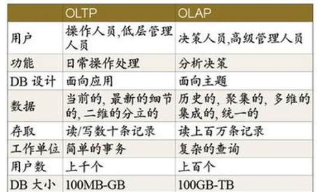

# Data mining
<!-- TOC -->

- [1. Lecture 1](#1-lecture-1)
    - [1.1. OLTP 与 OLAP](#11-oltp-与-olap)
    - [1.2. Why OLAP & OLTP don’t mix](#12-why-olap--oltp-dont-mix)
    - [1.3. Data warehouse （数据仓库）](#13-data-warehouse-数据仓库)
    - [1.4. Federated Database (联合数据库)](#14-federated-database-联合数据库)
- [2. Lecture 2](#2-lecture-2)
    - [2.1. Data Cube (数据立方体)](#21-data-cube-数据立方体)
    - [2.2. Fact and Dim table （事实与维度表）](#22-fact-and-dim-table-事实与维度表)
    - [2.3. Schema（多维数据表的模式）](#23-schema多维数据表的模式)
        - [2.3.1. 星型模式 Star Schema](#231-星型模式-star-schema)
        - [2.3.2. 雪花模式 Snowflake Schema](#232-雪花模式-snowflake-schema)
        - [2.3.3. 事实星座模式（Fact Constellation）或星系模式（galaxy schema）](#233-事实星座模式fact-constellation或星系模式galaxy-schema)
        - [2.3.4. 三种比较](#234-三种比较)
    - [2.4. Dimensions: The Role of Concept Hierarchies (维度阶级)](#24-dimensions-the-role-of-concept-hierarchies-维度阶级)
    - [2.5. Measure(度量)](#25-measure度量)
    - [2.6. Typical OLAP Operations（OLAP的典型操作）](#26-typical-olap-operationsolap的典型操作)
    - [2.7. starnet (星网)](#27-starnet-星网)
    - [2.8. Data Warehouse Design Template](#28-data-warehouse-design-template)
- [3. Lecture 3](#3-lecture-3)
    - [3.1. Grain(粒度)](#31-grain粒度)
    - [3.2. rollup() and cube() in SQL](#32-rollup-and-cube-in-sql)
    - [3.3. Efficient Data Cube Computation](#33-efficient-data-cube-computation)
    - [3.4. Physical Data Warehouse Design (物理设计)](#34-physical-data-warehouse-design-物理设计)
    - [3.5. Logical Data Warehouse Design （逻辑设计）](#35-logical-data-warehouse-design-逻辑设计)
- [4. Lecture 4](#4-lecture-4)
    - [4.1. Date Dimension（日期维度）](#41-date-dimension日期维度)
    - [4.2. Surrogate Keys （代理键）](#42-surrogate-keys-代理键)
    - [4.3. Degenerate dimension(退化维度)](#43-degenerate-dimension退化维度)
    - [4.4. Transactional vs. Snapshot facts (交易与快照类型的事实)](#44-transactional-vs-snapshot-facts-交易与快照类型的事实)
    - [4.5. Factless Fact Tables (非事实型事实表)](#45-factless-fact-tables-非事实型事实表)
    - [4.6. Slowly Changing Dimensions (SCD 缓慢变化维度)](#46-slowly-changing-dimensions-scd-缓慢变化维度)
    - [4.7. Dimension Roles （维度的角色）](#47-dimension-roles-维度的角色)
    - [4.8. Junk Dimension（碎片维度）](#48-junk-dimension碎片维度)

<!-- /TOC -->

## 1. Lecture 1

Introduction to Data Warehouse Click for more options

### 1.1. OLTP 与 OLAP

**OLTP** (Online Transaction Processing)

On-Line Transaction Processing联机事务处理过程(OLTP)

也称为面向交易的处理过程，其基本特征是前台接收的用户数据可以立即传送到计算中心进行处理，并在很短的时间内给出处理结果，是对用户操作快速响应的方式之一。

Examples:
• Update account balance
• Enroll in course
• Add book to shopping cart

**OLAP** (Online Analytical Processing)

联机分析处理OLAP是一种软件技术，它使分析人员能够迅速、一致、交互地从各个方面观察信息，以达到深入理解数据的目的。

联机分析处理OLAP具有共享多维信息的快速分析的特征（即FASMI）。其中F是快速性(Fast)，指系统能在数秒内对用户的多数分析要求做出反应；A是可分析性(Analysis)，指用户可以定义新的专门计算，将其作为分析的一部分；M是多维性(Multi—dimensional)，指提供对数据分析的多维视图和分析；I是信息性(Information)，指能及时获得信息，并且管理大容量信息。

• Report total sales for each
department in each month
• Identify top-selling books
• Count classes with < 10 students

**OLTP和OLAP主要区别有：**



1、基本含义不同：OLTP是传统的关系型数据库的主要应用，主要是基本的、日常的事务处理，记录即时的增、删、改、查，比如在银行存取一笔款，就是一个事务交易。OLAP即联机分析处理，是数据仓库的核心部心，支持复杂的分析操作，侧重决策支持，并且提供直观易懂的查询结果。典型的应用就是复杂的动态报表系统。

2、实时性要求不同：OLTP实时性要求高，OLTP 数据库旨在使事务应用程序仅写入所需的数据，以便尽快处理单个事务。OLAP的实时性要求不是很高，很多应用顶多是每天更新一下数据。

3、数据量不同：OLTP数据量不是很大，一般只读/写数十条记录，处理简单的事务。OLAP数据量大，因为OLAP支持的是动态查询，所以用户也许要通过将很多数据的统计后才能得到想要知道的信息，例如时间序列分析等等，所以处理的数据量很大。

4、用户和系统的面向性不同：OLTP是面向顾客的,用于事务和查询处理。OLAP是面向市场的,用于数据分析。

5、数据库设计不同：OLTP采用实体-联系ER模型和面向应用的数据库设计。OLAP采用星型或雪花模型和面向主题的数据库设计。

### 1.2. Why OLAP & OLTP don’t mix

**Different performance requirements**：

    对于OLTP来说：

    Fast response time important (< 1 second)

    Data must be up-to-date, consistent at all times

    对于OLAP来说：

    Queries can consume lots of resources

    Can saturate(使饱和) CPUs and disk bandwidth

    Operating on static “snapshot” of data usually OK

    所以OLAP可能会使OLTP变得很慢，这不是那些轻量级用户所喜欢的。

**Different data modeling requirements**：

    OLTP:

    Normalised schema for consistency(一致性的规范化模式)

    Complex data models, many tables

    Limited number of standardised queries and updates(数量有限的标准化查询和更新)

    OLAP:

    Simplicity of data model is important
    
        Allow semi-technical users to formulate ad hoc queries

    De-normalised schemas are common

        Fewer joins → improved query performance
        Fewer tables → schema is easier to understand

**Analysis requires data from many sources**:

    An OLTP system targets one specific process

    OLAP integrates data from different processes

    >Terminology, schemas vary across data sources

    OLAP often makes use of historical data

所以将**DBMS (database management system)** 与 **DW（data warehouse）** 分开

– **DBMS**— tuned for OLTP: access methods, indexing,
concurrency control, recovery

– **Warehouse**—tuned for OLAP: complex OLAP
queries, multidimensional view, consolidation.

DB 与 DW 上有功能上的区别：

- missing data: Decision support requires historical data
    which operational DBs do not typically maintain
- data consolidation: DW requires consolidation (aggregation, summarization) of data from heterogeneous sources
- data quality: different sources typically use inconsistent data representations, codes and formats which have to be reconciled

### 1.3. Data warehouse （数据仓库）

1. **数据仓库是面向主题的(Subject Oriented)**；操作型数据库的数据组织面向事务处理任务，而数据仓库中的数据是按照一定的主题域进行组织。主题是指用户使用数据仓库进行决策时所关心的重点方面，一个主题通常与多个操作型信息系统相关。

2. **数据仓库是集成的(Integrated)**，数据仓库的数据有来自于分散的操作型数据，将所需数据从原来的数据中抽取出数据仓库的核心工具来，进行加工与集成，统一与综合之后才能进入数据仓库；
数据仓库中的数据是在对原有分散的数据库数据抽取、清理的基础上经过系统加工、汇总和整理得到的，必须消除源数据中的不一致性，以保证数据仓库内的信息是关于整个企业的一致的全局信息。
    >Data integration represents ~80% of effort for a typical data warehouse project!

3. **数据仓库是不可更新的(Non-Volatile)**, 数据仓库的数据主要供企业决策分析之用，所涉及的数据操作主要是数据查询，一旦某个数据进入数据仓库以后，一般情况下将被长期保留，也就是数据仓库中一般有大量的查询操作，但修改和删除操作很少，通常只需要定期的加载、刷新。
4. **数据仓库是随时间而变化的(Time Variant)**，传统的关系数据库系统比较适合处理格式化的数据，能够较好的满足商业商务处理的需求。稳定的数据以只读格式保存，且不随时间改变。数据仓库中的数据通常包含历史信息，系统记录了企业从过去某一时点(如开始应用数据仓库的时点)到当前的各个阶段的信息，通过这些信息，可以对企业的发展历程和未来趋势做出定量分析和预测。
5. 汇总的。操作性数据映射成决策可用的格式。
6. 大容量。时间序列数据集合通常都非常大。
7. 非规范化的。Dw数据可以是而且经常是冗余的。
8. 元数据。将描述数据的数据保存起来。
9. 数据源。数据来自内部的和外部的非集成操作系统。

**建立一个数据仓库需要**：

- Copy data from various OLTP systems
- Optimise data organisation, system tuning for OLAP
- Transactions aren’t slowed by big analysis queries
- Periodically refresh the data in the warehouse

**A three-tier data warehousing architecture**


**三种DW的应用**:

- Information processing
– supports querying, basic statistical analysis, and reporting using crosstabs, tables, charts and graphs
- Analytical processing
– multidimensional analysis of data warehouse data
– supports basic OLAP operations, slice-dice, drilling, pivoting
- Data mining
– knowledge discovery from hidden patterns
– supports associations, constructing analytical models, performing classification and prediction, and presenting the mining results using visualisation tools.

### 1.4. Federated Database (联合数据库)

> An alternative to data warehouses

许多组织的计算资源，包括在部门或分部作为独立系统存在的局域网(LAN)、小型计算机和大型计算机，这些系统有各自的数据库，当建造一个企业计算平台来互连一个组织时，组织内分散的异构数据库系统就应结合成联合系统以供多个用户访问数据。中间件产品或象分布式计算环境(DCE)这样的环境，提供一个软件层，通过它用户可以与不同的系统互操作。因为几乎没有哪个组织从头设计其企业网和数据库，所以一个联合系统才是大多数组织应采用的现实系统。

当一个联合系统有了一定的互操作性，可以集成异构系统时，通常由局部管理者提供安全和管理的独立性，每一个系统都保持一定程度的独立性。另一方面，在一些企业环境中，管理者正致力于通过减少使用的通信协议数目来达到所有级别上的互操作性，并提供网络上任何用户应用程序对任何数据的访问。

**与DW的区别**：

- Data warehouse
    - Create a copy of all the data
    - Execute queries against the copy
- Federated database
    - Pull data from source systems as needed to answer queries

**优缺点**：

- Advantages of federated databases: 
    - No redundant copying of data
    - Queries see “real-time” view of evolving data
    - More flexible security policy
- Disadvantages of federated databases: 
    - Analysis queries place extra load on transactional systems
    - Query optimisation is hard to do well
    - Historical data may not be available
    - Complex “wrappers” needed to mediate between analysis server and source systems

所以 Data warehouses are much more common in practice

- Better performance
- Lower complexity
- Slightly out-of-date data is acceptable

## 2. Lecture 2 

Overview to Data Warehousing and OLAP Technology Click for more options

### 2.1. Data Cube (数据立方体)

**数据立方体（Data Cube）**是对多维数据的建模与观察，这里必须注意的是数据立方体只是多维模型的一个形象的说法。立方体其本身只有三维，但多维模型不仅限于三维模型，可以组合更多的维度，但一方面是出于更方便地解释和描述，同时也是给思维成像和想象的空间；另一方面是为了与传统关系型数据库的二维表区别开来，于是就有了数据立方体的叫法。

**Cubiods（方体）**
Given a set of **dimensions**, we can generate a **cuboid** for each of the possible subsets of the given dimensions.(数据方体是维度集的任意子集) The result would form a **lattice** of cuboids, each showing the data at a different level of summarization, or **group-by**（晶格是对数据不同层次，或某一维度确定数据的group by）. The lattice of cuboids is then referred to as **a data cube.** （方体中任意一格称为数据立方体，是对同一维度的不同描述位置信息的表述））Figure 4.5 shows a lattice of cuboids forming a data cube for the dimensions time, item, location, and supplier.


以上的图，不同层级表示不同的汇总程度，最上面的0维汇总记为all，称之为**apex cuboid**顶点方体，最下层称为**base cuboid**基本方体。举个例子，用求和运算，最上层是对所有数据做求和，没有任何限制条件，加在一起给出答案，最下面，就直接是分别给出了以四个维度为group的数值和（一般最底层的group，估计只含一个数据）。

**Multidimensional Data**
>dimensions are the perspectives or entities with respect to which an organization wants to keep records

即数据方块的一组基，上面就是time，item，location，support。注意，维度是有层次的（**Hierarchical summarisation paths**）


### 2.2. Fact and Dim table （事实与维度表）

***

**Fact**： A multidimensional data model is typically organized around a central theme, such as sales. This theme is represented by a fact table. Facts are numeric measures.

**The fact table**： contains the names of the facts, or measures, as well as keys to each of the related dimension tables. You will soon get a clearer picture of how this works when we look at multidimensional schemas.
(**事实**是对**维度**的度量，对time，item，location，support这几个维度来说，销售额就是一个度量)

**Fact表的性质**:

- Each fact row contains two things:
    - Numerical measure columns
    - Foreign keys to dimension tables
- Very big
    - Often millions or billions of rows
- Narrow
    - Small number of columns
- Changes often
    - New events in the world → new rows in the fact table
    - Typically append-only

**Fact表的作用**：

- Measurements are aggregated fact columns.

***

**Dimension**: Each one corresponds to a real-world object or concept. Examples: Customer, Product, Date, Employee, Region, Store, Promotion, Vendor, Partner, Account, Department

**Dimension tables**： Each dimension may have a table associated with it, called a dimension table, which further describes the dimension. For example, a dimension table for item may contain the attributes item name, brand, and type. Dimension tables can be specified by users or experts, or automatically generated and adjusted based on data distributions.

**Dim表的性质**：

- Contain many descriptive columns
    - Dimension tables are wide (dozens of columns)
- Generally don’t have too many rows
    - At least in comparison to the fact tables
    - Usually < 1 million rows
- Contents are relatively static
    - Almost like a lookup table

**Dim表的作用**：

- Filters are based on dimension attributes（过滤器是基于维度表的属性的）
- Grouping columns are dimension attributes（分组用的列是维度表的属性）
- Fact tables are referenced through dimensions

In dim table, determine a candidate key（候选关键字） based on the grain statement.

    Grain example: a student enrolled in a course, (Course, Student, Term) is a candidate key

Add other relevant dimensions that are **functionally determined** by the candidate key

即，先找候选键在通过候选键找相应的维度。
***

**Facts vs. Dimension Tables**

Facts|Dimensions
|-|-|
• Narrowz (few collums)|• Wide (many collums)
• Big (many rows)|• Small (few rows)
• Numeric|• Descriptive (描述性的)
• Growing over time|• Static

### 2.3. Schema（多维数据表的模式）

#### 2.3.1. 星型模式 Star Schema

星型模式是最简单的样式数据仓库架构。星型模式由一个或多个事实表中引用任何数量的维表。星型模式被认为是重要的特殊情况雪花模式，并且更有效的查询处理简单。


#### 2.3.2. 雪花模式 Snowflake Schema

雪花模式是星型模式的扩展，其中某些维表被规范化，进一步分解到附加表（维表）中。


从图中我们可以看到地址表被进一步细分出了城市（city）维。supplier_type表被进一步细分出来supplier维。

#### 2.3.3. 事实星座模式（Fact Constellation）或星系模式（galaxy schema）

数据仓库由多个主题构成，包含多个事实表，而维表是公共的，可以共享，这种模式可以看做星型模式的汇集，因而称作星系模式或者事实星座模式。本模式示例如下图所示。


事实星座模式是数据仓库最长使用的数据模式，尤其是企业级数据仓库（EDW）。这也是数据仓库区别于数据集市的一个典型的特征，从根本上而言，数据仓库数据模型的模式更多是为了避免冗余和数据复用，套用现成的模式，是设计数据仓库最合理的选择。当然大数据技术体系下，数据仓库数据模型的设计，还是一个盲点，探索中。

#### 2.3.4. 三种比较

- Star Schema
    - Fewer tables, faster when browsing data
    - Has more redundant information

- Snowflake Schema
    - More tables, slower browsing data
    - Reduces redundancy

- Effect of redundancy:
    - Storage
    - Data integration and cleaning


### 2.4. Dimensions: The Role of Concept Hierarchies (维度阶级)

**Concept Hierarchy**：
> Defines a sequence of mappings from a set of low-level concepts to high-level, more general concepts.

- Schema Hierarchy 
    > A concept hierarchy that is a total or partial orderamong attributes in a database schema

    • Total order: street < city < province_or_state < country
    • Partial order: day < {month < quarter; week} < year

    

- Set-grouping Hierarchy

    > Concept hierarchies may also be defined by discretizing or grouping values for a given dimension or attribute, resulting in a set-grouping hierarchy. A total or partial order can be defined among groups of values. An example of a set-grouping hierarchy is shown in Figure 4.11 for the dimension price, where an interval ($X ...$Y] denotes the range from $X (exclusive) to $Y (inclusive).

    

### 2.5. Measure(度量)

A data cube measure is a numeric function that can be evaluated at each point in the data cube space

A measure value is computed for a given point by aggregating the data corresponding to the respective dimension–value pairs defining the given point

**度量的类型：**

- Distributive（分布的，即可以被分布式计算的数值函数）:
    - An aggregate function is distributive if it can be computed in a distributed manner by applying the same function on partitioned sets.
    - count(), min(), and max() are distributive aggregate functions.
.
- Algebraic（代数的，即由多个分布式计算得到的参数组成的数值函数）:
    - An aggregate function is algebraic if it can be computed by an algebraic function with M arguments (where M is a bounded positive integer), each of which is obtained by applying a distributive aggregate function.
    - avg() (average) can be computed by sum()/count(), where both sum() and count() are distributive
    - standard_deviation().
.
- Holistic（整体的，即不能由以上方法得到的数值函数）:
    
    - An aggregate function is holistic if there is no constant bound on the storage size needed to describe a subaggregate. That is, there does not exist an algebraic function with M arguments (where M is a constant) that characterizes the computation。
    - median(), mode(), and rank().

### 2.6. Typical OLAP Operations（OLAP的典型操作）

**Roll up (drill-up): 上卷** summarise data
    - by climbing up hierarchy or by dimension reduction

**Drill down (roll down): 下钻** reverse of roll-up
    - from higher level summary to lower level summary or detailed data, or introducing new dimensions

 **Slice and dice: 切片/切丁**
    - project and select

 **Pivot (rotate):**
– reorient the cube, visualisation, 3D to series of 2D planes.

**Other operations**
– drill across: involving (across) more than one fact table
– drill through: through the bottom level of the cube to its back-end relational tables (using SQL)

### 2.7. starnet (星网)

The querying of multidimensional databases can be based on a starnet model, which consists of radial lines emanating from a central point, where each line represents a concept hierarchy for a dimension. Each abstraction level in the hierarchy is called a **footprint**. These represent the granularities available for use by OLAP operations such as drill-down and roll-up.


*starnet*


### 2.8. Data Warehouse Design Template

从商务分析框架出发，设计数据仓库必须考虑的
四个视图

- 自顶向下视图(Top-down)
¾可以选择数据仓库所需的相关信息
- 数据源视图(Data source)
¾揭示被操作数据库系统捕获、存储和管理的信息
- 数据仓库视图(Data warehouse)
¾提供存放在数据仓库内部的信息，由事实表和维表组成
- 商务查询视图(Business query)
¾从最终用户的角度透视数据仓库中的数据

以下为设计步骤：

- Choose a business process to model
– E.g. orders, invoices, shipments, sales …
- Choose the grain (atomic level of data) of the business process
– E.g. individual transactions, individual daily snapshots
- Choose the dimensions that will apply to each fact table record
– Typical dimensions are time, item, customer, supplier, warehouse, transaction type and status
- Choose the measure that will populate each fact table record
– Typical measures are numeric additive quantities like dollars_sold and units_sold

## 3. Lecture 3

OLAP Technology and Logical DW Design Click for more options

### 3.1. Grain(粒度)

粒度是数据仓库中你定义的最小查询片。简单说粒度就是事实表里测量值的测量‘分辨率’。 比如说，销售库里的销售额，可以是一天一个值，也可以是一个月一个值，甚至一年一个值，这就是相对于时间维度表的力度；可以是一个商品一个值，也可以是一类商品一个值，这就是相对于商品的粒度。

以“组织结构”为例，比如我们的一个层级结构式：总公司，分公司，部门，科室。
这就是不同的粒度级别。

实际应用中，比如有人问，你的某个报表粒度是怎样的。
我们可以说，组织结构我们的报表呈现是到分公司级别的，但是我们的数据粒度是到科室的（也就是你的事实表中，层级聚合到科室级别）。
所以我们就也能支持到之上的“粗”粒度，如总公司，分公司，及部门

如果我们的数据粒度是到分公司的，那明显我们的报表就不能支持下级粒度的数据展现。
也就是说，粒度不够“细”。

当然，粒度的也不是越细越好，要综合分析。
比如如果我们这一层级的需求，都是针对于分公司级别的，不需要往其下级部门的深化。那么粒度就到分公司即可。
毕竟粒度越细，事实表的数据量也会越大。

- Grain of a fact table = the meaning of one fact table row
- Determines the maximum level of detail of the warehouse

- Finer-grained fact tables:
    – are more expressive
    – have more rows
- Trade-off between performance and expressiveness
– Rule of thumb: Error in favor of expressiveness
– Pre-computed aggregates can solve performance problems

In dim table, determine a candidate key（候选关键字） based on the grain statement.

### 3.2. rollup() and cube() in SQL

数据挖掘查询语言(Data Mining Query Language)

- Cube definition and computation in DMQL

    ```sql
    define cube sales[item, city, year]:
    sum(sales_in_dollars)
    compute cube sales
    ```

- Transform it into a SQL-like language (with a new
operator cube by, introduced by Gray et al.’96)

    ```SQL
    SELECT item, city, year, SUM (amount)
    FROM SALES
    CUBE BY item, city, year
    ```

如果要做drill-down/roll-up 操作的话，写sql查询语句需要注意以下几方面：
**Standard Operations to Answer Queries**:

1. Measurements
• Which fact(s) should be reported?
2. Filters
• What slice(s) of the cube should be used?
3. Grouping attributes
• How finely should the cube be diced?
• Each dimension is either:
    1. A grouping attribute
    2. Aggregated over (“Rolled up” into a single total)

*n dimensions → 2n sets of grouping attributes*
*Aggregation = projection to a lower-dimensional subspace*

例如：
```sql
SELECT state, month, //Grouping attributes
SUM(quantity) //measurements
FROM sales
GROUP BY state, month //Grouping attributes
WHERE color = 'Red' //Fliters

```

然而，这样的语句，有缺陷，即不会得出key的总和，SQL aggregation query with GROUP BY does not produce subtotals, totals Our cross-tab report is incomplete


只能通过以下语句获得：

```sql
SELECT state, month, SUM(quantity)
FROM sales
GROUP BY state, month
WHERE color = 'Red‘
UNION ALL
SELECT state, "ALL", SUM(quantity)
FROM sales
GROUP BY state
WHERE color = 'Red'
UNION ALL
SELECT "ALL", month, SUM(quantity)
FROM sales
GROUP BY month
WHERE color = 'Red‘
UNION ALL
SELECT "ALL", "ALL", SUM(quantity)
FROM sales
WHERE color = 'Red'
```

这样做未免累赘。
而且，n grouping attributes → 2n parts in the union

所以，OLAP extensions added to SQL 99 are more convenient

 **CUBE,ROLLUP**

- CUBE computes entire lattice
- ROLLUP computes one path through lattice
    Order of GROUP BY list matters Groups by all prefixes（前缀） of the GROUP BYlist


CUBE 生成的结果集显示了所选列中值的所有组合的聚合。  

ROLLUP生成的结果集显示了所选列中值的某一层次结构的聚合

rollup(1,2,3):(1,2,3),(1,2),(1),all
cube(1,2,3):(1,2,3),(1,2),(2,3),(1,3),(1),(2),(3),all

ROLLUP会按照参数的顺序依次汇总, 依次减少后面的维度，生成答案。

CUBE可以对所有参数(字段)的排列情况进行汇总，如果在GROUP BY子句中有N个列或者是有N个表达式的话，SQLSERVER在结果集上会返回2的N－1次幂个可能组合。

实例：

```sql
SELECT state, month, SUM(quantity)
FROM sales
GROUP BY CUBE(month, state)
WHERE color = 'Red'
```

```sql
SELECT color, month, state, SUM(quantity)
FROM sales
GROUP BY ROLLUP(color,month,state)
```

### 3.3. Efficient Data Cube Computation

**Data cube can be viewed as a lattice of cuboids**

How many cuboids in an n-dimensional cube with L levels?

$$T=\prod^n_{i=1}(L_i+1)$$

Materialisation(实现) of data cube：

- Materialise every (cuboid) (full materialisation),
- none(no materialisation),
- or some (partial materialisation).


Selection of which cuboids to materialise Based on **size, sharing, access frequency**, etc.

Full Data Cube with SubTotals：

• Pre-computation of aggregates → fast answers to OLAP queries
• Ideally, pre-compute all 2n types of subtotals
• Otherwise, perform aggregation as needed
• Coarser-grained totals can be computed from finer-grained totals
    – But not the other way around
（粗的粒度可以从细的粒度中算出来，但是反之则不然。）

### 3.4. Physical Data Warehouse Design (物理设计)

**Data Cube is a Metaphor**.

Data cube is a metaphor for multi-dimentional data storage. Actual storage of such data may be different from the logical representation. (逻辑结构可能和实际储存的物理结构不一样)

有以下几种储存形式：

 **MOLAP**（Multidimensional OLAP）
>Store data cube as multidimensional array and (Usually) pre-compute all aggregates

- Advantages:
    - Very efficient data access → fast answers
- Disadvantages:
    - Doesn’t scale to large numbers of dimensions
    - Requires special-purpose data store
    - Multi-dimensional arrays are not an efficient way to store sparse data. (If there are 100,000 customers, 10,000 products, 1,000 stores, and 1,000 days…data cube has 1,000,000,000,000,000 (1000 Trillion) cells! and most cells are empty.)

**ROLAP** (Relational OLAP)
>Store data cube in relational database and Express queries in SQL.

- Advantages:
    - Scales well to high dimensionality
    - Scales well to large data sets
    - Sparsity is not a problem
    - Uses well-known, mature technology
- Disadvantages:
    - Query performance is slower than MOLAP
    - Need to construct explicit indexes

### 3.5. Logical Data Warehouse Design （逻辑设计）

- Logical design vs. physical design:
    - Logical design = conceptual organisation for the database
    - Create an abstraction for a real-world process
- Physical design = how is the data stored
    - Select data structures (tables, indexes, materialised views)
    - Organise data structures on disk

Three main goals for logical design:

- Simplicity（简洁）
    - Users should understand the design
    - Data model should match users’ conceptual model
    - Queries should be easy and intuitive to write
- Expressiveness （明了）
    - Include enough information to answer all important queries
    - Include all relevant data (without irrelevant data)
- Performance（高效）
    - An efficient physical design should be possible

## 4. Lecture 4

 Practical Concerns of Dimensional Modelling

本章根据PPT里的实例来做一个DW，并进行一些细节上的讨论。

### 4.1. Date Dimension（日期维度）

基本每个DW都有一个时间维度，因为一般的数据都是按时间序列来排列的。拥有一个时间维度也有助于我们去搜寻历史信息，这也是一个DW的重要特征。

一般我们将一天作为时间维度的粒度

时间维度一般包涵以下的属性：

Properties of a date:

- Holiday/non-holiday, weekday/weekend, day of week
- Selling season (Back-to-school, Christmas, etc.)
- Fiscal calendar (fiscal quarter / year)
- Day-number-in-year, Day-number-in-epoch
    >Allows for easy date arithmetic

为什么使用日期维度，而非SQL自带的时间戳呢？

- Capture interesting date properties (e.g. holiday / non-holiday)
- Avoid relying on special date-handling SQL functions
- Make use of indexes

其中关于Time-of-Day是写在date dim中，还是做一个单独的dim，亦或直接写在fact表里?

建议：

1. Separate time-of-day from the date dimension to avoid a row count explosion in the date dimension.

2. Use a time-of-day dimension table with one row per discrete time period, to filter or roll up time periods based on summarised day part groupings, for example
    - activity during 15-minute intervals, hours, shifts, lunch hour, or prime time,
    - one row per minute in a 24-hour period resulting in a dimension with 1,440 rows.
3. If there’s no need to roll up or filter on time-of-day groupings, time- of-day should be handled as a simple date/time fact in the fact table. 

### 4.2. Surrogate Keys （代理键）

定义：

- **Natural key**: A key that is meaningful to users
- **Surrogate key**: A meaningless integer key that is assigned by the data warehouse

**Primary keys of dimension tables should be surrogate keys, not natural keys**, Avoid using natural keys or codes generated by operational systems.

    E.g. Account number, UPC code, Social Security Number

这样做的理由，有以下几项：

1. Data warehouse insulated(隔离) from changes to operational systems，Easy to integrate data from multiple systems
.
2. Narrow dimension keys (e.g. 8 bytes using natural key, only 4 bytes using surrogate key)
    - Thinner fact table → Better performance
    - This can actually make a big performance difference.
.
3. Better handling of exceptional cases
    - For example, what if the value is unknown or TBD(To Be Determined)?
    - Using NULL is a poor option
    • Three-valued logic is not intuitive to users
    • Users may get their queries wrong
    • Join performance will suffer
    - Better: Explicit dimension rows for “Unknown”, “TBD”, “N/A”, etc.
.
4. Avoids tempting query writers to assume implicit semantics 避免诱使查询编写者假定隐式语义
    - Example: WHERE date_key < '01/01/2020'
    - Will facts with unknown date be included?

### 4.3. Degenerate dimension(退化维度)

**The degenerate dimension is a dimension key without a corresponding dimension table.**

- Occasionally a dimension is merely an identifier, without any interesting attributes
    - “Transaction ID” is a unique identifier, and serves to group together products that were bought in the same shopping cart
    - (Transaction ID, Product) was our candidate key.

Two options:

1. Discard the dimension
    • A good option if the dimension isn’t needed for analysis
2. Use a “degenerate dimension”
    - Store the dimension identifier directly in the act table
    - Don’t create a separate dimension table
    - Used for transaction ID, invoice number, etc.

### 4.4. Transactional vs. Snapshot facts (交易与快照类型的事实)

1. Transactional
    >Each fact row represents a discrete event, Provides the most granular, detailed information

2. Snapshot
    - Each fact row represents a point-in-time snapshot
    - Snapshots are taken at predefined time intervals
    • Examples: Hourly, daily, or weekly snapshots
    - Provides a cumulative view
    - Used for continuous processes / measures of intensity
    - Examples:
    • Account balance
    • Inventory level
    • Room temperature


一个记录一次次的变化，一个记录不同时间间隔的状态。
这两个是互补的结构，我们一般能用transaction来生成snapshot，但反过来则不行。


为什么我们一般使用快照：

1. Sampling is the only option for continuous processes
• E.g. sensor readings
2. Data compression
• Recording all transactional activity may be too much data!
• Stock price at each trade vs. opening / closing price
3. Query expressiveness
• Some queries are much easier to ask/answer with snapshot fact
• Example: Average daily balance


### 4.5. Factless Fact Tables (非事实型事实表)

同时运用transaction fact表，一些没有发生事件（变换）的产品数据可能会没记录。（No rows for products that didn’t sell）。

优缺点：

- Good: Take advantage of sparsity 
    >• Much less data to store if events are “rare”
- Bad: No record of non-events 
    >• Example: What products on promotion didn’t sell?

这时候又要用上“**Factless” fact table**
以下为其定义：

- A fact table without numeric fact columns（没有度量）
- Used to capture relationships between dimensions
- Include a dummy（虚拟的） fact column that always has value 1 （唯一一个度量就是常数1）

在维度建模的数据仓库中，有一种事实表叫FACTLESS FACT TABLE，中文一般翻译为“非事实型事实表”。在事实表中，通常会保存十个左右的维度外键和多个度量事实，度量事实是事实表的关键所在。**在非事实型事实表中没有这些度量事实**，只有多个维度外键。**非事实型事实表通常用来跟踪一些事件或者说明某些活动的范围**，下面举例来进行说明。


第一类非事实型事实表是用来**跟踪事件**的事实表。例如：学生注册事件，学校需要对学生按学期进行跟踪。维度表包括学期维度、课程维度、系维度、学生维度、注册专业维度和取得学分维度，而事实表是由这些维度的主键组成，事实只有注册数，并且恒为1。这样的事实表可以回答大量关于大学开课注册方面的问题，主要是回答各种情况下的注册数。


第二类非事实型事实表是用来说明某些**活动范围**的事实表。例如：促销范围事实表。通常销售事实表可以回答如促销商品的销售情况，但是对于那些没有销售出去的促销商品没法回答。这时，通过建立促销范围事实表，将商场需要促销的商品单独建立事实表保存。然后，通过这个**促销范围事实表**和**销售事实表**即可得出哪些促销商品没有销售出去。这样的促销范围事实表只是用来说明促销活动的范围，其中没有任何事实度量。

即如以下表单：


### 4.6. Slowly Changing Dimensions (SCD 缓慢变化维度)

缓慢变化维的提出是因为在现实世界中，维度的属性并不是静态的，它会随着时间的流失发生缓慢的变化。这种随时间发生变化的维度我们一般称之为缓慢变化维，并且把处理维度表的历史变化信息的问题称为处理缓慢变化维的问题，有时也简称为处理SCD的问题。

How to handle gradual changes to dimensions?

- Option 1: Overwrite history
- Option 2: Preserve history

**Overwrite history：**

**TYPE 1：重写**
对其相应需要重写维度行中的旧值，以当前值替换。因此其始终反映最近的情况。

例子：

- Product size incorrectly recorded as “8 oz” instead of “18 oz” due to clerical error
- Error is detected and fixed in operational system
- Error should also be corrected in data warehouse
- Update row in dimension table
- Update pre-computed aggregates

注意：这样处理，易于实现，但是没有保留历史数据，无法分析历史变化信息。

**Preserve history：**

TYPE 2：增加新行
数据仓库系统的目标之一是正确地表示历史。当提及缓慢变化维度属性时，类型2就是主要应用于支持这一需求的技术。

Type 2 SCD requires **surrogate keys**
– Store mapping from operational key to most current surrogate key in data staging area

如下所示


优缺点：

- Type 1: Overwrite existing value
    - Simple to implement

- Type 2: Add a new dimension row
    - Accurate historical reporting
    - Pre-computed aggregates unaffected
    - **Dimension table grows over time**

以上两种方法都很常用，一般混在一起用，但我们该如何选择用哪种呢？

Questions to ask:

1. Will queries want to use the original attribute value or the new attribute value?
    - In most cases preserving history is desirable
1. Does the performance impact of additional dimension rows outweigh the benefit of preserving history?
    - Some fields like “customer phone number” are not very useful for reporting
    - Adding extra rows to preserve phone number history may not be worth it

*其实还有type 0和3*：

*TYPE 0：保留原始值*：

此类型唯独属性值绝不会变化，因此事实始终按照该原始值分组。

比如客户的原始信用度分值，就可以用该类型。

*TYPE 3：增加新属性*：

尽管类型2能够区分历史情况，但它无法保证能够将新属性值和过去的历史事实关联，反之亦然。

这时候就可以用到类型3。

注意：这种类型使用哪种场景呢？它比较适合需要根据先后顺序来得出某种结论的场景。

举个例子，这个例子很恰当的哦。

还是以电商为背景，我们有一个商品表，里面有一个字段是商品价格。如果我们现在想知道这个商品的上一个价格是多少。

这个问题有两种方式：

我们在一张历史状态表中找到上一个商品的价格状态，但是这样会比较麻烦，可能会扫描很多的数据。

就是我们现在讲的这种方式，加一个字段，就方便很多了。

商品名|商品价格|先前商品价格
|-|-|-|
宇宙飞船一号|100|150
宇宙飞船二号|120|250
这种方式的优点是可以同时分析当前及前一次变化的属性值，缺点是只保留了最后一次变化信息。

<a href="https://www.jianshu.com/p/e0a39c90a523">漫谈数据仓库之SCD（缓慢变化维度）</a>

### 4.7. Dimension Roles （维度的角色）

有可能一个维度在事实表上出现了两次，我们在这种请况下，不建两个维度表，建一个就可以了。只要在事实表的两个列中用不同的外键就行。

即维度表可能在同一事实表中扮演不同角色


### 4.8. Junk Dimension（碎片维度）

Sometimes certain attributes don’t fit nicely into any dimension.

Create one or more “miscellaneous”(杂项) dimensions

Group together several leftover attributes as a dimension even if they aren’t logically related 

- Reduces number of dimension tables and width of fact table
- Works best if leftover(剩余的) attributes are
    • Few in number
    • Low in cardinality
    • Correlated

Some alternatives 

- Each leftover attribute becomes its own dimension
- Eliminate leftover attributes that are not useful

